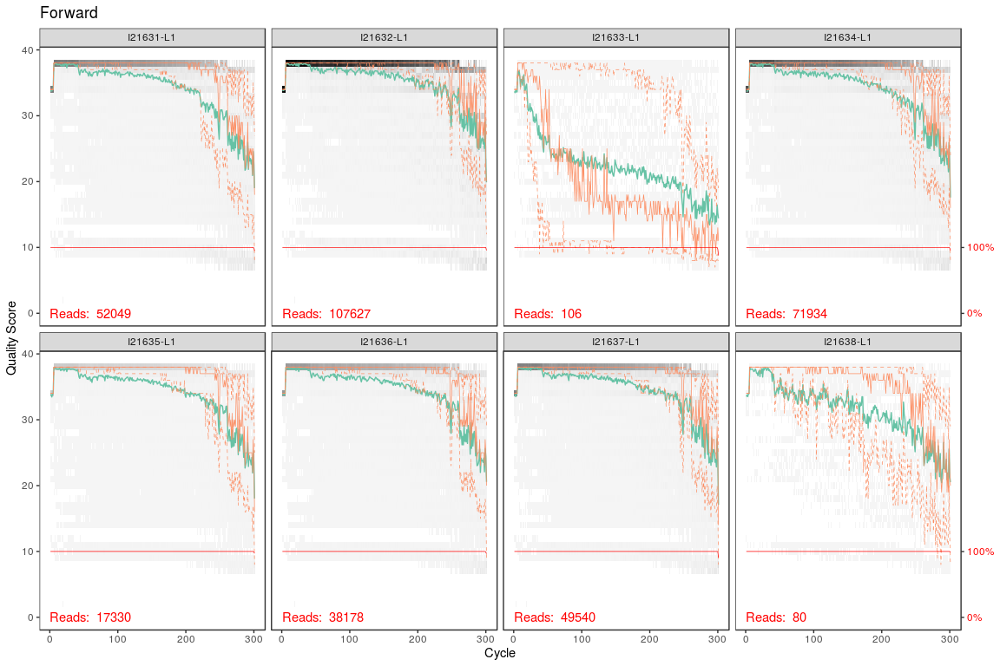
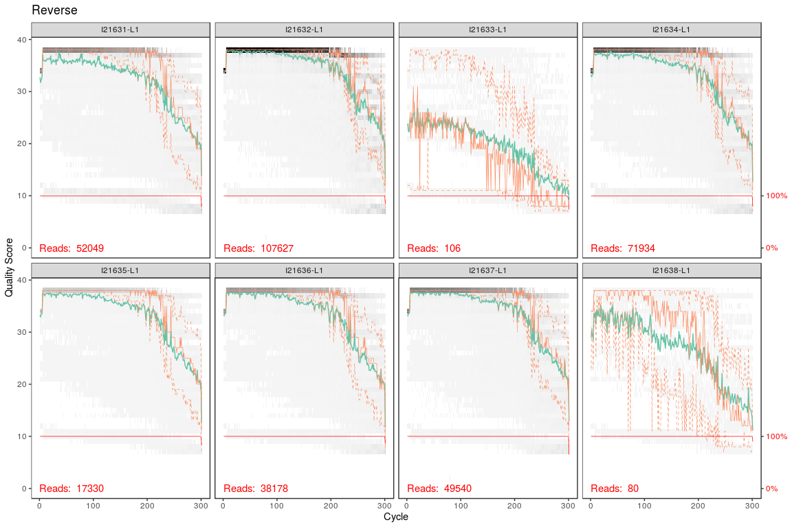
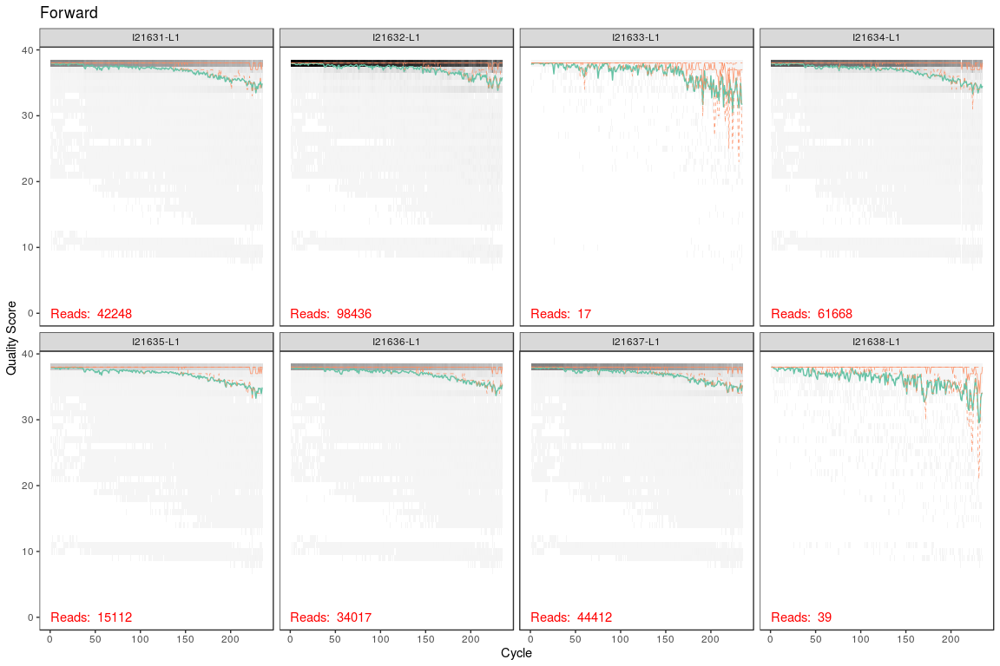
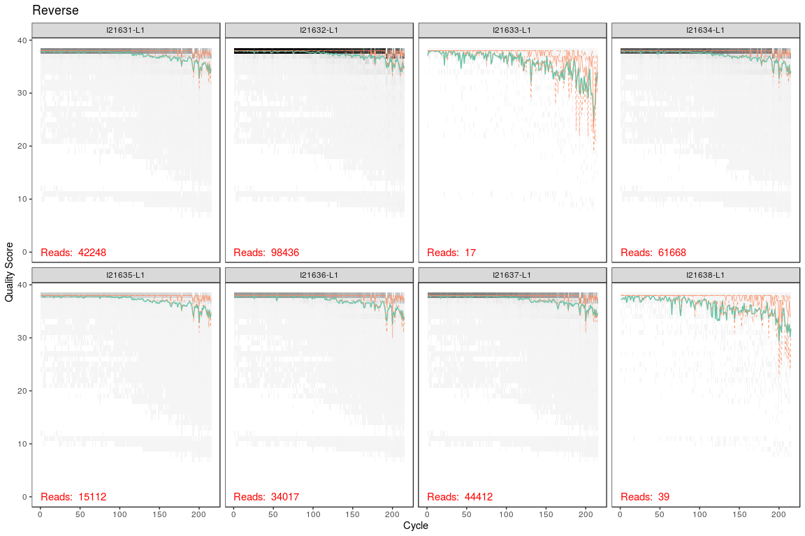
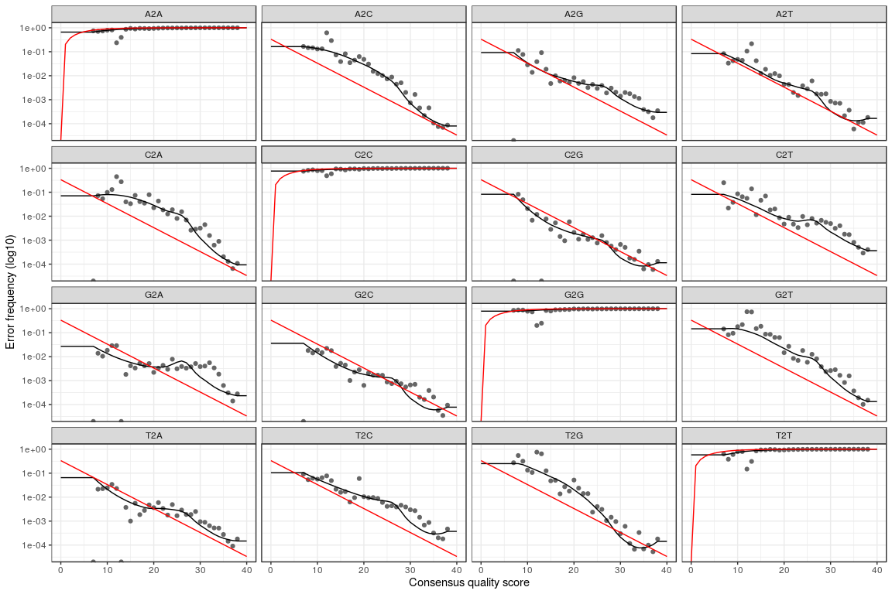
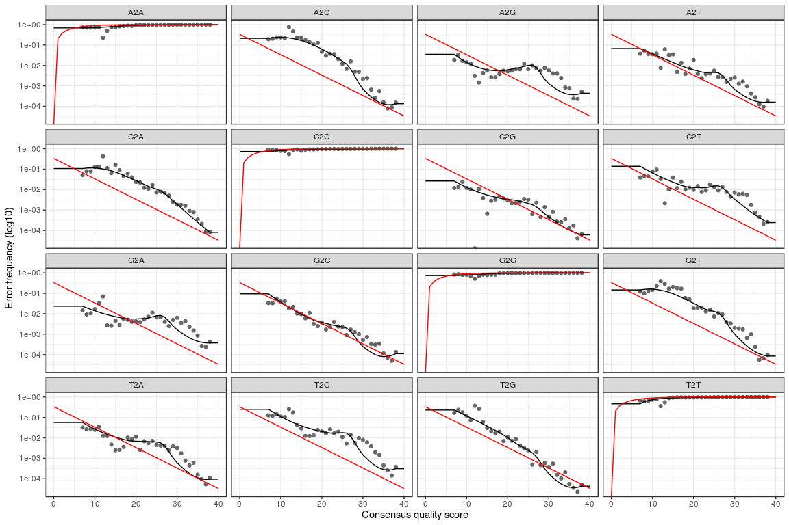
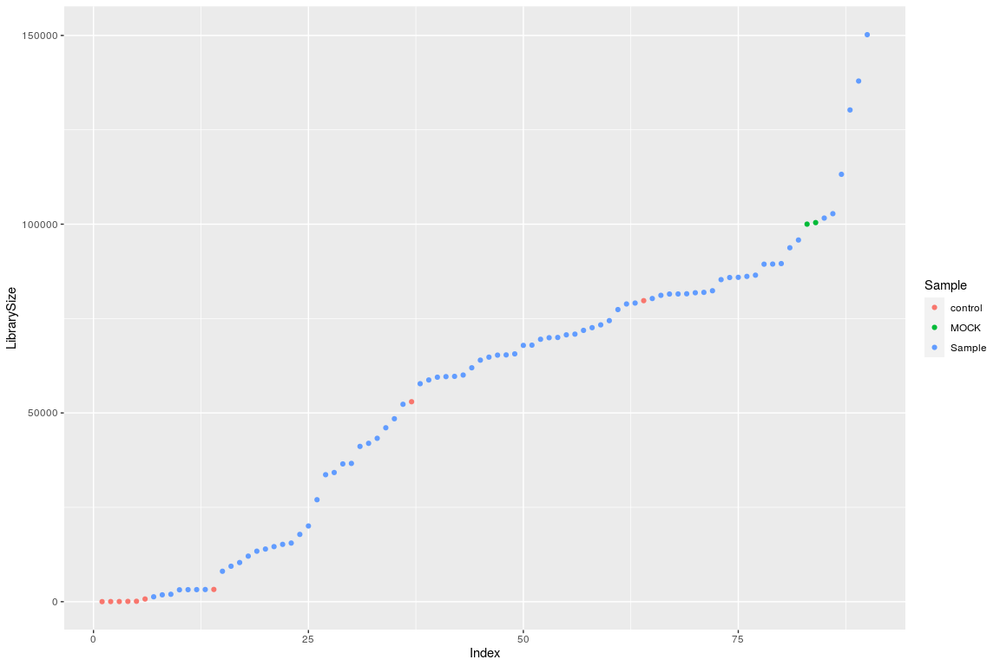
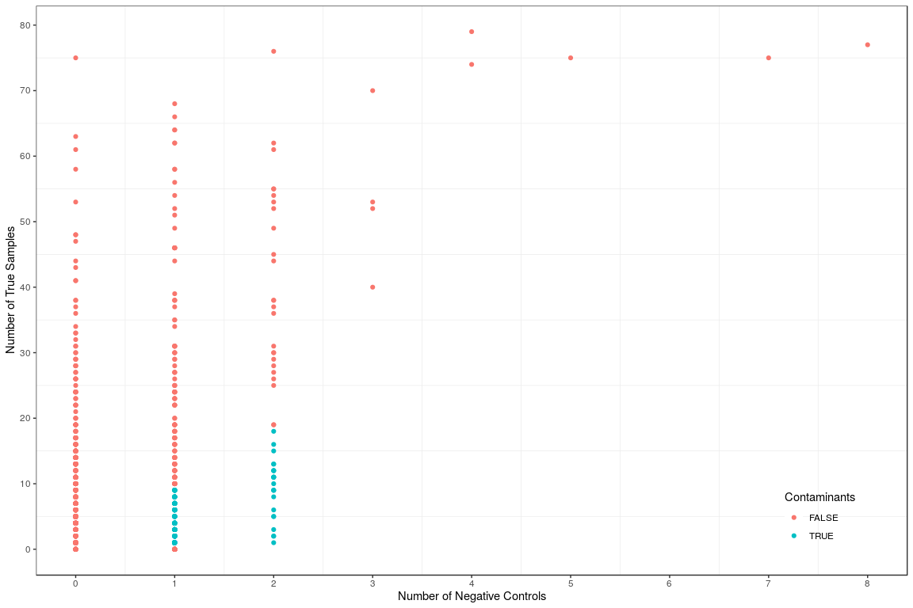
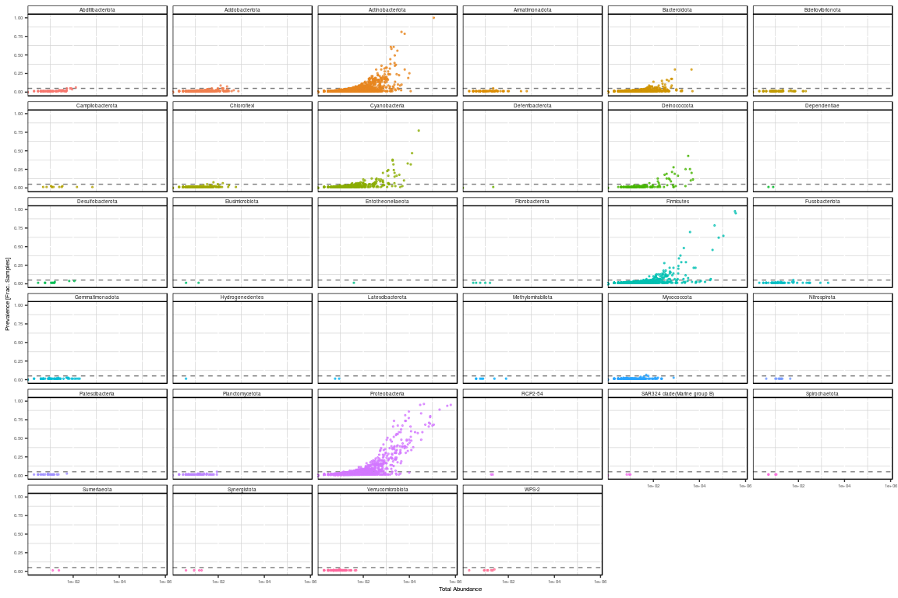

## **Project Overview**
Priming response (enhanced survival upon secondary infection) has been demonstrated with different routes (septic and oral) in the red flour beetle *Tribolium castaneum* and shows to have high degree of specificity.  Some studies have pointed out the importance of the hosts natural microbiota, suggesting that priming  might be partially explained by the presence of commensal bacteria in the gut. Using a well established model system for studying host-parasite interaction and insect immunity, red flour beetle *Tribolium castaneum* and enthomopathogenic bacterium *Bacillus thurigiensis* (Bt), we have studied if priming could influence microbiome composition of the beetle larvae. We conducted an experiment using the two established routes of priming in this system: injection with heat-killed Bt and oral via ingestion of filtered sterilized bacterial spore supernatants by beetle larvae, with diverse strains of Bt varying in their ability to induce priming. Microbiota composition was assessed after the priming treatment by deep sequencing of the v1-v2 region of the bacterial 16S rRNA gene.

## **Sequencing Methodology**
For sequencing, variable regions V1 and V2 of the 16S rRNA gene within the DNA samples were amplified using the primer pair 27F-338R in a dual-barcoding approach as per Caporaso et al. 2012. 3.5 µl of cDNA was used for amplification and PCR products were verified using the electrophoresis in agarose gel. PCR products were normalized using the SequalPrep Normalization Plate Kit, pooled equimolarly, and sequenced on the Illumina MiSeq v3 2x300bp. Demultiplexing after sequencing was based on 0 mismatches in the barcode sequences.


## **Loading R packages:**

```r
library(rmarkdown)
library(dada2)
library(ggplot2)
library(phyloseq)
library(DECIPHER)
library(phangorn)
library(ape)
library(decontam)
```

## **Pre-processing the reads:**


```r
# Loading the Forward and reverse fastq files for all the samples:
path <- "ngs_data"
fnFs <- sort(list.files(path, pattern="_R1.fastq.gz", full.names = TRUE))
fnRs <- sort(list.files(path, pattern="_R2.fastq.gz", full.names = TRUE))
# Extract sample names:
sample.names <- sapply(strsplit(basename(fnFs), "_"), `[`, 1)

# Plotting the quality profiles of the reads of first 10 samples:
temp <- sample.names[1:8]
names(temp) <- basename(fnFs)[1:8]
plotQualityProfile(fnFs[1:8]) + ggtitle("Forward") + facet_wrap(~file, ncol = 4, labeller=as_labeller(temp))
```



```r
names(temp) <- basename(fnRs)[1:8]
plotQualityProfile(fnRs[1:8]) + ggtitle("Reverse") + facet_wrap(~file, ncol = 4, labeller=as_labeller(temp))
```



```r
# Trimming the fastq files:
filtFs <- file.path(path, "filtered", paste0(sample.names, "_F_filt.fastq.gz"))
filtRs <- file.path(path, "filtered", paste0(sample.names, "_R_filt.fastq.gz"))
names(filtFs) <- sample.names
names(filtRs) <- sample.names
out <- filterAndTrim(fnFs, filtFs, fnRs, filtRs, trimLeft = c(5,5) , truncLen=c(240,220),
                     maxN=0, maxEE=c(2,2), truncQ=2, rm.phix=TRUE,
                     compress=TRUE, multithread=TRUE)

## Checking quality after trimming the reads:
temp <- sample.names[1:8]
names(temp) <- basename(filtFs)[1:8]
plotQualityProfile(filtFs[1:8]) + ggtitle("Forward") + facet_wrap(~file, ncol = 4, labeller=as_labeller(temp))
```



```r
names(temp) <- basename(filtRs)[1:8]
plotQualityProfile(filtRs[1:8]) + ggtitle("Reverse") + facet_wrap(~file, ncol = 4, labeller=as_labeller(temp))
```



```r
# De-replication: 
derepFs <- derepFastq(filtFs)
derepRs <- derepFastq(filtRs)
# Name the derep-class objects by the sample names
names(derepFs) <- sample.names
names(derepRs) <- sample.names

#Learning the error rates:
errF <- learnErrors(filtFs, multithread=TRUE, verbose = F)
```

```
## 101048355 total bases in 429993 reads from 9 samples will be used for learning the error rates.
```

```r
errR <- learnErrors(filtRs, multithread=TRUE, verbose = F)
```

```
## 111423535 total bases in 518249 reads from 11 samples will be used for learning the error rates.
```

```r
plotErrors(errF, nominalQ=TRUE)
```



```r
plotErrors(errR, nominalQ=TRUE)
```



## **Creating ASV table:**


```r
#Creating dada objects:
dadaFs <- dada(derepFs, err=errF, multithread=TRUE, verbose = F)
dadaRs <- dada(derepRs, err=errR, multithread=TRUE, verbose = F)

# Merge paired reads
mergers <- mergePairs(dadaFs, derepFs, dadaRs, derepRs, verbose = F)
# Constructing ASV sequence table
seqtab <- makeSequenceTable(mergers)
# Inspect distribution of sequence lengths:
table(nchar(getSequences(seqtab)))
```

```
## 
##  235  238  239  244  246  249  251  252  254  258  261  262  263  264  265  266  267  268  269  270  271 
##    1    2    1    1    2    2    1    1    2    1    4    1    1    9   18  352   79 1068  278  340  143 
##  272  273  274  275  276  277  278  279  280  281  282  283  284  285  286  287  288  289  290  291  292 
##  120   15   49    3   31   15   56   39   33   61  106  128   99  179   91  243  120  245  157  195  672 
##  293  294  295  296  297  298  299  300  301  302  303  304  305  306  307  308  309  310  311  312  313 
##  394 2003  721  775  402  571  304  845  183  190  416  494  206  340  359  421  220  266   65   47  128 
##  314  315  316  317  318  319  320  321  322  323  324  325  326  327  328  329  330  331  332  333  334 
##  108   41   60   53  126   76   22   11   52   11    7    1    3    6    8   10    5   22   83  301   45 
##  335  336  337  340  342  352  358  360  371  391 
##    1    1    8    2    3    2    1    7    1    1
```

```r
# Remove chimeras
seqtab.nochim <- removeBimeraDenovo(seqtab, method="consensus", multithread=TRUE, verbose=F)
# Chimeras account for 4.1% of the merged sequence reads:
(1- sum(seqtab.nochim)/sum(seqtab)) *100
```

```
## [1] 4.175729
```

```r
#Tracking reads through the pipeline:
getN <- function(x) sum(getUniques(x))
track <- cbind(out, sapply(dadaFs, getN), sapply(dadaRs, getN), sapply(mergers, getN), rowSums(seqtab.nochim))
colnames(track) <- c("input", "filtered", "denoisedF", "denoisedR", "merged", "nonchim")
rownames(track) <- sample.names
paged_table(as.data.frame(track))
```

<div data-pagedtable="false">
  <script data-pagedtable-source type="application/json">
{"columns":[{"label":[""],"name":["_rn_"],"type":[""],"align":["left"]},{"label":["input"],"name":[1],"type":["dbl"],"align":["right"]},{"label":["filtered"],"name":[2],"type":["dbl"],"align":["right"]},{"label":["denoisedF"],"name":[3],"type":["dbl"],"align":["right"]},{"label":["denoisedR"],"name":[4],"type":["dbl"],"align":["right"]},{"label":["merged"],"name":[5],"type":["dbl"],"align":["right"]},{"label":["nonchim"],"name":[6],"type":["dbl"],"align":["right"]}],"data":[{"1":"52049","2":"42248","3":"42036","4":"42024","5":"41461","6":"41131","_rn_":"I21631-L1"},{"1":"107627","2":"98436","3":"97872","4":"98009","5":"96416","6":"93756","_rn_":"I21632-L1"},{"1":"106","2":"17","3":"10","4":"10","5":"10","6":"10","_rn_":"I21633-L1"},{"1":"71934","2":"61668","3":"61099","4":"61354","5":"59899","6":"59684","_rn_":"I21634-L1"},{"1":"17330","2":"15112","3":"15073","4":"15009","5":"14706","6":"14579","_rn_":"I21635-L1"},{"1":"38178","2":"34017","3":"33906","4":"33920","5":"33665","6":"33635","_rn_":"I21636-L1"},{"1":"49540","2":"44412","3":"44187","4":"44217","5":"43493","6":"43277","_rn_":"I21637-L1"},{"1":"80","2":"39","3":"27","4":"27","5":"27","6":"27","_rn_":"I21638-L1"},{"1":"139682","2":"134044","3":"133740","4":"133750","5":"133059","6":"130257","_rn_":"I21639-L1"},{"1":"141","2":"83","3":"73","4":"76","5":"73","6":"73","_rn_":"I21640-L1"},{"1":"93663","2":"88173","3":"87654","4":"87791","5":"86343","6":"81515","_rn_":"I21641-L1"},{"1":"136","2":"57","3":"42","4":"41","5":"34","6":"34","_rn_":"I21642-L1"},{"1":"102470","2":"91549","3":"91228","4":"91297","5":"90223","6":"89404","_rn_":"I21643-L1"},{"1":"59240","2":"53245","3":"53226","4":"53227","5":"53056","6":"52967","_rn_":"I21644-L1"},{"1":"86735","2":"67785","3":"67557","4":"67569","5":"66550","6":"65314","_rn_":"I21645-L1"},{"1":"50311","2":"43048","3":"42864","4":"42944","5":"42391","6":"41945","_rn_":"I21646-L1"},{"1":"25764","2":"20675","3":"20509","4":"20520","5":"20089","6":"20052","_rn_":"I21647-L1"},{"1":"10193","2":"8525","3":"8323","4":"8388","5":"8149","6":"8056","_rn_":"I21648-L1"},{"1":"14410","2":"12281","3":"12223","4":"12245","5":"12127","6":"12067","_rn_":"I21649-L1"},{"1":"94160","2":"78358","3":"77771","4":"77877","5":"75148","6":"70872","_rn_":"I21650-L1"},{"1":"20821","2":"18250","3":"18176","4":"18183","5":"17948","6":"17823","_rn_":"I21651-L1"},{"1":"38673","2":"34847","3":"34682","4":"34748","5":"34388","6":"34214","_rn_":"I21652-L1"},{"1":"53225","2":"50230","3":"50092","4":"50111","5":"49614","6":"48457","_rn_":"I21653-L1"},{"1":"77403","2":"71611","3":"71316","4":"71484","5":"70786","6":"69923","_rn_":"I21654-L1"},{"1":"140132","2":"123151","3":"122758","4":"122796","5":"120953","6":"113212","_rn_":"I21655-L1"},{"1":"185443","2":"164816","3":"164483","4":"164608","5":"163186","6":"150200","_rn_":"I21656-L1"},{"1":"18591","2":"15858","3":"15791","4":"15748","5":"15551","6":"15527","_rn_":"I21657-L1"},{"1":"137548","2":"109159","3":"108695","4":"108947","5":"107448","6":"102778","_rn_":"I21658-L1"},{"1":"105761","2":"86385","3":"86044","4":"86057","5":"84712","6":"81834","_rn_":"I21659-L1"},{"1":"121794","2":"93160","3":"92417","4":"92629","5":"90609","6":"85921","_rn_":"I21660-L1"},{"1":"71231","2":"61636","3":"61355","4":"61394","5":"60414","6":"59464","_rn_":"I21661-L1"},{"1":"104681","2":"92219","3":"91697","4":"91870","5":"90100","6":"81937","_rn_":"I21662-L1"},{"1":"119829","2":"93862","3":"93421","4":"93577","5":"91912","6":"89561","_rn_":"I21663-L1"},{"1":"166818","2":"147398","3":"146511","4":"146448","5":"143916","6":"137919","_rn_":"I21664-L1"},{"1":"111928","2":"75241","3":"74659","4":"74837","5":"72741","6":"69992","_rn_":"I21665-L1"},{"1":"122323","2":"97792","3":"97077","4":"97211","5":"92847","6":"82367","_rn_":"I21666-L1"},{"1":"95032","2":"75594","3":"75058","4":"75151","5":"73583","6":"69513","_rn_":"I21667-L1"},{"1":"102373","2":"84685","3":"84141","4":"84246","5":"82536","6":"78865","_rn_":"I21668-L1"},{"1":"19611","2":"16201","3":"15988","4":"16038","5":"15639","6":"15181","_rn_":"I21669-L1"},{"1":"78825","2":"69379","3":"69118","4":"69182","5":"68277","6":"67958","_rn_":"I21670-L1"},{"1":"118099","2":"100186","3":"99554","4":"99604","5":"97748","6":"85869","_rn_":"I21671-L1"},{"1":"3887","2":"3262","3":"3254","4":"3240","5":"3237","6":"3237","_rn_":"I21672-L1"},{"1":"2759","2":"1921","3":"1878","4":"1896","5":"1815","6":"1815","_rn_":"I21673-L1"},{"1":"16222","2":"13767","3":"13712","4":"13660","5":"13378","6":"13377","_rn_":"I21674-L1"},{"1":"96125","2":"85661","3":"85461","4":"85245","5":"84106","6":"81497","_rn_":"I21675-L1"},{"1":"43423","2":"37880","3":"37612","4":"37731","5":"36971","6":"36624","_rn_":"I21676-L1"},{"1":"4174","2":"3229","3":"3221","4":"3221","5":"3179","6":"3179","_rn_":"I21677-L1"},{"1":"3099","2":"2031","3":"2022","4":"2008","5":"1962","6":"1962","_rn_":"I21678-L1"},{"1":"79030","2":"65672","3":"65493","4":"65569","5":"64845","6":"63982","_rn_":"I21679-L1"},{"1":"11597","2":"9532","3":"9503","4":"9524","5":"9419","6":"9389","_rn_":"I21680-L1"},{"1":"90601","2":"71655","3":"71416","4":"71453","5":"70707","6":"65367","_rn_":"I21681-L1"},{"1":"101920","2":"90102","3":"89538","4":"89645","5":"88380","6":"85312","_rn_":"I21682-L1"},{"1":"80858","2":"76962","3":"76677","4":"76787","5":"75962","6":"71869","_rn_":"I21683-L1"},{"1":"7543","2":"3291","3":"3279","4":"3275","5":"3216","6":"3216","_rn_":"I21684-L1"},{"1":"3888","2":"1356","3":"1340","4":"1351","5":"1293","6":"1293","_rn_":"I21685-L1"},{"1":"105360","2":"89681","3":"89504","4":"89512","5":"88668","6":"86491","_rn_":"I21686-L1"},{"1":"97690","2":"85332","3":"84876","4":"84880","5":"83576","6":"81154","_rn_":"I21687-L1"},{"1":"79446","2":"69803","3":"69522","4":"69592","5":"68743","6":"67893","_rn_":"I21688-L1"},{"1":"77238","2":"68043","3":"67743","4":"67800","5":"66935","6":"65638","_rn_":"I21689-L1"},{"1":"112169","2":"90566","3":"90148","4":"90171","5":"88586","6":"86168","_rn_":"I21690-L1"},{"1":"67487","2":"60966","3":"60758","4":"60789","5":"60123","6":"59617","_rn_":"I21691-L1"},{"1":"99945","2":"84631","3":"84338","4":"84431","5":"83051","6":"81561","_rn_":"I21692-L1"},{"1":"32130","2":"27556","3":"27425","4":"27392","5":"27049","6":"27004","_rn_":"I21693-L1"},{"1":"90539","2":"76308","3":"76025","4":"76070","5":"75155","6":"73329","_rn_":"I21694-L1"},{"1":"57585","2":"47600","3":"47354","4":"47342","5":"46494","6":"46068","_rn_":"I21695-L1"},{"1":"84957","2":"73151","3":"72871","4":"72921","5":"72016","6":"70686","_rn_":"I21696-L1"},{"1":"97856","2":"89376","3":"88705","4":"88917","5":"87107","6":"80307","_rn_":"I21697-L1"},{"1":"116367","2":"104187","3":"103824","4":"103946","5":"102885","6":"89434","_rn_":"I21698-L1"},{"1":"92425","2":"80557","3":"80413","4":"80431","5":"80122","6":"79742","_rn_":"I21699-L1"},{"1":"90454","2":"79089","3":"78845","4":"78854","5":"77890","6":"74446","_rn_":"I21700-L1"},{"1":"13021","2":"10748","3":"10677","4":"10702","5":"10430","6":"10366","_rn_":"I21701-L1"},{"1":"96880","2":"82188","3":"81852","4":"81987","5":"80745","6":"79106","_rn_":"I21702-L1"},{"1":"4185","2":"3255","3":"3200","4":"3242","5":"3150","6":"3140","_rn_":"I21703-L1"},{"1":"16462","2":"14369","3":"14298","4":"14294","5":"13965","6":"13942","_rn_":"I21704-L1"},{"1":"4257","2":"3300","3":"3298","4":"3290","5":"3230","6":"3196","_rn_":"I21705-L1"},{"1":"96035","2":"81462","3":"81104","4":"81123","5":"79652","6":"77379","_rn_":"I21706-L1"},{"1":"67699","2":"58871","3":"58707","4":"58700","5":"58192","6":"57740","_rn_":"I21707-L1"},{"1":"70874","2":"63322","3":"62673","4":"62771","5":"61462","6":"60037","_rn_":"I21708-L1"},{"1":"59568","2":"54930","3":"54728","4":"54791","5":"53989","6":"52289","_rn_":"I21709-L1"},{"1":"68013","2":"64955","3":"64821","4":"64835","5":"64478","6":"61961","_rn_":"I21710-L1"},{"1":"41777","2":"37587","3":"37348","4":"37397","5":"36750","6":"36493","_rn_":"I21711-L1"},{"1":"76808","2":"73582","3":"73499","4":"73549","5":"73220","6":"72588","_rn_":"I21712-L1"},{"1":"131805","2":"101000","3":"100725","4":"100793","5":"99528","6":"95807","_rn_":"I21713-L1"},{"1":"68176","2":"60813","3":"60705","4":"60686","5":"60232","6":"58729","_rn_":"I21714-L1"},{"1":"190","2":"116","3":"107","4":"105","5":"105","6":"105","_rn_":"I21725-L1"},{"1":"130638","2":"117635","3":"117380","4":"117349","5":"114109","6":"100415","_rn_":"I21726-L1"},{"1":"74778","2":"67273","3":"66726","4":"66796","5":"65595","6":"64777","_rn_":"I21740-L1"},{"1":"119969","2":"107334","3":"106743","4":"106726","5":"104849","6":"101616","_rn_":"I21741-L1"},{"1":"1052","2":"735","3":"718","4":"718","5":"713","6":"713","_rn_":"I21742-L1"},{"1":"142307","2":"128420","3":"127923","4":"128005","5":"123127","6":"100012","_rn_":"I21743-L1"}],"options":{"columns":{"min":{},"max":[10]},"rows":{"min":[10],"max":[10]},"pages":{}}}
  </script>
</div>

```r
rm(getN,out,filtFs,filtRs,dadaFs,dadaRs,fnFs,fnRs,derepFs,derepRs,errF,errR,mergers,seqtab,temp)

# Assigning taxonomy using Silva database
taxa <- assignTaxonomy(seqtab.nochim, "database/silva 138/silva_nr99_v138_train_set.fa.gz", 
                       multithread=TRUE, verbose = FALSE)
taxa <- addSpecies(taxa, "database/silva 138/silva_species_assignment_v138.fa.gz")

# making a fasta of ASV seqs:
asv_seqs <- colnames(seqtab.nochim)
asv_headers <- vector(dim(seqtab.nochim)[2], mode="character")
asv_fasta <- asv_seqs
for (i in 1:dim(seqtab.nochim)[2]) {
  asv_headers[i] <- paste(">ASV", i, sep="_")
}
asv_fasta <- c(rbind(asv_headers, asv_seqs))

# Making ASV count table:
asv_tab <- t(seqtab.nochim)
row.names(asv_tab) <- sub(">", "", asv_headers)
asv_tab<-as.matrix(asv_tab)

#Making ASV taxanomy table:
asv_tax <- taxa
row.names(asv_tax) <- sub(">", "", asv_headers)
paged_table(as.data.frame(asv_tax))
```

<div data-pagedtable="false">
  <script data-pagedtable-source type="application/json">
{"columns":[{"label":[""],"name":["_rn_"],"type":[""],"align":["left"]},{"label":["Kingdom"],"name":[1],"type":["fct"],"align":["left"]},{"label":["Phylum"],"name":[2],"type":["fct"],"align":["left"]},{"label":["Class"],"name":[3],"type":["fct"],"align":["left"]},{"label":["Order"],"name":[4],"type":["fct"],"align":["left"]},{"label":["Family"],"name":[5],"type":["fct"],"align":["left"]},{"label":["Genus"],"name":[6],"type":["fct"],"align":["left"]},{"label":["Species"],"name":[7],"type":["fct"],"align":["left"]}],"data":[{"1":"Bacteria","2":"Proteobacteria","3":"Gammaproteobacteria","4":"Burkholderiales","5":"Oxalobacteraceae","6":"Massilia","7":"timonae","_rn_":"ASV_1","_row":"ASV_1"},{"1":"Bacteria","2":"Proteobacteria","3":"Gammaproteobacteria","4":"Burkholderiales","5":"Oxalobacteraceae","6":"Massilia","7":"timonae","_rn_":"ASV_2","_row":"ASV_2"},{"1":"Bacteria","2":"Firmicutes","3":"Bacilli","4":"Bacillales","5":"Bacillaceae","6":"Bacillus","7":"NA","_rn_":"ASV_3","_row":"ASV_3"},{"1":"Bacteria","2":"Firmicutes","3":"Bacilli","4":"Bacillales","5":"Bacillaceae","6":"Bacillus","7":"NA","_rn_":"ASV_4","_row":"ASV_4"},{"1":"Bacteria","2":"Proteobacteria","3":"Gammaproteobacteria","4":"Burkholderiales","5":"Oxalobacteraceae","6":"Massilia","7":"NA","_rn_":"ASV_5","_row":"ASV_5"},{"1":"Bacteria","2":"Actinobacteriota","3":"Actinobacteria","4":"Propionibacteriales","5":"Propionibacteriaceae","6":"Cutibacterium","7":"NA","_rn_":"ASV_6","_row":"ASV_6"},{"1":"Bacteria","2":"Proteobacteria","3":"Gammaproteobacteria","4":"Pseudomonadales","5":"Moraxellaceae","6":"Acinetobacter","7":"radioresistens","_rn_":"ASV_7","_row":"ASV_7"},{"1":"Bacteria","2":"Firmicutes","3":"Bacilli","4":"Bacillales","5":"Bacillaceae","6":"Bacillus","7":"NA","_rn_":"ASV_8","_row":"ASV_8"},{"1":"Bacteria","2":"Proteobacteria","3":"Alphaproteobacteria","4":"Sphingomonadales","5":"Sphingomonadaceae","6":"Sphingomonas","7":"NA","_rn_":"ASV_9","_row":"ASV_9"},{"1":"Bacteria","2":"Proteobacteria","3":"Gammaproteobacteria","4":"Enterobacterales","5":"Enterobacteriaceae","6":"Escherichia-Shigella","7":"NA","_rn_":"ASV_10","_row":"ASV_10"},{"1":"Bacteria","2":"Proteobacteria","3":"Gammaproteobacteria","4":"Burkholderiales","5":"Oxalobacteraceae","6":"Massilia","7":"NA","_rn_":"ASV_11","_row":"ASV_11"},{"1":"Bacteria","2":"Proteobacteria","3":"Gammaproteobacteria","4":"Pseudomonadales","5":"Pseudomonadaceae","6":"Pseudomonas","7":"NA","_rn_":"ASV_12","_row":"ASV_12"},{"1":"Bacteria","2":"Proteobacteria","3":"Gammaproteobacteria","4":"Enterobacterales","5":"Enterobacteriaceae","6":"Escherichia-Shigella","7":"NA","_rn_":"ASV_13","_row":"ASV_13"},{"1":"Bacteria","2":"Proteobacteria","3":"Gammaproteobacteria","4":"Pseudomonadales","5":"Moraxellaceae","6":"Acinetobacter","7":"radioresistens","_rn_":"ASV_14","_row":"ASV_14"},{"1":"Bacteria","2":"Firmicutes","3":"Bacilli","4":"Bacillales","5":"Bacillaceae","6":"Bacillus","7":"nealsonii","_rn_":"ASV_15","_row":"ASV_15"},{"1":"Bacteria","2":"Proteobacteria","3":"Gammaproteobacteria","4":"Pseudomonadales","5":"Moraxellaceae","6":"Acinetobacter","7":"NA","_rn_":"ASV_16","_row":"ASV_16"},{"1":"Bacteria","2":"Firmicutes","3":"Bacilli","4":"Staphylococcales","5":"Staphylococcaceae","6":"Staphylococcus","7":"NA","_rn_":"ASV_17","_row":"ASV_17"},{"1":"Bacteria","2":"Proteobacteria","3":"Gammaproteobacteria","4":"Pseudomonadales","5":"Moraxellaceae","6":"Acinetobacter","7":"lwoffii","_rn_":"ASV_18","_row":"ASV_18"},{"1":"Bacteria","2":"Firmicutes","3":"Bacilli","4":"Bacillales","5":"Bacillaceae","6":"Bacillus","7":"NA","_rn_":"ASV_19","_row":"ASV_19"},{"1":"Bacteria","2":"Firmicutes","3":"Bacilli","4":"Bacillales","5":"Bacillaceae","6":"Bacillus","7":"NA","_rn_":"ASV_20","_row":"ASV_20"},{"1":"Bacteria","2":"Proteobacteria","3":"Alphaproteobacteria","4":"Rhizobiales","5":"Beijerinckiaceae","6":"Methylobacterium-Methylorubrum","7":"NA","_rn_":"ASV_21","_row":"ASV_21"},{"1":"Bacteria","2":"Proteobacteria","3":"Alphaproteobacteria","4":"Rhizobiales","5":"Beijerinckiaceae","6":"Methylobacterium-Methylorubrum","7":"NA","_rn_":"ASV_22","_row":"ASV_22"},{"1":"Bacteria","2":"Proteobacteria","3":"Gammaproteobacteria","4":"Burkholderiales","5":"Oxalobacteraceae","6":"Massilia","7":"aurea","_rn_":"ASV_23","_row":"ASV_23"},{"1":"Bacteria","2":"Firmicutes","3":"Bacilli","4":"Bacillales","5":"Bacillaceae","6":"Bacillus","7":"NA","_rn_":"ASV_24","_row":"ASV_24"},{"1":"Bacteria","2":"Proteobacteria","3":"Gammaproteobacteria","4":"Pseudomonadales","5":"Moraxellaceae","6":"Acinetobacter","7":"NA","_rn_":"ASV_25","_row":"ASV_25"},{"1":"Bacteria","2":"Firmicutes","3":"Bacilli","4":"Bacillales","5":"Bacillaceae","6":"Bacillus","7":"NA","_rn_":"ASV_26","_row":"ASV_26"},{"1":"Bacteria","2":"Cyanobacteria","3":"Cyanobacteriia","4":"Chloroplast","5":"NA","6":"NA","7":"NA","_rn_":"ASV_27","_row":"ASV_27"},{"1":"Bacteria","2":"Proteobacteria","3":"Gammaproteobacteria","4":"Enterobacterales","5":"Enterobacteriaceae","6":"Salmonella","7":"NA","_rn_":"ASV_28","_row":"ASV_28"},{"1":"Bacteria","2":"Proteobacteria","3":"Gammaproteobacteria","4":"Enterobacterales","5":"Enterobacteriaceae","6":"Escherichia-Shigella","7":"NA","_rn_":"ASV_29","_row":"ASV_29"},{"1":"Bacteria","2":"Firmicutes","3":"Bacilli","4":"Staphylococcales","5":"Staphylococcaceae","6":"Staphylococcus","7":"NA","_rn_":"ASV_30","_row":"ASV_30"},{"1":"Bacteria","2":"Firmicutes","3":"Bacilli","4":"Lactobacillales","5":"Enterococcaceae","6":"Enterococcus","7":"NA","_rn_":"ASV_31","_row":"ASV_31"},{"1":"Bacteria","2":"Proteobacteria","3":"Gammaproteobacteria","4":"Pseudomonadales","5":"Pseudomonadaceae","6":"Pseudomonas","7":"NA","_rn_":"ASV_32","_row":"ASV_32"},{"1":"Bacteria","2":"Proteobacteria","3":"Gammaproteobacteria","4":"Enterobacterales","5":"Enterobacteriaceae","6":"Escherichia-Shigella","7":"NA","_rn_":"ASV_33","_row":"ASV_33"},{"1":"Bacteria","2":"Proteobacteria","3":"Alphaproteobacteria","4":"Rhizobiales","5":"Beijerinckiaceae","6":"Methylobacterium-Methylorubrum","7":"NA","_rn_":"ASV_34","_row":"ASV_34"},{"1":"Bacteria","2":"Proteobacteria","3":"Gammaproteobacteria","4":"Pseudomonadales","5":"Pseudomonadaceae","6":"Pseudomonas","7":"NA","_rn_":"ASV_35","_row":"ASV_35"},{"1":"Bacteria","2":"Cyanobacteria","3":"Cyanobacteriia","4":"Cyanobacteriales","5":"Chroococcidiopsaceae","6":"Aliterella","7":"NA","_rn_":"ASV_36","_row":"ASV_36"},{"1":"Bacteria","2":"Proteobacteria","3":"Gammaproteobacteria","4":"Enterobacterales","5":"Enterobacteriaceae","6":"Escherichia-Shigella","7":"NA","_rn_":"ASV_37","_row":"ASV_37"},{"1":"Bacteria","2":"Proteobacteria","3":"Alphaproteobacteria","4":"Rhodobacterales","5":"Rhodobacteraceae","6":"Paracoccus","7":"NA","_rn_":"ASV_38","_row":"ASV_38"},{"1":"Bacteria","2":"Proteobacteria","3":"Alphaproteobacteria","4":"Caulobacterales","5":"Caulobacteraceae","6":"Brevundimonas","7":"NA","_rn_":"ASV_39","_row":"ASV_39"},{"1":"Bacteria","2":"Proteobacteria","3":"Gammaproteobacteria","4":"Burkholderiales","5":"Oxalobacteraceae","6":"Massilia","7":"NA","_rn_":"ASV_40","_row":"ASV_40"},{"1":"Bacteria","2":"Firmicutes","3":"Bacilli","4":"Lactobacillales","5":"Listeriaceae","6":"Listeria","7":"monocytogenes","_rn_":"ASV_41","_row":"ASV_41"},{"1":"Bacteria","2":"Proteobacteria","3":"Gammaproteobacteria","4":"Pseudomonadales","5":"Moraxellaceae","6":"Enhydrobacter","7":"NA","_rn_":"ASV_42","_row":"ASV_42"},{"1":"Bacteria","2":"Proteobacteria","3":"Alphaproteobacteria","4":"Sphingomonadales","5":"Sphingomonadaceae","6":"Rhizorhapis","7":"NA","_rn_":"ASV_43","_row":"ASV_43"},{"1":"Bacteria","2":"Cyanobacteria","3":"Cyanobacteriia","4":"Cyanobacteriales","5":"Phormidiaceae","6":"Tychonema CCAP 1459-11B","7":"NA","_rn_":"ASV_44","_row":"ASV_44"},{"1":"Bacteria","2":"Firmicutes","3":"Bacilli","4":"Bacillales","5":"Bacillaceae","6":"Bacillus","7":"NA","_rn_":"ASV_45","_row":"ASV_45"},{"1":"Bacteria","2":"Proteobacteria","3":"Gammaproteobacteria","4":"Enterobacterales","5":"Erwiniaceae","6":"Pantoea","7":"NA","_rn_":"ASV_46","_row":"ASV_46"},{"1":"Bacteria","2":"Actinobacteriota","3":"Thermoleophilia","4":"Solirubrobacterales","5":"Solirubrobacteraceae","6":"Solirubrobacter","7":"NA","_rn_":"ASV_47","_row":"ASV_47"},{"1":"Bacteria","2":"Proteobacteria","3":"Gammaproteobacteria","4":"Pseudomonadales","5":"Pseudomonadaceae","6":"Pseudomonas","7":"NA","_rn_":"ASV_48","_row":"ASV_48"},{"1":"Bacteria","2":"Actinobacteriota","3":"Actinobacteria","4":"Corynebacteriales","5":"Segniliparaceae","6":"Segniliparus","7":"NA","_rn_":"ASV_49","_row":"ASV_49"},{"1":"Bacteria","2":"Firmicutes","3":"Bacilli","4":"Bacillales","5":"Bacillaceae","6":"Bacillus","7":"NA","_rn_":"ASV_50","_row":"ASV_50"},{"1":"Bacteria","2":"Proteobacteria","3":"Gammaproteobacteria","4":"Burkholderiales","5":"Comamonadaceae","6":"Ramlibacter","7":"ginsenosidimutans","_rn_":"ASV_51","_row":"ASV_51"},{"1":"Bacteria","2":"Firmicutes","3":"Bacilli","4":"Bacillales","5":"Bacillaceae","6":"Bacillus","7":"NA","_rn_":"ASV_52","_row":"ASV_52"},{"1":"Bacteria","2":"Proteobacteria","3":"Alphaproteobacteria","4":"Rhodobacterales","5":"Rhodobacteraceae","6":"Paracoccus","7":"NA","_rn_":"ASV_53","_row":"ASV_53"},{"1":"Bacteria","2":"Actinobacteriota","3":"Actinobacteria","4":"Micrococcales","5":"Microbacteriaceae","6":"Microbacterium","7":"NA","_rn_":"ASV_54","_row":"ASV_54"},{"1":"Bacteria","2":"Proteobacteria","3":"Alphaproteobacteria","4":"Sphingomonadales","5":"Sphingomonadaceae","6":"Sphingomonas","7":"panaciterrae","_rn_":"ASV_55","_row":"ASV_55"},{"1":"Bacteria","2":"Proteobacteria","3":"Alphaproteobacteria","4":"Acetobacterales","5":"Acetobacteraceae","6":"Acetobacter","7":"NA","_rn_":"ASV_56","_row":"ASV_56"},{"1":"Bacteria","2":"Cyanobacteria","3":"Cyanobacteriia","4":"Cyanobacteriales","5":"Xenococcaceae","6":"Pleurocapsa PCC-7319","7":"NA","_rn_":"ASV_57","_row":"ASV_57"},{"1":"Bacteria","2":"Firmicutes","3":"Bacilli","4":"Lactobacillales","5":"Listeriaceae","6":"Listeria","7":"monocytogenes","_rn_":"ASV_58","_row":"ASV_58"},{"1":"Bacteria","2":"Proteobacteria","3":"Alphaproteobacteria","4":"Sphingomonadales","5":"Sphingomonadaceae","6":"Sphingobium","7":"yanoikuyae","_rn_":"ASV_59","_row":"ASV_59"},{"1":"Bacteria","2":"Proteobacteria","3":"Alphaproteobacteria","4":"Caulobacterales","5":"Caulobacteraceae","6":"Brevundimonas","7":"vesicularis","_rn_":"ASV_60","_row":"ASV_60"},{"1":"Bacteria","2":"Proteobacteria","3":"Alphaproteobacteria","4":"Rhizobiales","5":"Beijerinckiaceae","6":"Methylobacterium-Methylorubrum","7":"NA","_rn_":"ASV_61","_row":"ASV_61"},{"1":"Bacteria","2":"Actinobacteriota","3":"Actinobacteria","4":"Actinomycetales","5":"Actinomycetaceae","6":"Actinomyces","7":"johnsonii","_rn_":"ASV_62","_row":"ASV_62"},{"1":"Bacteria","2":"Firmicutes","3":"Bacilli","4":"Bacillales","5":"Bacillaceae","6":"Bacillus","7":"NA","_rn_":"ASV_63","_row":"ASV_63"},{"1":"Bacteria","2":"Actinobacteriota","3":"Actinobacteria","4":"Corynebacteriales","5":"Corynebacteriaceae","6":"Corynebacterium","7":"NA","_rn_":"ASV_64","_row":"ASV_64"},{"1":"Bacteria","2":"Proteobacteria","3":"Alphaproteobacteria","4":"Rickettsiales","5":"Mitochondria","6":"NA","7":"NA","_rn_":"ASV_65","_row":"ASV_65"},{"1":"Bacteria","2":"Proteobacteria","3":"Gammaproteobacteria","4":"Enterobacterales","5":"Enterobacteriaceae","6":"Escherichia-Shigella","7":"NA","_rn_":"ASV_66","_row":"ASV_66"},{"1":"Bacteria","2":"Firmicutes","3":"Bacilli","4":"Bacillales","5":"Bacillaceae","6":"Bacillus","7":"NA","_rn_":"ASV_67","_row":"ASV_67"},{"1":"Bacteria","2":"Proteobacteria","3":"Gammaproteobacteria","4":"Pseudomonadales","5":"Moraxellaceae","6":"Acinetobacter","7":"NA","_rn_":"ASV_68","_row":"ASV_68"},{"1":"Bacteria","2":"Firmicutes","3":"Bacilli","4":"Staphylococcales","5":"Staphylococcaceae","6":"Staphylococcus","7":"NA","_rn_":"ASV_69","_row":"ASV_69"},{"1":"Bacteria","2":"Firmicutes","3":"Bacilli","4":"Staphylococcales","5":"Staphylococcaceae","6":"Staphylococcus","7":"NA","_rn_":"ASV_70","_row":"ASV_70"},{"1":"Bacteria","2":"Proteobacteria","3":"Alphaproteobacteria","4":"Sphingomonadales","5":"Sphingomonadaceae","6":"Sphingomonas","7":"NA","_rn_":"ASV_71","_row":"ASV_71"},{"1":"Bacteria","2":"Proteobacteria","3":"Alphaproteobacteria","4":"Rhizobiales","5":"Beijerinckiaceae","6":"Methylobacterium-Methylorubrum","7":"NA","_rn_":"ASV_72","_row":"ASV_72"},{"1":"Bacteria","2":"Proteobacteria","3":"Alphaproteobacteria","4":"Sphingomonadales","5":"Sphingomonadaceae","6":"Sphingomonas","7":"aerolata","_rn_":"ASV_73","_row":"ASV_73"},{"1":"Bacteria","2":"Actinobacteriota","3":"Actinobacteria","4":"Micrococcales","5":"Micrococcaceae","6":"Kocuria","7":"NA","_rn_":"ASV_74","_row":"ASV_74"},{"1":"Bacteria","2":"Proteobacteria","3":"Gammaproteobacteria","4":"Burkholderiales","5":"Oxalobacteraceae","6":"Massilia","7":"NA","_rn_":"ASV_75","_row":"ASV_75"},{"1":"Bacteria","2":"Proteobacteria","3":"Alphaproteobacteria","4":"Rhizobiales","5":"Beijerinckiaceae","6":"Methylobacterium-Methylorubrum","7":"NA","_rn_":"ASV_76","_row":"ASV_76"},{"1":"Bacteria","2":"Firmicutes","3":"Bacilli","4":"Lactobacillales","5":"Lactobacillaceae","6":"Lactobacillus","7":"fermentum","_rn_":"ASV_77","_row":"ASV_77"},{"1":"Bacteria","2":"Cyanobacteria","3":"Cyanobacteriia","4":"Cyanobacteriales","5":"Chroococcidiopsaceae","6":"NA","7":"NA","_rn_":"ASV_78","_row":"ASV_78"},{"1":"Bacteria","2":"Firmicutes","3":"Bacilli","4":"Staphylococcales","5":"Staphylococcaceae","6":"Staphylococcus","7":"NA","_rn_":"ASV_79","_row":"ASV_79"},{"1":"Bacteria","2":"Firmicutes","3":"Bacilli","4":"Lactobacillales","5":"Lactobacillaceae","6":"Lactobacillus","7":"fermentum","_rn_":"ASV_80","_row":"ASV_80"},{"1":"Bacteria","2":"Firmicutes","3":"Bacilli","4":"Lactobacillales","5":"Lactobacillaceae","6":"Lactobacillus","7":"NA","_rn_":"ASV_81","_row":"ASV_81"},{"1":"Bacteria","2":"Deinococcota","3":"Deinococci","4":"Deinococcales","5":"Deinococcaceae","6":"Deinococcus","7":"marmoris","_rn_":"ASV_82","_row":"ASV_82"},{"1":"Bacteria","2":"Proteobacteria","3":"Gammaproteobacteria","4":"Pseudomonadales","5":"Pseudomonadaceae","6":"Pseudomonas","7":"NA","_rn_":"ASV_83","_row":"ASV_83"},{"1":"Bacteria","2":"Proteobacteria","3":"Alphaproteobacteria","4":"Sphingomonadales","5":"Sphingomonadaceae","6":"Sphingomonas","7":"phyllosphaerae","_rn_":"ASV_84","_row":"ASV_84"},{"1":"Bacteria","2":"Proteobacteria","3":"Alphaproteobacteria","4":"Rhizobiales","5":"Rhizobiaceae","6":"Allorhizobium-Neorhizobium-Pararhizobium-Rhizobium","7":"NA","_rn_":"ASV_85","_row":"ASV_85"},{"1":"Bacteria","2":"Cyanobacteria","3":"Cyanobacteriia","4":"Chloroplast","5":"NA","6":"NA","7":"NA","_rn_":"ASV_86","_row":"ASV_86"},{"1":"Bacteria","2":"Bacteroidota","3":"Bacteroidia","4":"Chitinophagales","5":"Chitinophagaceae","6":"NA","7":"NA","_rn_":"ASV_87","_row":"ASV_87"},{"1":"Bacteria","2":"Actinobacteriota","3":"Actinobacteria","4":"Corynebacteriales","5":"Corynebacteriaceae","6":"Lawsonella","7":"NA","_rn_":"ASV_88","_row":"ASV_88"},{"1":"Bacteria","2":"Proteobacteria","3":"Gammaproteobacteria","4":"Pseudomonadales","5":"Moraxellaceae","6":"Enhydrobacter","7":"aerosaccus","_rn_":"ASV_89","_row":"ASV_89"},{"1":"Bacteria","2":"Firmicutes","3":"Bacilli","4":"Staphylococcales","5":"Staphylococcaceae","6":"Staphylococcus","7":"NA","_rn_":"ASV_90","_row":"ASV_90"},{"1":"Bacteria","2":"Firmicutes","3":"Bacilli","4":"Bacillales","5":"Bacillaceae","6":"Bacillus","7":"NA","_rn_":"ASV_91","_row":"ASV_91"},{"1":"Bacteria","2":"Firmicutes","3":"Bacilli","4":"Lactobacillales","5":"Lactobacillaceae","6":"Lactobacillus","7":"NA","_rn_":"ASV_92","_row":"ASV_92"},{"1":"Bacteria","2":"Actinobacteriota","3":"Actinobacteria","4":"Micrococcales","5":"Microbacteriaceae","6":"Gulosibacter","7":"NA","_rn_":"ASV_93","_row":"ASV_93"},{"1":"Bacteria","2":"Deinococcota","3":"Deinococci","4":"Deinococcales","5":"Deinococcaceae","6":"Deinococcus","7":"NA","_rn_":"ASV_94","_row":"ASV_94"},{"1":"Bacteria","2":"Bacteroidota","3":"Bacteroidia","4":"Cytophagales","5":"Hymenobacteraceae","6":"Hymenobacter","7":"NA","_rn_":"ASV_95","_row":"ASV_95"},{"1":"Bacteria","2":"Proteobacteria","3":"Gammaproteobacteria","4":"Enterobacterales","5":"Erwiniaceae","6":"Pantoea","7":"NA","_rn_":"ASV_96","_row":"ASV_96"},{"1":"Bacteria","2":"Proteobacteria","3":"Alphaproteobacteria","4":"Rhodobacterales","5":"Rhodobacteraceae","6":"Paracoccus","7":"NA","_rn_":"ASV_97","_row":"ASV_97"},{"1":"Bacteria","2":"Actinobacteriota","3":"Actinobacteria","4":"Propionibacteriales","5":"Propionibacteriaceae","6":"Microlunatus","7":"NA","_rn_":"ASV_98","_row":"ASV_98"},{"1":"Bacteria","2":"Proteobacteria","3":"Gammaproteobacteria","4":"Enterobacterales","5":"Enterobacteriaceae","6":"Escherichia-Shigella","7":"NA","_rn_":"ASV_99","_row":"ASV_99"},{"1":"Bacteria","2":"Proteobacteria","3":"Gammaproteobacteria","4":"Enterobacterales","5":"Enterobacteriaceae","6":"Salmonella","7":"NA","_rn_":"ASV_100","_row":"ASV_100"},{"1":"Bacteria","2":"Proteobacteria","3":"Gammaproteobacteria","4":"Enterobacterales","5":"Erwiniaceae","6":"Pantoea","7":"NA","_rn_":"ASV_101","_row":"ASV_101"},{"1":"Bacteria","2":"Proteobacteria","3":"Alphaproteobacteria","4":"Rhizobiales","5":"Beijerinckiaceae","6":"Methylobacterium-Methylorubrum","7":"NA","_rn_":"ASV_102","_row":"ASV_102"},{"1":"Bacteria","2":"Proteobacteria","3":"Alphaproteobacteria","4":"Caulobacterales","5":"Caulobacteraceae","6":"Caulobacter","7":"NA","_rn_":"ASV_103","_row":"ASV_103"},{"1":"Bacteria","2":"Deinococcota","3":"Deinococci","4":"Deinococcales","5":"Deinococcaceae","6":"Deinococcus","7":"NA","_rn_":"ASV_104","_row":"ASV_104"},{"1":"Bacteria","2":"Proteobacteria","3":"Alphaproteobacteria","4":"Acetobacterales","5":"Acetobacteraceae","6":"Roseomonas","7":"aquatica","_rn_":"ASV_105","_row":"ASV_105"},{"1":"Bacteria","2":"Firmicutes","3":"Bacilli","4":"Staphylococcales","5":"Staphylococcaceae","6":"Staphylococcus","7":"NA","_rn_":"ASV_106","_row":"ASV_106"},{"1":"Bacteria","2":"Proteobacteria","3":"Gammaproteobacteria","4":"Burkholderiales","5":"Burkholderiaceae","6":"Limnobacter","7":"NA","_rn_":"ASV_107","_row":"ASV_107"},{"1":"Bacteria","2":"Firmicutes","3":"Bacilli","4":"Lactobacillales","5":"Lactobacillaceae","6":"Lactobacillus","7":"fermentum","_rn_":"ASV_108","_row":"ASV_108"},{"1":"Bacteria","2":"Proteobacteria","3":"Gammaproteobacteria","4":"Burkholderiales","5":"Oxalobacteraceae","6":"Massilia","7":"NA","_rn_":"ASV_109","_row":"ASV_109"},{"1":"Bacteria","2":"Cyanobacteria","3":"Cyanobacteriia","4":"Chloroplast","5":"NA","6":"NA","7":"NA","_rn_":"ASV_110","_row":"ASV_110"},{"1":"Bacteria","2":"Cyanobacteria","3":"Cyanobacteriia","4":"Cyanobacteriales","5":"NA","6":"NA","7":"NA","_rn_":"ASV_111","_row":"ASV_111"},{"1":"Bacteria","2":"Proteobacteria","3":"Alphaproteobacteria","4":"Sphingomonadales","5":"Sphingomonadaceae","6":"Sphingomonas","7":"NA","_rn_":"ASV_112","_row":"ASV_112"},{"1":"Bacteria","2":"Firmicutes","3":"Bacilli","4":"Lactobacillales","5":"Listeriaceae","6":"Listeria","7":"monocytogenes","_rn_":"ASV_113","_row":"ASV_113"},{"1":"Bacteria","2":"Actinobacteriota","3":"Actinobacteria","4":"Frankiales","5":"NA","6":"NA","7":"NA","_rn_":"ASV_114","_row":"ASV_114"},{"1":"Bacteria","2":"Proteobacteria","3":"Gammaproteobacteria","4":"Pseudomonadales","5":"Pseudomonadaceae","6":"Pseudomonas","7":"NA","_rn_":"ASV_115","_row":"ASV_115"},{"1":"Bacteria","2":"Deinococcota","3":"Deinococci","4":"Deinococcales","5":"Deinococcaceae","6":"Deinococcus","7":"aquatilis","_rn_":"ASV_116","_row":"ASV_116"},{"1":"Bacteria","2":"Proteobacteria","3":"Gammaproteobacteria","4":"Pseudomonadales","5":"Pseudomonadaceae","6":"Pseudomonas","7":"fuscovaginae","_rn_":"ASV_117","_row":"ASV_117"},{"1":"Bacteria","2":"Cyanobacteria","3":"Cyanobacteriia","4":"Cyanobacteriales","5":"Chroococcidiopsaceae","6":"NA","7":"NA","_rn_":"ASV_118","_row":"ASV_118"},{"1":"Bacteria","2":"Actinobacteriota","3":"Actinobacteria","4":"Propionibacteriales","5":"Propionibacteriaceae","6":"Friedmanniella","7":"NA","_rn_":"ASV_119","_row":"ASV_119"},{"1":"Bacteria","2":"Proteobacteria","3":"Gammaproteobacteria","4":"Gammaproteobacteria Incertae Sedis","5":"Unknown Family","6":"Acidibacter","7":"NA","_rn_":"ASV_120","_row":"ASV_120"},{"1":"Bacteria","2":"Proteobacteria","3":"Gammaproteobacteria","4":"Enterobacterales","5":"Enterobacteriaceae","6":"Escherichia-Shigella","7":"NA","_rn_":"ASV_121","_row":"ASV_121"},{"1":"Bacteria","2":"Actinobacteriota","3":"Actinobacteria","4":"Micrococcales","5":"Micrococcaceae","6":"Micrococcus","7":"NA","_rn_":"ASV_122","_row":"ASV_122"},{"1":"Bacteria","2":"Actinobacteriota","3":"Actinobacteria","4":"Frankiales","5":"NA","6":"NA","7":"NA","_rn_":"ASV_123","_row":"ASV_123"},{"1":"Bacteria","2":"Proteobacteria","3":"Gammaproteobacteria","4":"Pseudomonadales","5":"Pseudomonadaceae","6":"Pseudomonas","7":"NA","_rn_":"ASV_124","_row":"ASV_124"},{"1":"Bacteria","2":"Deinococcota","3":"Deinococci","4":"Deinococcales","5":"Deinococcaceae","6":"Deinococcus","7":"NA","_rn_":"ASV_125","_row":"ASV_125"},{"1":"Bacteria","2":"Proteobacteria","3":"Gammaproteobacteria","4":"Burkholderiales","5":"Comamonadaceae","6":"Diaphorobacter","7":"NA","_rn_":"ASV_126","_row":"ASV_126"},{"1":"Bacteria","2":"Actinobacteriota","3":"Actinobacteria","4":"Pseudonocardiales","5":"Pseudonocardiaceae","6":"Pseudonocardia","7":"NA","_rn_":"ASV_127","_row":"ASV_127"},{"1":"Bacteria","2":"Firmicutes","3":"Bacilli","4":"Bacillales","5":"Bacillaceae","6":"Bacillus","7":"NA","_rn_":"ASV_128","_row":"ASV_128"},{"1":"Bacteria","2":"Actinobacteriota","3":"Actinobacteria","4":"Frankiales","5":"NA","6":"NA","7":"NA","_rn_":"ASV_129","_row":"ASV_129"},{"1":"Bacteria","2":"Proteobacteria","3":"Gammaproteobacteria","4":"Cellvibrionales","5":"Cellvibrionaceae","6":"Cellvibrio","7":"NA","_rn_":"ASV_130","_row":"ASV_130"},{"1":"Bacteria","2":"Actinobacteriota","3":"Actinobacteria","4":"Frankiales","5":"Frankiaceae","6":"Jatrophihabitans","7":"NA","_rn_":"ASV_131","_row":"ASV_131"},{"1":"Bacteria","2":"Proteobacteria","3":"Gammaproteobacteria","4":"Burkholderiales","5":"Comamonadaceae","6":"Delftia","7":"NA","_rn_":"ASV_132","_row":"ASV_132"},{"1":"Bacteria","2":"Firmicutes","3":"Bacilli","4":"Bacillales","5":"Bacillaceae","6":"Bacillus","7":"subtilis","_rn_":"ASV_133","_row":"ASV_133"},{"1":"Bacteria","2":"Proteobacteria","3":"Gammaproteobacteria","4":"Pseudomonadales","5":"Pseudomonadaceae","6":"Pseudomonas","7":"NA","_rn_":"ASV_134","_row":"ASV_134"},{"1":"Bacteria","2":"Proteobacteria","3":"Alphaproteobacteria","4":"Rhodobacterales","5":"Rhodobacteraceae","6":"Paracoccus","7":"NA","_rn_":"ASV_135","_row":"ASV_135"},{"1":"Bacteria","2":"Firmicutes","3":"Bacilli","4":"Lactobacillales","5":"Streptococcaceae","6":"Streptococcus","7":"NA","_rn_":"ASV_136","_row":"ASV_136"},{"1":"Bacteria","2":"Actinobacteriota","3":"Actinobacteria","4":"Micrococcales","5":"Micrococcaceae","6":"Rothia","7":"NA","_rn_":"ASV_137","_row":"ASV_137"},{"1":"Bacteria","2":"Actinobacteriota","3":"Actinobacteria","4":"Corynebacteriales","5":"Corynebacteriaceae","6":"Corynebacterium","7":"NA","_rn_":"ASV_138","_row":"ASV_138"},{"1":"Bacteria","2":"Proteobacteria","3":"Gammaproteobacteria","4":"Burkholderiales","5":"Oxalobacteraceae","6":"Massilia","7":"NA","_rn_":"ASV_139","_row":"ASV_139"},{"1":"Bacteria","2":"Cyanobacteria","3":"Cyanobacteriia","4":"Chloroplast","5":"NA","6":"NA","7":"NA","_rn_":"ASV_140","_row":"ASV_140"},{"1":"Bacteria","2":"Proteobacteria","3":"Alphaproteobacteria","4":"Acetobacterales","5":"Acetobacteraceae","6":"Craurococcus-Caldovatus","7":"NA","_rn_":"ASV_141","_row":"ASV_141"},{"1":"Bacteria","2":"Proteobacteria","3":"Alphaproteobacteria","4":"Sphingomonadales","5":"Sphingomonadaceae","6":"Sphingomonas","7":"NA","_rn_":"ASV_142","_row":"ASV_142"},{"1":"Bacteria","2":"Proteobacteria","3":"Alphaproteobacteria","4":"Sphingomonadales","5":"Sphingomonadaceae","6":"Sphingomonas","7":"NA","_rn_":"ASV_143","_row":"ASV_143"},{"1":"Bacteria","2":"Proteobacteria","3":"Gammaproteobacteria","4":"Enterobacterales","5":"Enterobacteriaceae","6":"Escherichia-Shigella","7":"NA","_rn_":"ASV_144","_row":"ASV_144"},{"1":"Bacteria","2":"Proteobacteria","3":"Gammaproteobacteria","4":"Pseudomonadales","5":"Moraxellaceae","6":"Enhydrobacter","7":"NA","_rn_":"ASV_145","_row":"ASV_145"},{"1":"Bacteria","2":"Firmicutes","3":"Bacilli","4":"Lactobacillales","5":"Lactobacillaceae","6":"Lactobacillus","7":"NA","_rn_":"ASV_146","_row":"ASV_146"},{"1":"Bacteria","2":"Proteobacteria","3":"Alphaproteobacteria","4":"Acetobacterales","5":"Acetobacteraceae","6":"Acidiphilium","7":"NA","_rn_":"ASV_147","_row":"ASV_147"},{"1":"Bacteria","2":"Proteobacteria","3":"Alphaproteobacteria","4":"Sphingomonadales","5":"Sphingomonadaceae","6":"Sphingomonas","7":"NA","_rn_":"ASV_148","_row":"ASV_148"},{"1":"Bacteria","2":"Proteobacteria","3":"Gammaproteobacteria","4":"Burkholderiales","5":"Oxalobacteraceae","6":"Massilia","7":"NA","_rn_":"ASV_149","_row":"ASV_149"},{"1":"Bacteria","2":"Proteobacteria","3":"Gammaproteobacteria","4":"Burkholderiales","5":"Oxalobacteraceae","6":"NA","7":"NA","_rn_":"ASV_150","_row":"ASV_150"},{"1":"Bacteria","2":"Deinococcota","3":"Deinococci","4":"Deinococcales","5":"Trueperaceae","6":"Truepera","7":"NA","_rn_":"ASV_151","_row":"ASV_151"},{"1":"Bacteria","2":"Proteobacteria","3":"Gammaproteobacteria","4":"Pseudomonadales","5":"Pseudomonadaceae","6":"Pseudomonas","7":"NA","_rn_":"ASV_152","_row":"ASV_152"},{"1":"Bacteria","2":"Actinobacteriota","3":"Actinobacteria","4":"Propionibacteriales","5":"Propionibacteriaceae","6":"Cutibacterium","7":"namnetense","_rn_":"ASV_153","_row":"ASV_153"},{"1":"Bacteria","2":"Proteobacteria","3":"Alphaproteobacteria","4":"Acetobacterales","5":"Acetobacteraceae","6":"Craurococcus-Caldovatus","7":"NA","_rn_":"ASV_154","_row":"ASV_154"},{"1":"Bacteria","2":"Actinobacteriota","3":"Actinobacteria","4":"Propionibacteriales","5":"Propionibacteriaceae","6":"NA","7":"NA","_rn_":"ASV_155","_row":"ASV_155"},{"1":"Bacteria","2":"Proteobacteria","3":"Gammaproteobacteria","4":"Burkholderiales","5":"Neisseriaceae","6":"Kingella","7":"oralis","_rn_":"ASV_156","_row":"ASV_156"},{"1":"Bacteria","2":"Firmicutes","3":"Bacilli","4":"Lactobacillales","5":"Streptococcaceae","6":"Streptococcus","7":"NA","_rn_":"ASV_157","_row":"ASV_157"},{"1":"Bacteria","2":"Proteobacteria","3":"Alphaproteobacteria","4":"Rhodobacterales","5":"Rhodobacteraceae","6":"Paracoccus","7":"NA","_rn_":"ASV_158","_row":"ASV_158"},{"1":"Bacteria","2":"Cyanobacteria","3":"Cyanobacteriia","4":"Oxyphotobacteria Incertae Sedis","5":"Unknown Family","6":"Phormidium CYN64","7":"NA","_rn_":"ASV_159","_row":"ASV_159"},{"1":"Bacteria","2":"Deinococcota","3":"Deinococci","4":"Deinococcales","5":"Deinococcaceae","6":"Deinococcus","7":"humi","_rn_":"ASV_160","_row":"ASV_160"},{"1":"Bacteria","2":"Firmicutes","3":"Negativicutes","4":"Veillonellales-Selenomonadales","5":"Veillonellaceae","6":"Veillonella","7":"NA","_rn_":"ASV_161","_row":"ASV_161"},{"1":"Bacteria","2":"Cyanobacteria","3":"Cyanobacteriia","4":"Cyanobacteriales","5":"Chroococcidiopsaceae","6":"Aliterella","7":"NA","_rn_":"ASV_162","_row":"ASV_162"},{"1":"Bacteria","2":"Actinobacteriota","3":"Actinobacteria","4":"Frankiales","5":"NA","6":"NA","7":"NA","_rn_":"ASV_163","_row":"ASV_163"},{"1":"Bacteria","2":"Proteobacteria","3":"Alphaproteobacteria","4":"Rhizobiales","5":"Rhizobiaceae","6":"Allorhizobium-Neorhizobium-Pararhizobium-Rhizobium","7":"NA","_rn_":"ASV_164","_row":"ASV_164"},{"1":"Bacteria","2":"Actinobacteriota","3":"Actinobacteria","4":"Propionibacteriales","5":"Nocardioidaceae","6":"Nocardioides","7":"NA","_rn_":"ASV_165","_row":"ASV_165"},{"1":"Bacteria","2":"Actinobacteriota","3":"Actinobacteria","4":"Propionibacteriales","5":"Nocardioidaceae","6":"Marmoricola","7":"NA","_rn_":"ASV_166","_row":"ASV_166"},{"1":"Bacteria","2":"Cyanobacteria","3":"Cyanobacteriia","4":"Cyanobacteriales","5":"Chroococcidiopsaceae","6":"NA","7":"NA","_rn_":"ASV_167","_row":"ASV_167"},{"1":"Bacteria","2":"Firmicutes","3":"Bacilli","4":"Bacillales","5":"Bacillaceae","6":"Bacillus","7":"drentensis","_rn_":"ASV_168","_row":"ASV_168"},{"1":"Bacteria","2":"Actinobacteriota","3":"Actinobacteria","4":"Micrococcales","5":"Micrococcaceae","6":"Kocuria","7":"palustris","_rn_":"ASV_169","_row":"ASV_169"},{"1":"Bacteria","2":"Cyanobacteria","3":"Cyanobacteriia","4":"Cyanobacteriales","5":"Chroococcidiopsaceae","6":"NA","7":"NA","_rn_":"ASV_170","_row":"ASV_170"},{"1":"Bacteria","2":"Cyanobacteria","3":"Cyanobacteriia","4":"Cyanobacteriales","5":"Chroococcidiopsaceae","6":"NA","7":"NA","_rn_":"ASV_171","_row":"ASV_171"},{"1":"Bacteria","2":"Proteobacteria","3":"Gammaproteobacteria","4":"Burkholderiales","5":"Oxalobacteraceae","6":"Massilia","7":"NA","_rn_":"ASV_172","_row":"ASV_172"},{"1":"Bacteria","2":"Cyanobacteria","3":"Cyanobacteriia","4":"Chloroplast","5":"NA","6":"NA","7":"NA","_rn_":"ASV_173","_row":"ASV_173"},{"1":"Bacteria","2":"Actinobacteriota","3":"Actinobacteria","4":"Micrococcales","5":"Intrasporangiaceae","6":"Aquipuribacter","7":"NA","_rn_":"ASV_174","_row":"ASV_174"},{"1":"Bacteria","2":"Actinobacteriota","3":"Actinobacteria","4":"Pseudonocardiales","5":"Pseudonocardiaceae","6":"Pseudonocardia","7":"NA","_rn_":"ASV_175","_row":"ASV_175"},{"1":"Bacteria","2":"Proteobacteria","3":"Alphaproteobacteria","4":"Sphingomonadales","5":"Sphingomonadaceae","6":"Sphingomonas","7":"aerolata","_rn_":"ASV_176","_row":"ASV_176"},{"1":"Bacteria","2":"Proteobacteria","3":"Alphaproteobacteria","4":"Sphingomonadales","5":"Sphingomonadaceae","6":"Rhizorhapis","7":"NA","_rn_":"ASV_177","_row":"ASV_177"},{"1":"Bacteria","2":"Cyanobacteria","3":"Cyanobacteriia","4":"Cyanobacteriales","5":"Chroococcidiopsaceae","6":"Aliterella","7":"NA","_rn_":"ASV_178","_row":"ASV_178"},{"1":"Bacteria","2":"Proteobacteria","3":"Alphaproteobacteria","4":"Rhodobacterales","5":"Rhodobacteraceae","6":"Paracoccus","7":"yeei","_rn_":"ASV_179","_row":"ASV_179"},{"1":"Bacteria","2":"Proteobacteria","3":"Gammaproteobacteria","4":"Xanthomonadales","5":"Xanthomonadaceae","6":"Stenotrophomonas","7":"maltophilia","_rn_":"ASV_180","_row":"ASV_180"},{"1":"Bacteria","2":"Actinobacteriota","3":"Actinobacteria","4":"Micrococcales","5":"Microbacteriaceae","6":"Curtobacterium","7":"NA","_rn_":"ASV_181","_row":"ASV_181"},{"1":"Bacteria","2":"Firmicutes","3":"Bacilli","4":"Lactobacillales","5":"Streptococcaceae","6":"Streptococcus","7":"NA","_rn_":"ASV_182","_row":"ASV_182"},{"1":"Bacteria","2":"Actinobacteriota","3":"Actinobacteria","4":"Frankiales","5":"Geodermatophilaceae","6":"Modestobacter","7":"versicolor","_rn_":"ASV_183","_row":"ASV_183"},{"1":"Bacteria","2":"Proteobacteria","3":"Gammaproteobacteria","4":"Pseudomonadales","5":"Moraxellaceae","6":"Acinetobacter","7":"NA","_rn_":"ASV_184","_row":"ASV_184"},{"1":"Bacteria","2":"Firmicutes","3":"Bacilli","4":"Bacillales","5":"Bacillaceae","6":"Bacillus","7":"NA","_rn_":"ASV_185","_row":"ASV_185"},{"1":"Bacteria","2":"Proteobacteria","3":"Alphaproteobacteria","4":"Sphingomonadales","5":"Sphingomonadaceae","6":"Sphingomonas","7":"NA","_rn_":"ASV_186","_row":"ASV_186"},{"1":"Bacteria","2":"Actinobacteriota","3":"Actinobacteria","4":"Micrococcales","5":"Brevibacteriaceae","6":"Brevibacterium","7":"NA","_rn_":"ASV_187","_row":"ASV_187"},{"1":"Bacteria","2":"Fusobacteriota","3":"Fusobacteriia","4":"Fusobacteriales","5":"Leptotrichiaceae","6":"Leptotrichia","7":"NA","_rn_":"ASV_188","_row":"ASV_188"},{"1":"Bacteria","2":"Firmicutes","3":"Bacilli","4":"Lactobacillales","5":"Lactobacillaceae","6":"Lactobacillus","7":"crispatus","_rn_":"ASV_189","_row":"ASV_189"},{"1":"Bacteria","2":"Proteobacteria","3":"Gammaproteobacteria","4":"Pseudomonadales","5":"Moraxellaceae","6":"Enhydrobacter","7":"NA","_rn_":"ASV_190","_row":"ASV_190"},{"1":"Bacteria","2":"Firmicutes","3":"Bacilli","4":"Staphylococcales","5":"Staphylococcaceae","6":"Staphylococcus","7":"NA","_rn_":"ASV_191","_row":"ASV_191"},{"1":"Bacteria","2":"Cyanobacteria","3":"Cyanobacteriia","4":"Cyanobacteriales","5":"Microcystaceae","6":"Chalicogloea CCALA 975","7":"NA","_rn_":"ASV_192","_row":"ASV_192"},{"1":"Bacteria","2":"Proteobacteria","3":"Gammaproteobacteria","4":"Pasteurellales","5":"Pasteurellaceae","6":"Haemophilus","7":"NA","_rn_":"ASV_193","_row":"ASV_193"},{"1":"Bacteria","2":"Proteobacteria","3":"Gammaproteobacteria","4":"Pseudomonadales","5":"Pseudomonadaceae","6":"Pseudomonas","7":"NA","_rn_":"ASV_194","_row":"ASV_194"},{"1":"Bacteria","2":"Proteobacteria","3":"Gammaproteobacteria","4":"Burkholderiales","5":"Comamonadaceae","6":"Polaromonas","7":"NA","_rn_":"ASV_195","_row":"ASV_195"},{"1":"Bacteria","2":"Actinobacteriota","3":"Thermoleophilia","4":"Gaiellales","5":"Gaiellaceae","6":"Gaiella","7":"NA","_rn_":"ASV_196","_row":"ASV_196"},{"1":"Bacteria","2":"Actinobacteriota","3":"Actinobacteria","4":"Frankiales","5":"NA","6":"NA","7":"NA","_rn_":"ASV_197","_row":"ASV_197"},{"1":"Bacteria","2":"Proteobacteria","3":"Alphaproteobacteria","4":"Rhizobiales","5":"Rhizobiaceae","6":"Mesorhizobium","7":"NA","_rn_":"ASV_198","_row":"ASV_198"},{"1":"Bacteria","2":"Proteobacteria","3":"Gammaproteobacteria","4":"Enterobacterales","5":"Morganellaceae","6":"Candidatus Blochmannia","7":"NA","_rn_":"ASV_199","_row":"ASV_199"},{"1":"Bacteria","2":"Proteobacteria","3":"Gammaproteobacteria","4":"Burkholderiales","5":"Comamonadaceae","6":"Variovorax","7":"boronicumulans","_rn_":"ASV_200","_row":"ASV_200"},{"1":"Bacteria","2":"Cyanobacteria","3":"Cyanobacteriia","4":"Cyanobacteriales","5":"Chroococcidiopsaceae","6":"NA","7":"NA","_rn_":"ASV_201","_row":"ASV_201"},{"1":"Bacteria","2":"Proteobacteria","3":"Alphaproteobacteria","4":"Rhizobiales","5":"Beijerinckiaceae","6":"Microvirga","7":"NA","_rn_":"ASV_202","_row":"ASV_202"},{"1":"Bacteria","2":"Proteobacteria","3":"Gammaproteobacteria","4":"Burkholderiales","5":"Oxalobacteraceae","6":"Massilia","7":"NA","_rn_":"ASV_203","_row":"ASV_203"},{"1":"Bacteria","2":"Firmicutes","3":"Bacilli","4":"Bacillales","5":"Bacillaceae","6":"Bacillus","7":"NA","_rn_":"ASV_204","_row":"ASV_204"},{"1":"Bacteria","2":"Proteobacteria","3":"Gammaproteobacteria","4":"Burkholderiales","5":"Oxalobacteraceae","6":"Rugamonas","7":"NA","_rn_":"ASV_205","_row":"ASV_205"},{"1":"Bacteria","2":"Bacteroidota","3":"Bacteroidia","4":"Cytophagales","5":"Hymenobacteraceae","6":"Hymenobacter","7":"NA","_rn_":"ASV_206","_row":"ASV_206"},{"1":"Bacteria","2":"Bacteroidota","3":"Bacteroidia","4":"Cytophagales","5":"Hymenobacteraceae","6":"Adhaeribacter","7":"NA","_rn_":"ASV_207","_row":"ASV_207"},{"1":"Bacteria","2":"Proteobacteria","3":"Alphaproteobacteria","4":"Rhizobiales","5":"Rhizobiaceae","6":"Allorhizobium-Neorhizobium-Pararhizobium-Rhizobium","7":"NA","_rn_":"ASV_208","_row":"ASV_208"},{"1":"Bacteria","2":"Actinobacteriota","3":"Actinobacteria","4":"Propionibacteriales","5":"Propionibacteriaceae","6":"Cutibacterium","7":"granulosum","_rn_":"ASV_209","_row":"ASV_209"},{"1":"Bacteria","2":"Proteobacteria","3":"Gammaproteobacteria","4":"Pseudomonadales","5":"Moraxellaceae","6":"Enhydrobacter","7":"NA","_rn_":"ASV_210","_row":"ASV_210"},{"1":"Bacteria","2":"Actinobacteriota","3":"Actinobacteria","4":"Frankiales","5":"NA","6":"NA","7":"NA","_rn_":"ASV_211","_row":"ASV_211"},{"1":"Bacteria","2":"Proteobacteria","3":"Gammaproteobacteria","4":"Burkholderiales","5":"Comamonadaceae","6":"Rhodoferax","7":"NA","_rn_":"ASV_212","_row":"ASV_212"},{"1":"Bacteria","2":"Actinobacteriota","3":"Actinobacteria","4":"Propionibacteriales","5":"Propionibacteriaceae","6":"Friedmanniella","7":"NA","_rn_":"ASV_213","_row":"ASV_213"},{"1":"Bacteria","2":"Proteobacteria","3":"Alphaproteobacteria","4":"Sphingomonadales","5":"Sphingomonadaceae","6":"Sphingomonas","7":"NA","_rn_":"ASV_214","_row":"ASV_214"},{"1":"Bacteria","2":"Firmicutes","3":"Bacilli","4":"Staphylococcales","5":"Staphylococcaceae","6":"Staphylococcus","7":"NA","_rn_":"ASV_215","_row":"ASV_215"},{"1":"Bacteria","2":"Actinobacteriota","3":"Actinobacteria","4":"Micrococcales","5":"Microbacteriaceae","6":"Agrococcus","7":"jenensis","_rn_":"ASV_216","_row":"ASV_216"},{"1":"Bacteria","2":"Actinobacteriota","3":"Actinobacteria","4":"Micrococcales","5":"Microbacteriaceae","6":"Microbacterium","7":"testaceum","_rn_":"ASV_217","_row":"ASV_217"},{"1":"Bacteria","2":"Actinobacteriota","3":"Actinobacteria","4":"Micrococcales","5":"Micrococcaceae","6":"Micrococcus","7":"NA","_rn_":"ASV_218","_row":"ASV_218"},{"1":"Bacteria","2":"Proteobacteria","3":"Gammaproteobacteria","4":"Pseudomonadales","5":"Pseudomonadaceae","6":"Pseudomonas","7":"NA","_rn_":"ASV_219","_row":"ASV_219"},{"1":"Bacteria","2":"Bacteroidota","3":"Bacteroidia","4":"Cytophagales","5":"Hymenobacteraceae","6":"Hymenobacter","7":"NA","_rn_":"ASV_220","_row":"ASV_220"},{"1":"Bacteria","2":"Proteobacteria","3":"Alphaproteobacteria","4":"Rhizobiales","5":"Beijerinckiaceae","6":"Methylobacterium-Methylorubrum","7":"NA","_rn_":"ASV_221","_row":"ASV_221"},{"1":"Bacteria","2":"Actinobacteriota","3":"Actinobacteria","4":"Corynebacteriales","5":"NA","6":"NA","7":"NA","_rn_":"ASV_222","_row":"ASV_222"},{"1":"Bacteria","2":"Proteobacteria","3":"Gammaproteobacteria","4":"Burkholderiales","5":"Oxalobacteraceae","6":"Massilia","7":"NA","_rn_":"ASV_223","_row":"ASV_223"},{"1":"Bacteria","2":"Actinobacteriota","3":"Actinobacteria","4":"Propionibacteriales","5":"Nocardioidaceae","6":"Marmoricola","7":"NA","_rn_":"ASV_224","_row":"ASV_224"},{"1":"Bacteria","2":"Actinobacteriota","3":"Actinobacteria","4":"Micrococcales","5":"Intrasporangiaceae","6":"Aquipuribacter","7":"NA","_rn_":"ASV_225","_row":"ASV_225"},{"1":"Bacteria","2":"Actinobacteriota","3":"Actinobacteria","4":"Frankiales","5":"NA","6":"NA","7":"NA","_rn_":"ASV_226","_row":"ASV_226"},{"1":"Bacteria","2":"Proteobacteria","3":"Alphaproteobacteria","4":"Sphingomonadales","5":"Sphingomonadaceae","6":"Sphingomonas","7":"NA","_rn_":"ASV_227","_row":"ASV_227"},{"1":"Bacteria","2":"Actinobacteriota","3":"Actinobacteria","4":"Frankiales","5":"Nakamurellaceae","6":"Nakamurella","7":"NA","_rn_":"ASV_228","_row":"ASV_228"},{"1":"Bacteria","2":"Proteobacteria","3":"Gammaproteobacteria","4":"Pseudomonadales","5":"Moraxellaceae","6":"Acinetobacter","7":"johnsonii","_rn_":"ASV_229","_row":"ASV_229"},{"1":"Bacteria","2":"Actinobacteriota","3":"Actinobacteria","4":"Corynebacteriales","5":"Corynebacteriaceae","6":"Corynebacterium","7":"NA","_rn_":"ASV_230","_row":"ASV_230"},{"1":"Bacteria","2":"Actinobacteriota","3":"Actinobacteria","4":"Corynebacteriales","5":"Corynebacteriaceae","6":"Corynebacterium","7":"kroppenstedtii","_rn_":"ASV_231","_row":"ASV_231"},{"1":"Bacteria","2":"Cyanobacteria","3":"Cyanobacteriia","4":"Cyanobacteriales","5":"Chroococcidiopsaceae","6":"NA","7":"NA","_rn_":"ASV_232","_row":"ASV_232"},{"1":"Bacteria","2":"Firmicutes","3":"Bacilli","4":"Lactobacillales","5":"Streptococcaceae","6":"Streptococcus","7":"NA","_rn_":"ASV_233","_row":"ASV_233"},{"1":"Bacteria","2":"Cyanobacteria","3":"Cyanobacteriia","4":"Cyanobacteriales","5":"Nostocaceae","6":"Scytonema UTEX 2349","7":"NA","_rn_":"ASV_234","_row":"ASV_234"},{"1":"Bacteria","2":"Deinococcota","3":"Deinococci","4":"Deinococcales","5":"Trueperaceae","6":"Truepera","7":"NA","_rn_":"ASV_235","_row":"ASV_235"},{"1":"Bacteria","2":"Proteobacteria","3":"Alphaproteobacteria","4":"Rhizobiales","5":"Rhizobiaceae","6":"Ochrobactrum","7":"NA","_rn_":"ASV_236","_row":"ASV_236"},{"1":"Bacteria","2":"Bacteroidota","3":"Rhodothermia","4":"Rhodothermales","5":"Rhodothermaceae","6":"Rubrivirga","7":"NA","_rn_":"ASV_237","_row":"ASV_237"},{"1":"Bacteria","2":"Firmicutes","3":"Bacilli","4":"Bacillales","5":"Bacillaceae","6":"Bacillus","7":"NA","_rn_":"ASV_238","_row":"ASV_238"},{"1":"Bacteria","2":"Cyanobacteria","3":"Cyanobacteriia","4":"Chloroplast","5":"NA","6":"NA","7":"NA","_rn_":"ASV_239","_row":"ASV_239"},{"1":"Bacteria","2":"Firmicutes","3":"Bacilli","4":"Staphylococcales","5":"Staphylococcaceae","6":"Staphylococcus","7":"NA","_rn_":"ASV_240","_row":"ASV_240"},{"1":"Bacteria","2":"Proteobacteria","3":"Gammaproteobacteria","4":"Burkholderiales","5":"Oxalobacteraceae","6":"Massilia","7":"consociata","_rn_":"ASV_241","_row":"ASV_241"},{"1":"Bacteria","2":"Proteobacteria","3":"Gammaproteobacteria","4":"Pseudomonadales","5":"Moraxellaceae","6":"Enhydrobacter","7":"aerosaccus","_rn_":"ASV_242","_row":"ASV_242"},{"1":"Bacteria","2":"Actinobacteriota","3":"Actinobacteria","4":"Corynebacteriales","5":"Corynebacteriaceae","6":"Corynebacterium","7":"kroppenstedtii","_rn_":"ASV_243","_row":"ASV_243"},{"1":"Bacteria","2":"Cyanobacteria","3":"Cyanobacteriia","4":"Chloroplast","5":"NA","6":"NA","7":"NA","_rn_":"ASV_244","_row":"ASV_244"},{"1":"Bacteria","2":"Cyanobacteria","3":"Cyanobacteriia","4":"Cyanobacteriales","5":"Coleofasciculaceae","6":"Wilmottia Ant-Ph58","7":"NA","_rn_":"ASV_245","_row":"ASV_245"},{"1":"Bacteria","2":"Proteobacteria","3":"Gammaproteobacteria","4":"Xanthomonadales","5":"Xanthomonadaceae","6":"Stenotrophomonas","7":"rhizophila","_rn_":"ASV_246","_row":"ASV_246"},{"1":"Bacteria","2":"Actinobacteriota","3":"Actinobacteria","4":"Corynebacteriales","5":"Corynebacteriaceae","6":"Turicella","7":"otitidis","_rn_":"ASV_247","_row":"ASV_247"},{"1":"Bacteria","2":"Actinobacteriota","3":"Actinobacteria","4":"Frankiales","5":"Nakamurellaceae","6":"Nakamurella","7":"NA","_rn_":"ASV_248","_row":"ASV_248"},{"1":"Bacteria","2":"Actinobacteriota","3":"Actinobacteria","4":"Propionibacteriales","5":"Nocardioidaceae","6":"Nocardioides","7":"NA","_rn_":"ASV_249","_row":"ASV_249"},{"1":"Bacteria","2":"Proteobacteria","3":"Gammaproteobacteria","4":"Burkholderiales","5":"Oxalobacteraceae","6":"Duganella","7":"NA","_rn_":"ASV_250","_row":"ASV_250"},{"1":"Bacteria","2":"Actinobacteriota","3":"Actinobacteria","4":"Corynebacteriales","5":"Corynebacteriaceae","6":"Corynebacterium","7":"NA","_rn_":"ASV_251","_row":"ASV_251"},{"1":"Bacteria","2":"Firmicutes","3":"Bacilli","4":"Staphylococcales","5":"Gemellaceae","6":"Gemella","7":"haemolysans","_rn_":"ASV_252","_row":"ASV_252"},{"1":"Bacteria","2":"Proteobacteria","3":"Alphaproteobacteria","4":"Sphingomonadales","5":"Sphingomonadaceae","6":"Sphingomonas","7":"NA","_rn_":"ASV_253","_row":"ASV_253"},{"1":"Bacteria","2":"Cyanobacteria","3":"Cyanobacteriia","4":"Cyanobacteriales","5":"Chroococcidiopsaceae","6":"NA","7":"NA","_rn_":"ASV_254","_row":"ASV_254"},{"1":"Bacteria","2":"Actinobacteriota","3":"Actinobacteria","4":"Frankiales","5":"NA","6":"NA","7":"NA","_rn_":"ASV_255","_row":"ASV_255"},{"1":"Bacteria","2":"Proteobacteria","3":"Alphaproteobacteria","4":"Reyranellales","5":"Reyranellaceae","6":"Reyranella","7":"NA","_rn_":"ASV_256","_row":"ASV_256"},{"1":"Bacteria","2":"Proteobacteria","3":"Gammaproteobacteria","4":"Pseudomonadales","5":"Moraxellaceae","6":"Acinetobacter","7":"lwoffii","_rn_":"ASV_257","_row":"ASV_257"},{"1":"Bacteria","2":"Proteobacteria","3":"Alphaproteobacteria","4":"Acetobacterales","5":"Acetobacteraceae","6":"Acidiphilium","7":"NA","_rn_":"ASV_258","_row":"ASV_258"},{"1":"Bacteria","2":"Firmicutes","3":"Bacilli","4":"Staphylococcales","5":"Staphylococcaceae","6":"Staphylococcus","7":"nepalensis","_rn_":"ASV_259","_row":"ASV_259"},{"1":"Bacteria","2":"Proteobacteria","3":"Alphaproteobacteria","4":"Sphingomonadales","5":"Sphingomonadaceae","6":"NA","7":"NA","_rn_":"ASV_260","_row":"ASV_260"},{"1":"Bacteria","2":"Actinobacteriota","3":"Actinobacteria","4":"Micromonosporales","5":"Micromonosporaceae","6":"Hamadaea","7":"NA","_rn_":"ASV_261","_row":"ASV_261"},{"1":"Bacteria","2":"Deinococcota","3":"Deinococci","4":"Deinococcales","5":"Trueperaceae","6":"Truepera","7":"NA","_rn_":"ASV_262","_row":"ASV_262"},{"1":"Bacteria","2":"Cyanobacteria","3":"Cyanobacteriia","4":"Cyanobacteriales","5":"Chroococcidiopsaceae","6":"NA","7":"NA","_rn_":"ASV_263","_row":"ASV_263"},{"1":"Bacteria","2":"Actinobacteriota","3":"Actinobacteria","4":"Frankiales","5":"NA","6":"NA","7":"NA","_rn_":"ASV_264","_row":"ASV_264"},{"1":"Bacteria","2":"Actinobacteriota","3":"Actinobacteria","4":"Frankiales","5":"Nakamurellaceae","6":"Nakamurella","7":"NA","_rn_":"ASV_265","_row":"ASV_265"},{"1":"Bacteria","2":"Actinobacteriota","3":"Thermoleophilia","4":"Gaiellales","5":"Gaiellaceae","6":"Gaiella","7":"NA","_rn_":"ASV_266","_row":"ASV_266"},{"1":"Bacteria","2":"Proteobacteria","3":"Alphaproteobacteria","4":"Sphingomonadales","5":"Sphingomonadaceae","6":"Sphingomonas","7":"NA","_rn_":"ASV_267","_row":"ASV_267"},{"1":"Bacteria","2":"Firmicutes","3":"Bacilli","4":"Lactobacillales","5":"Streptococcaceae","6":"Streptococcus","7":"NA","_rn_":"ASV_268","_row":"ASV_268"},{"1":"Bacteria","2":"Cyanobacteria","3":"Cyanobacteriia","4":"Cyanobacteriales","5":"Chroococcidiopsaceae","6":"Aliterella","7":"NA","_rn_":"ASV_269","_row":"ASV_269"},{"1":"Bacteria","2":"Actinobacteriota","3":"Actinobacteria","4":"Frankiales","5":"NA","6":"NA","7":"NA","_rn_":"ASV_270","_row":"ASV_270"},{"1":"Bacteria","2":"Actinobacteriota","3":"Actinobacteria","4":"Propionibacteriales","5":"Nocardioidaceae","6":"Nocardioides","7":"NA","_rn_":"ASV_271","_row":"ASV_271"},{"1":"Bacteria","2":"Actinobacteriota","3":"Actinobacteria","4":"Propionibacteriales","5":"Propionibacteriaceae","6":"Friedmanniella","7":"NA","_rn_":"ASV_272","_row":"ASV_272"},{"1":"Bacteria","2":"Firmicutes","3":"Bacilli","4":"Lactobacillales","5":"Streptococcaceae","6":"Streptococcus","7":"NA","_rn_":"ASV_273","_row":"ASV_273"},{"1":"Bacteria","2":"Firmicutes","3":"Bacilli","4":"Bacillales","5":"Bacillaceae","6":"Bacillus","7":"NA","_rn_":"ASV_274","_row":"ASV_274"},{"1":"Bacteria","2":"Actinobacteriota","3":"Actinobacteria","4":"Propionibacteriales","5":"Propionibacteriaceae","6":"Microlunatus","7":"aurantiacus","_rn_":"ASV_275","_row":"ASV_275"},{"1":"Bacteria","2":"Actinobacteriota","3":"Actinobacteria","4":"Corynebacteriales","5":"NA","6":"NA","7":"NA","_rn_":"ASV_276","_row":"ASV_276"},{"1":"Bacteria","2":"Proteobacteria","3":"Gammaproteobacteria","4":"Burkholderiales","5":"Oxalobacteraceae","6":"Rugamonas","7":"NA","_rn_":"ASV_277","_row":"ASV_277"},{"1":"Bacteria","2":"Proteobacteria","3":"Gammaproteobacteria","4":"Xanthomonadales","5":"Xanthomonadaceae","6":"Pseudoxanthomonas","7":"NA","_rn_":"ASV_278","_row":"ASV_278"},{"1":"Bacteria","2":"Actinobacteriota","3":"Actinobacteria","4":"Frankiales","5":"NA","6":"NA","7":"NA","_rn_":"ASV_279","_row":"ASV_279"},{"1":"Bacteria","2":"Proteobacteria","3":"Gammaproteobacteria","4":"Burkholderiales","5":"Oxalobacteraceae","6":"Undibacterium","7":"NA","_rn_":"ASV_280","_row":"ASV_280"},{"1":"Bacteria","2":"Cyanobacteria","3":"Cyanobacteriia","4":"Chloroplast","5":"NA","6":"NA","7":"NA","_rn_":"ASV_281","_row":"ASV_281"},{"1":"Bacteria","2":"Proteobacteria","3":"Alphaproteobacteria","4":"Rhodobacterales","5":"Rhodobacteraceae","6":"Rubellimicrobium","7":"NA","_rn_":"ASV_282","_row":"ASV_282"},{"1":"Bacteria","2":"Actinobacteriota","3":"Actinobacteria","4":"Micrococcales","5":"Brevibacteriaceae","6":"Brevibacterium","7":"siliguriense","_rn_":"ASV_283","_row":"ASV_283"},{"1":"Bacteria","2":"Bacteroidota","3":"Bacteroidia","4":"Cytophagales","5":"Hymenobacteraceae","6":"Hymenobacter","7":"NA","_rn_":"ASV_284","_row":"ASV_284"},{"1":"Bacteria","2":"Bacteroidota","3":"Bacteroidia","4":"Cytophagales","5":"Cytophagaceae","6":"Cytophaga","7":"NA","_rn_":"ASV_285","_row":"ASV_285"},{"1":"Bacteria","2":"Proteobacteria","3":"Alphaproteobacteria","4":"Rhizobiales","5":"Hyphomicrobiaceae","6":"Pedomicrobium","7":"NA","_rn_":"ASV_286","_row":"ASV_286"},{"1":"Bacteria","2":"Proteobacteria","3":"Gammaproteobacteria","4":"Pseudomonadales","5":"Pseudomonadaceae","6":"Pseudomonas","7":"NA","_rn_":"ASV_287","_row":"ASV_287"},{"1":"Bacteria","2":"Firmicutes","3":"Negativicutes","4":"Veillonellales-Selenomonadales","5":"Veillonellaceae","6":"Veillonella","7":"NA","_rn_":"ASV_288","_row":"ASV_288"},{"1":"Bacteria","2":"Bacteroidota","3":"Bacteroidia","4":"Cytophagales","5":"Hymenobacteraceae","6":"Hymenobacter","7":"NA","_rn_":"ASV_289","_row":"ASV_289"},{"1":"Bacteria","2":"Firmicutes","3":"Bacilli","4":"Lactobacillales","5":"Lactobacillaceae","6":"Lactobacillus","7":"NA","_rn_":"ASV_290","_row":"ASV_290"},{"1":"Bacteria","2":"Proteobacteria","3":"Gammaproteobacteria","4":"Pseudomonadales","5":"Moraxellaceae","6":"Enhydrobacter","7":"NA","_rn_":"ASV_291","_row":"ASV_291"},{"1":"Bacteria","2":"Actinobacteriota","3":"Actinobacteria","4":"Micrococcales","5":"Dermabacteraceae","6":"Brachybacterium","7":"NA","_rn_":"ASV_292","_row":"ASV_292"},{"1":"Bacteria","2":"Actinobacteriota","3":"Actinobacteria","4":"Corynebacteriales","5":"Corynebacteriaceae","6":"Corynebacterium","7":"segmentosum","_rn_":"ASV_293","_row":"ASV_293"},{"1":"Bacteria","2":"Firmicutes","3":"Bacilli","4":"Bacillales","5":"Bacillaceae","6":"Bacillus","7":"NA","_rn_":"ASV_294","_row":"ASV_294"},{"1":"Bacteria","2":"Actinobacteriota","3":"Actinobacteria","4":"Kineosporiales","5":"Kineosporiaceae","6":"Quadrisphaera","7":"NA","_rn_":"ASV_295","_row":"ASV_295"},{"1":"Bacteria","2":"Actinobacteriota","3":"Actinobacteria","4":"Frankiales","5":"NA","6":"NA","7":"NA","_rn_":"ASV_296","_row":"ASV_296"},{"1":"Bacteria","2":"Actinobacteriota","3":"Actinobacteria","4":"Propionibacteriales","5":"Propionibacteriaceae","6":"Microlunatus","7":"NA","_rn_":"ASV_297","_row":"ASV_297"},{"1":"Bacteria","2":"Actinobacteriota","3":"Actinobacteria","4":"Propionibacteriales","5":"Nocardioidaceae","6":"Nocardioides","7":"NA","_rn_":"ASV_298","_row":"ASV_298"},{"1":"Bacteria","2":"Firmicutes","3":"Bacilli","4":"Lactobacillales","5":"Streptococcaceae","6":"Streptococcus","7":"NA","_rn_":"ASV_299","_row":"ASV_299"},{"1":"Bacteria","2":"Proteobacteria","3":"Alphaproteobacteria","4":"Sphingomonadales","5":"Sphingomonadaceae","6":"Sphingomonas","7":"NA","_rn_":"ASV_300","_row":"ASV_300"},{"1":"Bacteria","2":"Proteobacteria","3":"Alphaproteobacteria","4":"Sphingomonadales","5":"Sphingomonadaceae","6":"Sphingomonas","7":"NA","_rn_":"ASV_301","_row":"ASV_301"},{"1":"Bacteria","2":"Deinococcota","3":"Deinococci","4":"Deinococcales","5":"Deinococcaceae","6":"Deinococcus","7":"NA","_rn_":"ASV_302","_row":"ASV_302"},{"1":"Bacteria","2":"Proteobacteria","3":"Alphaproteobacteria","4":"Rhodobacterales","5":"Rhodobacteraceae","6":"Paracoccus","7":"NA","_rn_":"ASV_303","_row":"ASV_303"},{"1":"Bacteria","2":"Actinobacteriota","3":"Acidimicrobiia","4":"Microtrichales","5":"Ilumatobacteraceae","6":"NA","7":"NA","_rn_":"ASV_304","_row":"ASV_304"},{"1":"Bacteria","2":"Proteobacteria","3":"Alphaproteobacteria","4":"Rhizobiales","5":"Xanthobacteraceae","6":"NA","7":"NA","_rn_":"ASV_305","_row":"ASV_305"},{"1":"Bacteria","2":"Proteobacteria","3":"Gammaproteobacteria","4":"Pseudomonadales","5":"Moraxellaceae","6":"Acinetobacter","7":"NA","_rn_":"ASV_306","_row":"ASV_306"},{"1":"Bacteria","2":"Proteobacteria","3":"Alphaproteobacteria","4":"Acetobacterales","5":"Acetobacteraceae","6":"Craurococcus-Caldovatus","7":"NA","_rn_":"ASV_307","_row":"ASV_307"},{"1":"Bacteria","2":"Fusobacteriota","3":"Fusobacteriia","4":"Fusobacteriales","5":"Leptotrichiaceae","6":"Leptotrichia","7":"NA","_rn_":"ASV_308","_row":"ASV_308"},{"1":"Bacteria","2":"Proteobacteria","3":"Gammaproteobacteria","4":"Burkholderiales","5":"Comamonadaceae","6":"Leptothrix","7":"NA","_rn_":"ASV_309","_row":"ASV_309"},{"1":"Bacteria","2":"Proteobacteria","3":"Gammaproteobacteria","4":"Burkholderiales","5":"Oxalobacteraceae","6":"NA","7":"NA","_rn_":"ASV_310","_row":"ASV_310"},{"1":"Bacteria","2":"Firmicutes","3":"Bacilli","4":"Staphylococcales","5":"Staphylococcaceae","6":"Staphylococcus","7":"NA","_rn_":"ASV_311","_row":"ASV_311"},{"1":"Bacteria","2":"Actinobacteriota","3":"Actinobacteria","4":"Propionibacteriales","5":"Propionibacteriaceae","6":"Friedmanniella","7":"NA","_rn_":"ASV_312","_row":"ASV_312"},{"1":"Bacteria","2":"Actinobacteriota","3":"Actinobacteria","4":"Corynebacteriales","5":"Nocardiaceae","6":"Rhodococcus","7":"NA","_rn_":"ASV_313","_row":"ASV_313"},{"1":"Bacteria","2":"Actinobacteriota","3":"Actinobacteria","4":"Propionibacteriales","5":"Propionibacteriaceae","6":"Microlunatus","7":"NA","_rn_":"ASV_314","_row":"ASV_314"},{"1":"Bacteria","2":"Proteobacteria","3":"Alphaproteobacteria","4":"Sphingomonadales","5":"Sphingomonadaceae","6":"Novosphingobium","7":"NA","_rn_":"ASV_315","_row":"ASV_315"},{"1":"Bacteria","2":"Proteobacteria","3":"Gammaproteobacteria","4":"Burkholderiales","5":"Oxalobacteraceae","6":"Massilia","7":"NA","_rn_":"ASV_316","_row":"ASV_316"},{"1":"Bacteria","2":"Actinobacteriota","3":"Actinobacteria","4":"Propionibacteriales","5":"Propionibacteriaceae","6":"Microlunatus","7":"NA","_rn_":"ASV_317","_row":"ASV_317"},{"1":"Bacteria","2":"Proteobacteria","3":"Alphaproteobacteria","4":"Sphingomonadales","5":"Sphingomonadaceae","6":"NA","7":"NA","_rn_":"ASV_318","_row":"ASV_318"},{"1":"Bacteria","2":"Deinococcota","3":"Deinococci","4":"Deinococcales","5":"Deinococcaceae","6":"Deinococcus","7":"NA","_rn_":"ASV_319","_row":"ASV_319"},{"1":"Bacteria","2":"Firmicutes","3":"Bacilli","4":"Lactobacillales","5":"Streptococcaceae","6":"Streptococcus","7":"mitis","_rn_":"ASV_320","_row":"ASV_320"},{"1":"Bacteria","2":"Proteobacteria","3":"Gammaproteobacteria","4":"Burkholderiales","5":"Comamonadaceae","6":"Acidovorax","7":"NA","_rn_":"ASV_321","_row":"ASV_321"},{"1":"Bacteria","2":"Bacteroidota","3":"Bacteroidia","4":"Flavobacteriales","5":"Flavobacteriaceae","6":"Flavobacterium","7":"NA","_rn_":"ASV_322","_row":"ASV_322"},{"1":"Bacteria","2":"Proteobacteria","3":"Alphaproteobacteria","4":"Rhodobacterales","5":"Rhodobacteraceae","6":"Paracoccus","7":"marinus","_rn_":"ASV_323","_row":"ASV_323"},{"1":"Bacteria","2":"Actinobacteriota","3":"Actinobacteria","4":"Propionibacteriales","5":"Propionibacteriaceae","6":"Microlunatus","7":"NA","_rn_":"ASV_324","_row":"ASV_324"},{"1":"Bacteria","2":"Bacteroidota","3":"Bacteroidia","4":"Flavobacteriales","5":"Weeksellaceae","6":"Cloacibacterium","7":"normanense","_rn_":"ASV_325","_row":"ASV_325"},{"1":"Bacteria","2":"Proteobacteria","3":"Gammaproteobacteria","4":"Pseudomonadales","5":"Pseudomonadaceae","6":"Pseudomonas","7":"NA","_rn_":"ASV_326","_row":"ASV_326"},{"1":"Bacteria","2":"Deinococcota","3":"Deinococci","4":"Deinococcales","5":"Deinococcaceae","6":"Deinococcus","7":"geothermalis","_rn_":"ASV_327","_row":"ASV_327"},{"1":"Bacteria","2":"Actinobacteriota","3":"Actinobacteria","4":"Propionibacteriales","5":"Propionibacteriaceae","6":"Microlunatus","7":"NA","_rn_":"ASV_328","_row":"ASV_328"},{"1":"Bacteria","2":"Firmicutes","3":"Bacilli","4":"Staphylococcales","5":"Staphylococcaceae","6":"Staphylococcus","7":"nepalensis","_rn_":"ASV_329","_row":"ASV_329"},{"1":"Bacteria","2":"Actinobacteriota","3":"Actinobacteria","4":"Pseudonocardiales","5":"Pseudonocardiaceae","6":"Pseudonocardia","7":"NA","_rn_":"ASV_330","_row":"ASV_330"},{"1":"Bacteria","2":"Proteobacteria","3":"Alphaproteobacteria","4":"Rhizobiales","5":"Beijerinckiaceae","6":"Methylobacterium-Methylorubrum","7":"NA","_rn_":"ASV_331","_row":"ASV_331"},{"1":"Bacteria","2":"Proteobacteria","3":"Alphaproteobacteria","4":"Rhodobacterales","5":"Rhodobacteraceae","6":"Paracoccus","7":"NA","_rn_":"ASV_332","_row":"ASV_332"},{"1":"Bacteria","2":"Proteobacteria","3":"Alphaproteobacteria","4":"Rickettsiales","5":"Mitochondria","6":"NA","7":"NA","_rn_":"ASV_333","_row":"ASV_333"},{"1":"Bacteria","2":"Actinobacteriota","3":"Actinobacteria","4":"Micrococcales","5":"Micrococcaceae","6":"Micrococcus","7":"NA","_rn_":"ASV_334","_row":"ASV_334"},{"1":"Bacteria","2":"Proteobacteria","3":"Gammaproteobacteria","4":"Pseudomonadales","5":"Moraxellaceae","6":"Acinetobacter","7":"johnsonii","_rn_":"ASV_335","_row":"ASV_335"},{"1":"Bacteria","2":"Actinobacteriota","3":"Actinobacteria","4":"Micrococcales","5":"Micrococcaceae","6":"Rothia","7":"mucilaginosa","_rn_":"ASV_336","_row":"ASV_336"},{"1":"Bacteria","2":"Cyanobacteria","3":"Cyanobacteriia","4":"Cyanobacteriales","5":"Nostocaceae","6":"Scytonema UTEX 2349","7":"NA","_rn_":"ASV_337","_row":"ASV_337"},{"1":"Bacteria","2":"Actinobacteriota","3":"Actinobacteria","4":"Propionibacteriales","5":"Nocardioidaceae","6":"Nocardioides","7":"NA","_rn_":"ASV_338","_row":"ASV_338"},{"1":"Bacteria","2":"Cyanobacteria","3":"Cyanobacteriia","4":"Chloroplast","5":"NA","6":"NA","7":"NA","_rn_":"ASV_339","_row":"ASV_339"},{"1":"Bacteria","2":"Proteobacteria","3":"Alphaproteobacteria","4":"Rhodobacterales","5":"Rhodobacteraceae","6":"Rubellimicrobium","7":"NA","_rn_":"ASV_340","_row":"ASV_340"},{"1":"Bacteria","2":"Proteobacteria","3":"Gammaproteobacteria","4":"Burkholderiales","5":"Comamonadaceae","6":"Polaromonas","7":"hydrogenivorans","_rn_":"ASV_341","_row":"ASV_341"},{"1":"Bacteria","2":"Firmicutes","3":"Bacilli","4":"Lactobacillales","5":"Streptococcaceae","6":"Streptococcus","7":"NA","_rn_":"ASV_342","_row":"ASV_342"},{"1":"Bacteria","2":"Proteobacteria","3":"Alphaproteobacteria","4":"Rhodobacterales","5":"Rhodobacteraceae","6":"Amaricoccus","7":"NA","_rn_":"ASV_343","_row":"ASV_343"},{"1":"Bacteria","2":"Actinobacteriota","3":"Actinobacteria","4":"Frankiales","5":"Geodermatophilaceae","6":"Klenkia","7":"NA","_rn_":"ASV_344","_row":"ASV_344"},{"1":"Bacteria","2":"Proteobacteria","3":"Gammaproteobacteria","4":"Pseudomonadales","5":"Moraxellaceae","6":"Enhydrobacter","7":"NA","_rn_":"ASV_345","_row":"ASV_345"},{"1":"Bacteria","2":"Proteobacteria","3":"Alphaproteobacteria","4":"Rhodobacterales","5":"Rhodobacteraceae","6":"Rubellimicrobium","7":"NA","_rn_":"ASV_346","_row":"ASV_346"},{"1":"Bacteria","2":"Proteobacteria","3":"Alphaproteobacteria","4":"Sphingomonadales","5":"Sphingomonadaceae","6":"NA","7":"NA","_rn_":"ASV_347","_row":"ASV_347"},{"1":"Bacteria","2":"Proteobacteria","3":"Alphaproteobacteria","4":"Rhizobiales","5":"Rhizobiaceae","6":"Allorhizobium-Neorhizobium-Pararhizobium-Rhizobium","7":"NA","_rn_":"ASV_348","_row":"ASV_348"},{"1":"Bacteria","2":"Proteobacteria","3":"Gammaproteobacteria","4":"Pseudomonadales","5":"Moraxellaceae","6":"Acinetobacter","7":"lwoffii","_rn_":"ASV_349","_row":"ASV_349"},{"1":"Bacteria","2":"Proteobacteria","3":"Alphaproteobacteria","4":"Rhodobacterales","5":"Rhodobacteraceae","6":"NA","7":"NA","_rn_":"ASV_350","_row":"ASV_350"},{"1":"Bacteria","2":"Deinococcota","3":"Deinococci","4":"Deinococcales","5":"Deinococcaceae","6":"Deinococcus","7":"NA","_rn_":"ASV_351","_row":"ASV_351"},{"1":"Bacteria","2":"Myxococcota","3":"Polyangia","4":"Polyangiales","5":"Phaselicystidaceae","6":"Phaselicystis","7":"NA","_rn_":"ASV_352","_row":"ASV_352"},{"1":"Bacteria","2":"Actinobacteriota","3":"Actinobacteria","4":"Frankiales","5":"Frankiaceae","6":"Jatrophihabitans","7":"NA","_rn_":"ASV_353","_row":"ASV_353"},{"1":"Bacteria","2":"Proteobacteria","3":"Gammaproteobacteria","4":"Burkholderiales","5":"Comamonadaceae","6":"Variovorax","7":"NA","_rn_":"ASV_354","_row":"ASV_354"},{"1":"Bacteria","2":"Deinococcota","3":"Deinococci","4":"Deinococcales","5":"Deinococcaceae","6":"Deinococcus","7":"NA","_rn_":"ASV_355","_row":"ASV_355"},{"1":"Bacteria","2":"Proteobacteria","3":"Gammaproteobacteria","4":"Pseudomonadales","5":"Moraxellaceae","6":"Enhydrobacter","7":"NA","_rn_":"ASV_356","_row":"ASV_356"},{"1":"Bacteria","2":"Firmicutes","3":"Bacilli","4":"Lactobacillales","5":"Streptococcaceae","6":"Streptococcus","7":"NA","_rn_":"ASV_357","_row":"ASV_357"},{"1":"Bacteria","2":"Proteobacteria","3":"Gammaproteobacteria","4":"Pseudomonadales","5":"Pseudomonadaceae","6":"Pseudomonas","7":"NA","_rn_":"ASV_358","_row":"ASV_358"},{"1":"Bacteria","2":"Actinobacteriota","3":"Actinobacteria","4":"Micrococcales","5":"Microbacteriaceae","6":"Microbacterium","7":"NA","_rn_":"ASV_359","_row":"ASV_359"},{"1":"Bacteria","2":"Acidobacteriota","3":"Vicinamibacteria","4":"Subgroup 17","5":"NA","6":"NA","7":"NA","_rn_":"ASV_360","_row":"ASV_360"},{"1":"Bacteria","2":"Deinococcota","3":"Deinococci","4":"Deinococcales","5":"Deinococcaceae","6":"Deinococcus","7":"NA","_rn_":"ASV_361","_row":"ASV_361"},{"1":"Bacteria","2":"Proteobacteria","3":"Alphaproteobacteria","4":"Rhizobiales","5":"Beijerinckiaceae","6":"Methylobacterium-Methylorubrum","7":"NA","_rn_":"ASV_362","_row":"ASV_362"},{"1":"Bacteria","2":"Proteobacteria","3":"Alphaproteobacteria","4":"Rhizobiales","5":"Beijerinckiaceae","6":"Methylobacterium-Methylorubrum","7":"NA","_rn_":"ASV_363","_row":"ASV_363"},{"1":"Bacteria","2":"Proteobacteria","3":"Alphaproteobacteria","4":"Rhodobacterales","5":"Rhodobacteraceae","6":"Paracoccus","7":"sphaerophysae","_rn_":"ASV_364","_row":"ASV_364"},{"1":"Bacteria","2":"Cyanobacteria","3":"Cyanobacteriia","4":"Cyanobacteriales","5":"Chroococcidiopsaceae","6":"NA","7":"NA","_rn_":"ASV_365","_row":"ASV_365"},{"1":"Bacteria","2":"Cyanobacteria","3":"Cyanobacteriia","4":"Chloroplast","5":"NA","6":"NA","7":"NA","_rn_":"ASV_366","_row":"ASV_366"},{"1":"Bacteria","2":"Cyanobacteria","3":"Cyanobacteriia","4":"Cyanobacteriales","5":"Chroococcidiopsaceae","6":"Aliterella","7":"NA","_rn_":"ASV_367","_row":"ASV_367"},{"1":"Bacteria","2":"Actinobacteriota","3":"Actinobacteria","4":"Propionibacteriales","5":"Nocardioidaceae","6":"Nocardioides","7":"NA","_rn_":"ASV_368","_row":"ASV_368"},{"1":"Bacteria","2":"Proteobacteria","3":"Alphaproteobacteria","4":"Rhizobiales","5":"Beijerinckiaceae","6":"Methylobacterium-Methylorubrum","7":"NA","_rn_":"ASV_369","_row":"ASV_369"},{"1":"Bacteria","2":"Cyanobacteria","3":"Cyanobacteriia","4":"Cyanobacteriales","5":"Chroococcidiopsaceae","6":"NA","7":"NA","_rn_":"ASV_370","_row":"ASV_370"},{"1":"Bacteria","2":"Deinococcota","3":"Deinococci","4":"Deinococcales","5":"Deinococcaceae","6":"Deinococcus","7":"NA","_rn_":"ASV_371","_row":"ASV_371"},{"1":"Bacteria","2":"Proteobacteria","3":"Gammaproteobacteria","4":"Burkholderiales","5":"Neisseriaceae","6":"Neisseria","7":"NA","_rn_":"ASV_372","_row":"ASV_372"},{"1":"Bacteria","2":"Proteobacteria","3":"Alphaproteobacteria","4":"Rhizobiales","5":"Beijerinckiaceae","6":"Methylobacterium-Methylorubrum","7":"NA","_rn_":"ASV_373","_row":"ASV_373"},{"1":"Bacteria","2":"Proteobacteria","3":"Alphaproteobacteria","4":"Acetobacterales","5":"Acetobacteraceae","6":"Roseomonas","7":"NA","_rn_":"ASV_374","_row":"ASV_374"},{"1":"Bacteria","2":"Actinobacteriota","3":"Actinobacteria","4":"Kineosporiales","5":"Kineosporiaceae","6":"Quadrisphaera","7":"NA","_rn_":"ASV_375","_row":"ASV_375"},{"1":"Bacteria","2":"Proteobacteria","3":"Gammaproteobacteria","4":"Salinisphaerales","5":"Solimonadaceae","6":"Nevskia","7":"NA","_rn_":"ASV_376","_row":"ASV_376"},{"1":"Bacteria","2":"Proteobacteria","3":"Alphaproteobacteria","4":"Acetobacterales","5":"Acetobacteraceae","6":"Craurococcus-Caldovatus","7":"NA","_rn_":"ASV_377","_row":"ASV_377"},{"1":"Bacteria","2":"Cyanobacteria","3":"Cyanobacteriia","4":"Chloroplast","5":"NA","6":"NA","7":"NA","_rn_":"ASV_378","_row":"ASV_378"},{"1":"Bacteria","2":"Proteobacteria","3":"Gammaproteobacteria","4":"Burkholderiales","5":"Oxalobacteraceae","6":"NA","7":"NA","_rn_":"ASV_379","_row":"ASV_379"},{"1":"Bacteria","2":"Proteobacteria","3":"Gammaproteobacteria","4":"Pseudomonadales","5":"Pseudomonadaceae","6":"Pseudomonas","7":"NA","_rn_":"ASV_380","_row":"ASV_380"},{"1":"Bacteria","2":"Actinobacteriota","3":"Actinobacteria","4":"Frankiales","5":"NA","6":"NA","7":"NA","_rn_":"ASV_381","_row":"ASV_381"},{"1":"Bacteria","2":"Actinobacteriota","3":"Actinobacteria","4":"Propionibacteriales","5":"Propionibacteriaceae","6":"Friedmanniella","7":"NA","_rn_":"ASV_382","_row":"ASV_382"},{"1":"Bacteria","2":"Campilobacterota","3":"Campylobacteria","4":"Campylobacterales","5":"Campylobacteraceae","6":"Campylobacter","7":"gracilis","_rn_":"ASV_383","_row":"ASV_383"},{"1":"Bacteria","2":"Firmicutes","3":"Bacilli","4":"Staphylococcales","5":"Staphylococcaceae","6":"Staphylococcus","7":"NA","_rn_":"ASV_384","_row":"ASV_384"},{"1":"Bacteria","2":"Proteobacteria","3":"Gammaproteobacteria","4":"Xanthomonadales","5":"Rhodanobacteraceae","6":"NA","7":"NA","_rn_":"ASV_385","_row":"ASV_385"},{"1":"Bacteria","2":"Cyanobacteria","3":"Cyanobacteriia","4":"Chloroplast","5":"NA","6":"NA","7":"NA","_rn_":"ASV_386","_row":"ASV_386"},{"1":"Bacteria","2":"Actinobacteriota","3":"Actinobacteria","4":"Propionibacteriales","5":"Propionibacteriaceae","6":"Friedmanniella","7":"NA","_rn_":"ASV_387","_row":"ASV_387"},{"1":"Bacteria","2":"Proteobacteria","3":"Gammaproteobacteria","4":"Burkholderiales","5":"Comamonadaceae","6":"Rhizobacter","7":"NA","_rn_":"ASV_388","_row":"ASV_388"},{"1":"Bacteria","2":"Firmicutes","3":"Bacilli","4":"Lactobacillales","5":"Carnobacteriaceae","6":"Desemzia","7":"incerta","_rn_":"ASV_389","_row":"ASV_389"},{"1":"Bacteria","2":"Actinobacteriota","3":"Actinobacteria","4":"Corynebacteriales","5":"Corynebacteriaceae","6":"Corynebacterium","7":"NA","_rn_":"ASV_390","_row":"ASV_390"},{"1":"Bacteria","2":"Cyanobacteria","3":"Cyanobacteriia","4":"Cyanobacteriales","5":"Nostocaceae","6":"NA","7":"NA","_rn_":"ASV_391","_row":"ASV_391"},{"1":"Bacteria","2":"Proteobacteria","3":"Gammaproteobacteria","4":"Burkholderiales","5":"Alcaligenaceae","6":"Alcaligenes","7":"faecalis","_rn_":"ASV_392","_row":"ASV_392"},{"1":"Bacteria","2":"Proteobacteria","3":"Alphaproteobacteria","4":"Rhizobiales","5":"Beijerinckiaceae","6":"NA","7":"NA","_rn_":"ASV_393","_row":"ASV_393"},{"1":"Bacteria","2":"Proteobacteria","3":"Alphaproteobacteria","4":"Rhodobacterales","5":"Rhodobacteraceae","6":"Rubellimicrobium","7":"NA","_rn_":"ASV_394","_row":"ASV_394"},{"1":"Bacteria","2":"Firmicutes","3":"Bacilli","4":"Lactobacillales","5":"Lactobacillaceae","6":"Lactobacillus","7":"crispatus","_rn_":"ASV_395","_row":"ASV_395"},{"1":"Bacteria","2":"Proteobacteria","3":"Alphaproteobacteria","4":"Rhodobacterales","5":"Rhodobacteraceae","6":"Paracoccus","7":"NA","_rn_":"ASV_396","_row":"ASV_396"},{"1":"Bacteria","2":"Proteobacteria","3":"Alphaproteobacteria","4":"Rhodobacterales","5":"Rhodobacteraceae","6":"Rubellimicrobium","7":"NA","_rn_":"ASV_397","_row":"ASV_397"},{"1":"Bacteria","2":"Actinobacteriota","3":"Actinobacteria","4":"Propionibacteriales","5":"Nocardioidaceae","6":"Marmoricola","7":"NA","_rn_":"ASV_398","_row":"ASV_398"},{"1":"Bacteria","2":"Actinobacteriota","3":"Actinobacteria","4":"Micrococcales","5":"Microbacteriaceae","6":"Rathayibacter","7":"tritici","_rn_":"ASV_399","_row":"ASV_399"},{"1":"Bacteria","2":"Actinobacteriota","3":"Actinobacteria","4":"Micrococcales","5":"Brevibacteriaceae","6":"Brevibacterium","7":"NA","_rn_":"ASV_400","_row":"ASV_400"},{"1":"Bacteria","2":"Actinobacteriota","3":"Actinobacteria","4":"Frankiales","5":"NA","6":"NA","7":"NA","_rn_":"ASV_401","_row":"ASV_401"},{"1":"Bacteria","2":"Proteobacteria","3":"Gammaproteobacteria","4":"Burkholderiales","5":"Comamonadaceae","6":"Leptothrix","7":"NA","_rn_":"ASV_402","_row":"ASV_402"},{"1":"Bacteria","2":"Firmicutes","3":"Bacilli","4":"Lactobacillales","5":"Streptococcaceae","6":"Lactococcus","7":"lactis","_rn_":"ASV_403","_row":"ASV_403"},{"1":"Bacteria","2":"Actinobacteriota","3":"Actinobacteria","4":"Propionibacteriales","5":"Propionibacteriaceae","6":"Microlunatus","7":"NA","_rn_":"ASV_404","_row":"ASV_404"},{"1":"Bacteria","2":"Actinobacteriota","3":"Actinobacteria","4":"Corynebacteriales","5":"Corynebacteriaceae","6":"Corynebacterium","7":"NA","_rn_":"ASV_405","_row":"ASV_405"},{"1":"Bacteria","2":"Proteobacteria","3":"Gammaproteobacteria","4":"Burkholderiales","5":"Oxalobacteraceae","6":"Massilia","7":"alkalitolerans","_rn_":"ASV_406","_row":"ASV_406"},{"1":"Bacteria","2":"Armatimonadota","3":"Armatimonadia","4":"Armatimonadales","5":"NA","6":"NA","7":"NA","_rn_":"ASV_407","_row":"ASV_407"},{"1":"Bacteria","2":"Actinobacteriota","3":"Actinobacteria","4":"Micrococcales","5":"Cellulomonadaceae","6":"Cellulomonas","7":"NA","_rn_":"ASV_408","_row":"ASV_408"},{"1":"Bacteria","2":"Proteobacteria","3":"Gammaproteobacteria","4":"Burkholderiales","5":"Oxalobacteraceae","6":"Massilia","7":"NA","_rn_":"ASV_409","_row":"ASV_409"},{"1":"Bacteria","2":"Bacteroidota","3":"Bacteroidia","4":"Cytophagales","5":"Spirosomaceae","6":"Dyadobacter","7":"NA","_rn_":"ASV_410","_row":"ASV_410"},{"1":"Bacteria","2":"Proteobacteria","3":"Alphaproteobacteria","4":"Rhodobacterales","5":"Rhodobacteraceae","6":"NA","7":"NA","_rn_":"ASV_411","_row":"ASV_411"},{"1":"Bacteria","2":"Proteobacteria","3":"Alphaproteobacteria","4":"Rhodobacterales","5":"Rhodobacteraceae","6":"Paracoccus","7":"NA","_rn_":"ASV_412","_row":"ASV_412"},{"1":"Bacteria","2":"Actinobacteriota","3":"Actinobacteria","4":"Micrococcales","5":"Micrococcaceae","6":"Arthrobacter","7":"agilis","_rn_":"ASV_413","_row":"ASV_413"},{"1":"Bacteria","2":"Proteobacteria","3":"Alphaproteobacteria","4":"Acetobacterales","5":"Acetobacteraceae","6":"Craurococcus-Caldovatus","7":"NA","_rn_":"ASV_414","_row":"ASV_414"},{"1":"Bacteria","2":"Proteobacteria","3":"Alphaproteobacteria","4":"Rhodobacterales","5":"Rhodobacteraceae","6":"Paracoccus","7":"NA","_rn_":"ASV_415","_row":"ASV_415"},{"1":"Bacteria","2":"Actinobacteriota","3":"Actinobacteria","4":"Frankiales","5":"Acidothermaceae","6":"Acidothermus","7":"NA","_rn_":"ASV_416","_row":"ASV_416"},{"1":"Bacteria","2":"Actinobacteriota","3":"Actinobacteria","4":"Frankiales","5":"Nakamurellaceae","6":"Nakamurella","7":"NA","_rn_":"ASV_417","_row":"ASV_417"},{"1":"Bacteria","2":"Actinobacteriota","3":"Actinobacteria","4":"Micrococcales","5":"Microbacteriaceae","6":"Frigoribacterium","7":"faeni","_rn_":"ASV_418","_row":"ASV_418"},{"1":"Bacteria","2":"Proteobacteria","3":"Gammaproteobacteria","4":"Cellvibrionales","5":"Cellvibrionaceae","6":"Cellvibrio","7":"NA","_rn_":"ASV_419","_row":"ASV_419"},{"1":"Bacteria","2":"Proteobacteria","3":"Gammaproteobacteria","4":"Pseudomonadales","5":"Moraxellaceae","6":"Acinetobacter","7":"lwoffii","_rn_":"ASV_420","_row":"ASV_420"},{"1":"Bacteria","2":"Bacteroidota","3":"Bacteroidia","4":"Flavobacteriales","5":"Flavobacteriaceae","6":"Flavobacterium","7":"lindanitolerans","_rn_":"ASV_421","_row":"ASV_421"},{"1":"Bacteria","2":"Proteobacteria","3":"Alphaproteobacteria","4":"Acetobacterales","5":"Acetobacteraceae","6":"Roseomonas","7":"NA","_rn_":"ASV_422","_row":"ASV_422"},{"1":"Bacteria","2":"Firmicutes","3":"Bacilli","4":"Lactobacillales","5":"Carnobacteriaceae","6":"Dolosigranulum","7":"pigrum","_rn_":"ASV_423","_row":"ASV_423"},{"1":"Bacteria","2":"Firmicutes","3":"Bacilli","4":"Lactobacillales","5":"Lactobacillaceae","6":"Lactobacillus","7":"NA","_rn_":"ASV_424","_row":"ASV_424"},{"1":"Bacteria","2":"Firmicutes","3":"Bacilli","4":"Lactobacillales","5":"Lactobacillaceae","6":"Lactobacillus","7":"NA","_rn_":"ASV_425","_row":"ASV_425"},{"1":"Bacteria","2":"Actinobacteriota","3":"Actinobacteria","4":"Propionibacteriales","5":"Propionibacteriaceae","6":"Microlunatus","7":"NA","_rn_":"ASV_426","_row":"ASV_426"},{"1":"Bacteria","2":"Proteobacteria","3":"Gammaproteobacteria","4":"Pseudomonadales","5":"Moraxellaceae","6":"Acinetobacter","7":"albensis","_rn_":"ASV_427","_row":"ASV_427"},{"1":"Bacteria","2":"Cyanobacteria","3":"Cyanobacteriia","4":"Cyanobacteriales","5":"NA","6":"NA","7":"NA","_rn_":"ASV_428","_row":"ASV_428"},{"1":"Bacteria","2":"Bacteroidota","3":"Bacteroidia","4":"Cytophagales","5":"Spirosomaceae","6":"Spirosoma","7":"NA","_rn_":"ASV_429","_row":"ASV_429"},{"1":"Bacteria","2":"Chloroflexi","3":"KD4-96","4":"NA","5":"NA","6":"NA","7":"NA","_rn_":"ASV_430","_row":"ASV_430"},{"1":"Bacteria","2":"Actinobacteriota","3":"Actinobacteria","4":"Micromonosporales","5":"Micromonosporaceae","6":"Actinoplanes","7":"NA","_rn_":"ASV_431","_row":"ASV_431"},{"1":"Bacteria","2":"Deinococcota","3":"Deinococci","4":"Deinococcales","5":"Trueperaceae","6":"Truepera","7":"NA","_rn_":"ASV_432","_row":"ASV_432"},{"1":"Bacteria","2":"Proteobacteria","3":"Alphaproteobacteria","4":"Sphingomonadales","5":"Sphingomonadaceae","6":"Sphingomonas","7":"NA","_rn_":"ASV_433","_row":"ASV_433"},{"1":"Bacteria","2":"Cyanobacteria","3":"Cyanobacteriia","4":"Cyanobacteriales","5":"NA","6":"NA","7":"NA","_rn_":"ASV_434","_row":"ASV_434"},{"1":"Bacteria","2":"Actinobacteriota","3":"Actinobacteria","4":"Propionibacteriales","5":"Nocardioidaceae","6":"Nocardioides","7":"NA","_rn_":"ASV_435","_row":"ASV_435"},{"1":"Bacteria","2":"Actinobacteriota","3":"Thermoleophilia","4":"Gaiellales","5":"Gaiellaceae","6":"Gaiella","7":"NA","_rn_":"ASV_436","_row":"ASV_436"},{"1":"Bacteria","2":"Cyanobacteria","3":"Cyanobacteriia","4":"Cyanobacteriales","5":"Chroococcidiopsaceae","6":"NA","7":"NA","_rn_":"ASV_437","_row":"ASV_437"},{"1":"Bacteria","2":"Proteobacteria","3":"Alphaproteobacteria","4":"Acetobacterales","5":"Acetobacteraceae","6":"Acidiphilium","7":"NA","_rn_":"ASV_438","_row":"ASV_438"},{"1":"Bacteria","2":"Proteobacteria","3":"Alphaproteobacteria","4":"Sphingomonadales","5":"Sphingomonadaceae","6":"Sphingorhabdus","7":"NA","_rn_":"ASV_439","_row":"ASV_439"},{"1":"Bacteria","2":"Actinobacteriota","3":"Actinobacteria","4":"Frankiales","5":"Nakamurellaceae","6":"Nakamurella","7":"NA","_rn_":"ASV_440","_row":"ASV_440"},{"1":"Bacteria","2":"Firmicutes","3":"Bacilli","4":"Lactobacillales","5":"Streptococcaceae","6":"Streptococcus","7":"NA","_rn_":"ASV_441","_row":"ASV_441"},{"1":"Bacteria","2":"Actinobacteriota","3":"Actinobacteria","4":"Frankiales","5":"Geodermatophilaceae","6":"Blastococcus","7":"aggregatus","_rn_":"ASV_442","_row":"ASV_442"},{"1":"Bacteria","2":"Actinobacteriota","3":"Actinobacteria","4":"Micrococcales","5":"Intrasporangiaceae","6":"Aquipuribacter","7":"NA","_rn_":"ASV_443","_row":"ASV_443"},{"1":"Bacteria","2":"Actinobacteriota","3":"Actinobacteria","4":"Frankiales","5":"NA","6":"NA","7":"NA","_rn_":"ASV_444","_row":"ASV_444"},{"1":"Bacteria","2":"Actinobacteriota","3":"Actinobacteria","4":"Propionibacteriales","5":"Propionibacteriaceae","6":"Micropruina","7":"NA","_rn_":"ASV_445","_row":"ASV_445"},{"1":"Bacteria","2":"Actinobacteriota","3":"Actinobacteria","4":"Micrococcales","5":"Micrococcaceae","6":"Arthrobacter","7":"NA","_rn_":"ASV_446","_row":"ASV_446"},{"1":"Bacteria","2":"Actinobacteriota","3":"Actinobacteria","4":"Corynebacteriales","5":"Corynebacteriaceae","6":"Corynebacterium","7":"gottingense","_rn_":"ASV_447","_row":"ASV_447"},{"1":"Bacteria","2":"Proteobacteria","3":"Gammaproteobacteria","4":"Pseudomonadales","5":"Moraxellaceae","6":"Acinetobacter","7":"NA","_rn_":"ASV_448","_row":"ASV_448"},{"1":"Bacteria","2":"Proteobacteria","3":"Alphaproteobacteria","4":"Sphingomonadales","5":"Sphingomonadaceae","6":"Novosphingobium","7":"NA","_rn_":"ASV_449","_row":"ASV_449"},{"1":"Bacteria","2":"Actinobacteriota","3":"Thermoleophilia","4":"Gaiellales","5":"Gaiellaceae","6":"Gaiella","7":"NA","_rn_":"ASV_450","_row":"ASV_450"},{"1":"Bacteria","2":"Proteobacteria","3":"Gammaproteobacteria","4":"Burkholderiales","5":"Neisseriaceae","6":"Neisseria","7":"NA","_rn_":"ASV_451","_row":"ASV_451"},{"1":"Bacteria","2":"Actinobacteriota","3":"Actinobacteria","4":"Propionibacteriales","5":"Propionibacteriaceae","6":"Friedmanniella","7":"NA","_rn_":"ASV_452","_row":"ASV_452"},{"1":"Bacteria","2":"Cyanobacteria","3":"Cyanobacteriia","4":"Chloroplast","5":"NA","6":"NA","7":"NA","_rn_":"ASV_453","_row":"ASV_453"},{"1":"Bacteria","2":"Actinobacteriota","3":"Actinobacteria","4":"Propionibacteriales","5":"Propionibacteriaceae","6":"Friedmanniella","7":"NA","_rn_":"ASV_454","_row":"ASV_454"},{"1":"Bacteria","2":"Bacteroidota","3":"Bacteroidia","4":"Flavobacteriales","5":"Weeksellaceae","6":"Cloacibacterium","7":"NA","_rn_":"ASV_455","_row":"ASV_455"},{"1":"Bacteria","2":"Proteobacteria","3":"Alphaproteobacteria","4":"Rhizobiales","5":"Rhizobiaceae","6":"Allorhizobium-Neorhizobium-Pararhizobium-Rhizobium","7":"NA","_rn_":"ASV_456","_row":"ASV_456"},{"1":"Bacteria","2":"Actinobacteriota","3":"Actinobacteria","4":"Propionibacteriales","5":"Propionibacteriaceae","6":"Microlunatus","7":"NA","_rn_":"ASV_457","_row":"ASV_457"},{"1":"Bacteria","2":"Cyanobacteria","3":"Cyanobacteriia","4":"Cyanobacteriales","5":"NA","6":"NA","7":"NA","_rn_":"ASV_458","_row":"ASV_458"},{"1":"Bacteria","2":"Actinobacteriota","3":"Actinobacteria","4":"Propionibacteriales","5":"Propionibacteriaceae","6":"Friedmanniella","7":"NA","_rn_":"ASV_459","_row":"ASV_459"},{"1":"Bacteria","2":"Proteobacteria","3":"Gammaproteobacteria","4":"Xanthomonadales","5":"Xanthomonadaceae","6":"Stenotrophomonas","7":"NA","_rn_":"ASV_460","_row":"ASV_460"},{"1":"Bacteria","2":"Proteobacteria","3":"Gammaproteobacteria","4":"Pseudomonadales","5":"Moraxellaceae","6":"Acinetobacter","7":"lwoffii","_rn_":"ASV_461","_row":"ASV_461"},{"1":"Bacteria","2":"Actinobacteriota","3":"Actinobacteria","4":"Micrococcales","5":"Intrasporangiaceae","6":"Aquipuribacter","7":"NA","_rn_":"ASV_462","_row":"ASV_462"},{"1":"Bacteria","2":"Proteobacteria","3":"Gammaproteobacteria","4":"Pseudomonadales","5":"Pseudomonadaceae","6":"Pseudomonas","7":"NA","_rn_":"ASV_463","_row":"ASV_463"},{"1":"Bacteria","2":"Actinobacteriota","3":"Actinobacteria","4":"Micrococcales","5":"Dermabacteraceae","6":"Brachybacterium","7":"NA","_rn_":"ASV_464","_row":"ASV_464"},{"1":"Bacteria","2":"Cyanobacteria","3":"Cyanobacteriia","4":"Cyanobacteriales","5":"Chroococcidiopsaceae","6":"NA","7":"NA","_rn_":"ASV_465","_row":"ASV_465"},{"1":"Bacteria","2":"Firmicutes","3":"Bacilli","4":"Staphylococcales","5":"Staphylococcaceae","6":"Staphylococcus","7":"NA","_rn_":"ASV_466","_row":"ASV_466"},{"1":"Bacteria","2":"Firmicutes","3":"Bacilli","4":"Bacillales","5":"Bacillaceae","6":"Bacillus","7":"cereus","_rn_":"ASV_467","_row":"ASV_467"},{"1":"Bacteria","2":"Actinobacteriota","3":"Actinobacteria","4":"Micrococcales","5":"Brevibacteriaceae","6":"Brevibacterium","7":"NA","_rn_":"ASV_468","_row":"ASV_468"},{"1":"Bacteria","2":"Actinobacteriota","3":"Actinobacteria","4":"Propionibacteriales","5":"Nocardioidaceae","6":"Nocardioides","7":"NA","_rn_":"ASV_469","_row":"ASV_469"},{"1":"Bacteria","2":"Proteobacteria","3":"Alphaproteobacteria","4":"Sphingomonadales","5":"Sphingomonadaceae","6":"Sphingomonas","7":"NA","_rn_":"ASV_470","_row":"ASV_470"},{"1":"Bacteria","2":"Proteobacteria","3":"Alphaproteobacteria","4":"Rhodobacterales","5":"Rhodobacteraceae","6":"Paracoccus","7":"NA","_rn_":"ASV_471","_row":"ASV_471"},{"1":"Bacteria","2":"Actinobacteriota","3":"Actinobacteria","4":"Propionibacteriales","5":"Propionibacteriaceae","6":"Friedmanniella","7":"NA","_rn_":"ASV_472","_row":"ASV_472"},{"1":"Bacteria","2":"Firmicutes","3":"Bacilli","4":"Staphylococcales","5":"Staphylococcaceae","6":"Staphylococcus","7":"NA","_rn_":"ASV_473","_row":"ASV_473"},{"1":"Bacteria","2":"Actinobacteriota","3":"Actinobacteria","4":"Corynebacteriales","5":"Dietziaceae","6":"Dietzia","7":"timorensis","_rn_":"ASV_474","_row":"ASV_474"},{"1":"Bacteria","2":"Actinobacteriota","3":"Actinobacteria","4":"Micrococcales","5":"Microbacteriaceae","6":"Microbacterium","7":"NA","_rn_":"ASV_475","_row":"ASV_475"},{"1":"Bacteria","2":"Deinococcota","3":"Deinococci","4":"Deinococcales","5":"Deinococcaceae","6":"Deinococcus","7":"NA","_rn_":"ASV_476","_row":"ASV_476"},{"1":"Bacteria","2":"Actinobacteriota","3":"Actinobacteria","4":"Pseudonocardiales","5":"Pseudonocardiaceae","6":"Pseudonocardia","7":"NA","_rn_":"ASV_477","_row":"ASV_477"},{"1":"Bacteria","2":"Proteobacteria","3":"Alphaproteobacteria","4":"Sphingomonadales","5":"Sphingomonadaceae","6":"Sphingomonas","7":"NA","_rn_":"ASV_478","_row":"ASV_478"},{"1":"Bacteria","2":"Firmicutes","3":"Bacilli","4":"Lactobacillales","5":"Lactobacillaceae","6":"Lactobacillus","7":"NA","_rn_":"ASV_479","_row":"ASV_479"},{"1":"Bacteria","2":"Firmicutes","3":"Bacilli","4":"Lactobacillales","5":"Lactobacillaceae","6":"Lactobacillus","7":"iners","_rn_":"ASV_480","_row":"ASV_480"},{"1":"Bacteria","2":"Actinobacteriota","3":"Actinobacteria","4":"Frankiales","5":"NA","6":"NA","7":"NA","_rn_":"ASV_481","_row":"ASV_481"},{"1":"Bacteria","2":"Proteobacteria","3":"Alphaproteobacteria","4":"Rickettsiales","5":"Mitochondria","6":"NA","7":"NA","_rn_":"ASV_482","_row":"ASV_482"},{"1":"Bacteria","2":"Actinobacteriota","3":"Actinobacteria","4":"Corynebacteriales","5":"NA","6":"NA","7":"NA","_rn_":"ASV_483","_row":"ASV_483"},{"1":"Bacteria","2":"Proteobacteria","3":"Alphaproteobacteria","4":"Rhizobiales","5":"Rhizobiaceae","6":"NA","7":"NA","_rn_":"ASV_484","_row":"ASV_484"},{"1":"Bacteria","2":"Actinobacteriota","3":"Actinobacteria","4":"Actinomycetales","5":"Actinomycetaceae","6":"Actinomyces","7":"NA","_rn_":"ASV_485","_row":"ASV_485"},{"1":"Bacteria","2":"Proteobacteria","3":"Alphaproteobacteria","4":"Rhizobiales","5":"Devosiaceae","6":"Devosia","7":"riboflavina","_rn_":"ASV_486","_row":"ASV_486"},{"1":"Bacteria","2":"Actinobacteriota","3":"Actinobacteria","4":"Corynebacteriales","5":"Corynebacteriaceae","6":"Turicella","7":"NA","_rn_":"ASV_487","_row":"ASV_487"},{"1":"Bacteria","2":"Proteobacteria","3":"Alphaproteobacteria","4":"Rhodobacterales","5":"Rhodobacteraceae","6":"Rubellimicrobium","7":"NA","_rn_":"ASV_488","_row":"ASV_488"},{"1":"Bacteria","2":"Actinobacteriota","3":"Actinobacteria","4":"Micrococcales","5":"Intrasporangiaceae","6":"Humibacillus","7":"NA","_rn_":"ASV_489","_row":"ASV_489"},{"1":"Bacteria","2":"Actinobacteriota","3":"Actinobacteria","4":"Kineosporiales","5":"Kineosporiaceae","6":"Quadrisphaera","7":"NA","_rn_":"ASV_490","_row":"ASV_490"},{"1":"Bacteria","2":"Proteobacteria","3":"Alphaproteobacteria","4":"Sphingomonadales","5":"Sphingomonadaceae","6":"Sphingomonas","7":"jaspsi","_rn_":"ASV_491","_row":"ASV_491"},{"1":"Bacteria","2":"Proteobacteria","3":"Alphaproteobacteria","4":"Acetobacterales","5":"Acetobacteraceae","6":"NA","7":"NA","_rn_":"ASV_492","_row":"ASV_492"},{"1":"Bacteria","2":"Actinobacteriota","3":"Actinobacteria","4":"Pseudonocardiales","5":"Pseudonocardiaceae","6":"Pseudonocardia","7":"NA","_rn_":"ASV_493","_row":"ASV_493"},{"1":"Bacteria","2":"Actinobacteriota","3":"Actinobacteria","4":"Micrococcales","5":"Micrococcaceae","6":"Micrococcus","7":"luteus","_rn_":"ASV_494","_row":"ASV_494"},{"1":"Bacteria","2":"Bacteroidota","3":"Bacteroidia","4":"Cytophagales","5":"Hymenobacteraceae","6":"Hymenobacter","7":"NA","_rn_":"ASV_495","_row":"ASV_495"},{"1":"Bacteria","2":"Actinobacteriota","3":"Actinobacteria","4":"Micrococcales","5":"Micrococcaceae","6":"Kocuria","7":"rosea","_rn_":"ASV_496","_row":"ASV_496"},{"1":"Bacteria","2":"Proteobacteria","3":"Gammaproteobacteria","4":"Pseudomonadales","5":"Pseudomonadaceae","6":"Pseudomonas","7":"NA","_rn_":"ASV_497","_row":"ASV_497"},{"1":"Bacteria","2":"Proteobacteria","3":"Gammaproteobacteria","4":"Burkholderiales","5":"Oxalobacteraceae","6":"Massilia","7":"NA","_rn_":"ASV_498","_row":"ASV_498"},{"1":"Bacteria","2":"Proteobacteria","3":"Gammaproteobacteria","4":"Burkholderiales","5":"Comamonadaceae","6":"Variovorax","7":"NA","_rn_":"ASV_499","_row":"ASV_499"},{"1":"Bacteria","2":"Proteobacteria","3":"Alphaproteobacteria","4":"Rhodobacterales","5":"Rhodobacteraceae","6":"Cereibacter","7":"NA","_rn_":"ASV_500","_row":"ASV_500"},{"1":"Bacteria","2":"Actinobacteriota","3":"Actinobacteria","4":"Micrococcales","5":"Micrococcaceae","6":"Rothia","7":"dentocariosa","_rn_":"ASV_501","_row":"ASV_501"},{"1":"Bacteria","2":"Proteobacteria","3":"Gammaproteobacteria","4":"Enterobacterales","5":"Erwiniaceae","6":"Pantoea","7":"NA","_rn_":"ASV_502","_row":"ASV_502"},{"1":"Bacteria","2":"Actinobacteriota","3":"Actinobacteria","4":"Propionibacteriales","5":"Nocardioidaceae","6":"Nocardioides","7":"NA","_rn_":"ASV_503","_row":"ASV_503"},{"1":"Bacteria","2":"Deinococcota","3":"Deinococci","4":"Deinococcales","5":"Deinococcaceae","6":"Deinococcus","7":"NA","_rn_":"ASV_504","_row":"ASV_504"},{"1":"Bacteria","2":"Actinobacteriota","3":"Actinobacteria","4":"Micrococcales","5":"Brevibacteriaceae","6":"Brevibacterium","7":"casei","_rn_":"ASV_505","_row":"ASV_505"},{"1":"Bacteria","2":"Cyanobacteria","3":"Cyanobacteriia","4":"Cyanobacteriales","5":"Chroococcidiopsaceae","6":"Aliterella","7":"NA","_rn_":"ASV_506","_row":"ASV_506"},{"1":"Bacteria","2":"Proteobacteria","3":"Gammaproteobacteria","4":"Pseudomonadales","5":"Pseudomonadaceae","6":"Pseudomonas","7":"NA","_rn_":"ASV_507","_row":"ASV_507"},{"1":"Bacteria","2":"Acidobacteriota","3":"Blastocatellia","4":"Pyrinomonadales","5":"Pyrinomonadaceae","6":"RB41","7":"NA","_rn_":"ASV_508","_row":"ASV_508"},{"1":"Bacteria","2":"Deinococcota","3":"Deinococci","4":"Deinococcales","5":"Deinococcaceae","6":"Deinococcus","7":"ficus","_rn_":"ASV_509","_row":"ASV_509"},{"1":"Bacteria","2":"Proteobacteria","3":"Alphaproteobacteria","4":"Acetobacterales","5":"Acetobacteraceae","6":"Acidiphilium","7":"NA","_rn_":"ASV_510","_row":"ASV_510"},{"1":"Bacteria","2":"Actinobacteriota","3":"Actinobacteria","4":"Micrococcales","5":"Micrococcaceae","6":"Rothia","7":"NA","_rn_":"ASV_511","_row":"ASV_511"},{"1":"Bacteria","2":"Actinobacteriota","3":"Actinobacteria","4":"Frankiales","5":"NA","6":"NA","7":"NA","_rn_":"ASV_512","_row":"ASV_512"},{"1":"Bacteria","2":"Bacteroidota","3":"Bacteroidia","4":"Cytophagales","5":"Spirosomaceae","6":"Fibrella","7":"NA","_rn_":"ASV_513","_row":"ASV_513"},{"1":"Bacteria","2":"Firmicutes","3":"Bacilli","4":"Staphylococcales","5":"Staphylococcaceae","6":"Staphylococcus","7":"NA","_rn_":"ASV_514","_row":"ASV_514"},{"1":"Bacteria","2":"Bacteroidota","3":"Bacteroidia","4":"Flavobacteriales","5":"Weeksellaceae","6":"Chryseobacterium","7":"NA","_rn_":"ASV_515","_row":"ASV_515"},{"1":"Bacteria","2":"Firmicutes","3":"Bacilli","4":"Lactobacillales","5":"Streptococcaceae","6":"Streptococcus","7":"NA","_rn_":"ASV_516","_row":"ASV_516"},{"1":"Bacteria","2":"Bacteroidota","3":"Bacteroidia","4":"Sphingobacteriales","5":"Sphingobacteriaceae","6":"Sphingobacterium","7":"NA","_rn_":"ASV_517","_row":"ASV_517"},{"1":"Bacteria","2":"Firmicutes","3":"Bacilli","4":"Staphylococcales","5":"Staphylococcaceae","6":"Staphylococcus","7":"NA","_rn_":"ASV_518","_row":"ASV_518"},{"1":"Bacteria","2":"Proteobacteria","3":"Gammaproteobacteria","4":"Burkholderiales","5":"Oxalobacteraceae","6":"Noviherbaspirillum","7":"suwonense","_rn_":"ASV_519","_row":"ASV_519"},{"1":"Bacteria","2":"Actinobacteriota","3":"Actinobacteria","4":"Propionibacteriales","5":"Propionibacteriaceae","6":"Friedmanniella","7":"NA","_rn_":"ASV_520","_row":"ASV_520"},{"1":"Bacteria","2":"Proteobacteria","3":"Alphaproteobacteria","4":"Rhizobiales","5":"Beijerinckiaceae","6":"Psychroglaciecola","7":"NA","_rn_":"ASV_521","_row":"ASV_521"},{"1":"Bacteria","2":"Actinobacteriota","3":"Actinobacteria","4":"Micrococcales","5":"Intrasporangiaceae","6":"NA","7":"NA","_rn_":"ASV_522","_row":"ASV_522"},{"1":"Bacteria","2":"Actinobacteriota","3":"Actinobacteria","4":"Micrococcales","5":"Microbacteriaceae","6":"Rathayibacter","7":"NA","_rn_":"ASV_523","_row":"ASV_523"},{"1":"Bacteria","2":"Proteobacteria","3":"Alphaproteobacteria","4":"Sphingomonadales","5":"Sphingomonadaceae","6":"Sphingobium","7":"NA","_rn_":"ASV_524","_row":"ASV_524"},{"1":"Bacteria","2":"Actinobacteriota","3":"Thermoleophilia","4":"Solirubrobacterales","5":"Solirubrobacteraceae","6":"Solirubrobacter","7":"NA","_rn_":"ASV_525","_row":"ASV_525"},{"1":"Bacteria","2":"Actinobacteriota","3":"Actinobacteria","4":"Frankiales","5":"NA","6":"NA","7":"NA","_rn_":"ASV_526","_row":"ASV_526"},{"1":"Bacteria","2":"Proteobacteria","3":"Alphaproteobacteria","4":"Rhizobiales","5":"Beijerinckiaceae","6":"NA","7":"NA","_rn_":"ASV_527","_row":"ASV_527"},{"1":"Bacteria","2":"Actinobacteriota","3":"Actinobacteria","4":"Micrococcales","5":"AKAU3644","6":"NA","7":"NA","_rn_":"ASV_528","_row":"ASV_528"},{"1":"Bacteria","2":"Bacteroidota","3":"Bacteroidia","4":"Cytophagales","5":"Spirosomaceae","6":"Spirosoma","7":"NA","_rn_":"ASV_529","_row":"ASV_529"},{"1":"Bacteria","2":"Proteobacteria","3":"Alphaproteobacteria","4":"Sphingomonadales","5":"Sphingomonadaceae","6":"Sphingomonas","7":"NA","_rn_":"ASV_530","_row":"ASV_530"},{"1":"Bacteria","2":"Firmicutes","3":"Bacilli","4":"Lactobacillales","5":"Lactobacillaceae","6":"Lactobacillus","7":"NA","_rn_":"ASV_531","_row":"ASV_531"},{"1":"Bacteria","2":"Proteobacteria","3":"Gammaproteobacteria","4":"Xanthomonadales","5":"Xanthomonadaceae","6":"Stenotrophomonas","7":"maltophilia","_rn_":"ASV_532","_row":"ASV_532"},{"1":"Bacteria","2":"Actinobacteriota","3":"Actinobacteria","4":"Micrococcales","5":"NA","6":"NA","7":"NA","_rn_":"ASV_533","_row":"ASV_533"},{"1":"Bacteria","2":"Cyanobacteria","3":"Cyanobacteriia","4":"Cyanobacteriales","5":"Phormidiaceae","6":"Tychonema CCAP 1459-11B","7":"NA","_rn_":"ASV_534","_row":"ASV_534"},{"1":"Bacteria","2":"Actinobacteriota","3":"Actinobacteria","4":"Propionibacteriales","5":"Propionibacteriaceae","6":"NA","7":"NA","_rn_":"ASV_535","_row":"ASV_535"},{"1":"Bacteria","2":"Actinobacteriota","3":"Actinobacteria","4":"Propionibacteriales","5":"Propionibacteriaceae","6":"Friedmanniella","7":"NA","_rn_":"ASV_536","_row":"ASV_536"},{"1":"Bacteria","2":"Actinobacteriota","3":"Actinobacteria","4":"Micrococcales","5":"Microbacteriaceae","6":"Microbacterium","7":"NA","_rn_":"ASV_537","_row":"ASV_537"},{"1":"Bacteria","2":"Proteobacteria","3":"Gammaproteobacteria","4":"Burkholderiales","5":"Comamonadaceae","6":"Variovorax","7":"NA","_rn_":"ASV_538","_row":"ASV_538"},{"1":"Bacteria","2":"Actinobacteriota","3":"Actinobacteria","4":"Micrococcales","5":"Microbacteriaceae","6":"Curtobacterium","7":"NA","_rn_":"ASV_539","_row":"ASV_539"},{"1":"Bacteria","2":"Bacteroidota","3":"Bacteroidia","4":"Chitinophagales","5":"Chitinophagaceae","6":"Flavisolibacter","7":"NA","_rn_":"ASV_540","_row":"ASV_540"},{"1":"Bacteria","2":"Cyanobacteria","3":"Cyanobacteriia","4":"Oxyphotobacteria Incertae Sedis","5":"Unknown Family","6":"Leptolyngbya ANT.L52.2","7":"NA","_rn_":"ASV_541","_row":"ASV_541"},{"1":"Bacteria","2":"Actinobacteriota","3":"Actinobacteria","4":"Actinomycetales","5":"Actinomycetaceae","6":"Actinomyces","7":"NA","_rn_":"ASV_542","_row":"ASV_542"},{"1":"Bacteria","2":"Firmicutes","3":"Clostridia","4":"Peptostreptococcales-Tissierellales","5":"Anaerococcus","6":"NA","7":"NA","_rn_":"ASV_543","_row":"ASV_543"},{"1":"Bacteria","2":"Proteobacteria","3":"Alphaproteobacteria","4":"Rhizobiales","5":"Beijerinckiaceae","6":"Psychroglaciecola","7":"NA","_rn_":"ASV_544","_row":"ASV_544"},{"1":"Bacteria","2":"Proteobacteria","3":"Gammaproteobacteria","4":"Burkholderiales","5":"Comamonadaceae","6":"Rhizobacter","7":"NA","_rn_":"ASV_545","_row":"ASV_545"},{"1":"Bacteria","2":"Proteobacteria","3":"Gammaproteobacteria","4":"Pseudomonadales","5":"Moraxellaceae","6":"Acinetobacter","7":"parvus","_rn_":"ASV_546","_row":"ASV_546"},{"1":"Bacteria","2":"Actinobacteriota","3":"Actinobacteria","4":"Micromonosporales","5":"Micromonosporaceae","6":"Actinoplanes","7":"NA","_rn_":"ASV_547","_row":"ASV_547"},{"1":"Bacteria","2":"Proteobacteria","3":"Alphaproteobacteria","4":"Rhodobacterales","5":"Rhodobacteraceae","6":"Paracoccus","7":"NA","_rn_":"ASV_548","_row":"ASV_548"},{"1":"Bacteria","2":"Firmicutes","3":"Bacilli","4":"Staphylococcales","5":"Staphylococcaceae","6":"Staphylococcus","7":"hominis","_rn_":"ASV_549","_row":"ASV_549"},{"1":"Bacteria","2":"Firmicutes","3":"Bacilli","4":"Lactobacillales","5":"Lactobacillaceae","6":"Lactobacillus","7":"NA","_rn_":"ASV_550","_row":"ASV_550"},{"1":"Bacteria","2":"Proteobacteria","3":"Alphaproteobacteria","4":"Caulobacterales","5":"Caulobacteraceae","6":"Asticcacaulis","7":"NA","_rn_":"ASV_551","_row":"ASV_551"},{"1":"Bacteria","2":"Actinobacteriota","3":"Actinobacteria","4":"Propionibacteriales","5":"Nocardioidaceae","6":"Marmoricola","7":"NA","_rn_":"ASV_552","_row":"ASV_552"},{"1":"Bacteria","2":"Firmicutes","3":"Bacilli","4":"Bacillales","5":"Bacillaceae","6":"Bacillus","7":"NA","_rn_":"ASV_553","_row":"ASV_553"},{"1":"Bacteria","2":"Actinobacteriota","3":"Actinobacteria","4":"Propionibacteriales","5":"Propionibacteriaceae","6":"Friedmanniella","7":"NA","_rn_":"ASV_554","_row":"ASV_554"},{"1":"Bacteria","2":"Proteobacteria","3":"Alphaproteobacteria","4":"Acetobacterales","5":"Acetobacteraceae","6":"Roseomonas","7":"NA","_rn_":"ASV_555","_row":"ASV_555"},{"1":"Bacteria","2":"Actinobacteriota","3":"Actinobacteria","4":"Frankiales","5":"Nakamurellaceae","6":"Nakamurella","7":"NA","_rn_":"ASV_556","_row":"ASV_556"},{"1":"Bacteria","2":"Proteobacteria","3":"Alphaproteobacteria","4":"Rhizobiales","5":"Rhizobiaceae","6":"Shinella","7":"zoogloeoides","_rn_":"ASV_557","_row":"ASV_557"},{"1":"Bacteria","2":"Actinobacteriota","3":"Actinobacteria","4":"Streptomycetales","5":"Streptomycetaceae","6":"Streptomyces","7":"NA","_rn_":"ASV_558","_row":"ASV_558"},{"1":"Bacteria","2":"Bacteroidota","3":"Bacteroidia","4":"Cytophagales","5":"Hymenobacteraceae","6":"Hymenobacter","7":"NA","_rn_":"ASV_559","_row":"ASV_559"},{"1":"Bacteria","2":"Proteobacteria","3":"Gammaproteobacteria","4":"Burkholderiales","5":"Oxalobacteraceae","6":"Massilia","7":"NA","_rn_":"ASV_560","_row":"ASV_560"},{"1":"Bacteria","2":"Proteobacteria","3":"Gammaproteobacteria","4":"Burkholderiales","5":"Burkholderiaceae","6":"Lautropia","7":"mirabilis","_rn_":"ASV_561","_row":"ASV_561"},{"1":"Bacteria","2":"Bacteroidota","3":"Bacteroidia","4":"Chitinophagales","5":"Chitinophagaceae","6":"Flavisolibacter","7":"NA","_rn_":"ASV_562","_row":"ASV_562"},{"1":"Bacteria","2":"Actinobacteriota","3":"Actinobacteria","4":"Propionibacteriales","5":"Propionibacteriaceae","6":"Friedmanniella","7":"NA","_rn_":"ASV_563","_row":"ASV_563"},{"1":"Bacteria","2":"Actinobacteriota","3":"Actinobacteria","4":"Actinomycetales","5":"Actinomycetaceae","6":"Actinomyces","7":"NA","_rn_":"ASV_564","_row":"ASV_564"},{"1":"Bacteria","2":"Cyanobacteria","3":"Cyanobacteriia","4":"Chloroplast","5":"NA","6":"NA","7":"NA","_rn_":"ASV_565","_row":"ASV_565"},{"1":"Bacteria","2":"Actinobacteriota","3":"Actinobacteria","4":"Frankiales","5":"Nakamurellaceae","6":"Nakamurella","7":"NA","_rn_":"ASV_566","_row":"ASV_566"},{"1":"Bacteria","2":"Cyanobacteria","3":"Cyanobacteriia","4":"Cyanobacteriales","5":"Chroococcidiopsaceae","6":"NA","7":"NA","_rn_":"ASV_567","_row":"ASV_567"},{"1":"Bacteria","2":"Actinobacteriota","3":"Actinobacteria","4":"Micrococcales","5":"Microbacteriaceae","6":"Curtobacterium","7":"herbarum","_rn_":"ASV_568","_row":"ASV_568"},{"1":"Bacteria","2":"Proteobacteria","3":"Alphaproteobacteria","4":"Sphingomonadales","5":"Sphingomonadaceae","6":"Sphingobium","7":"NA","_rn_":"ASV_569","_row":"ASV_569"},{"1":"Bacteria","2":"Proteobacteria","3":"Alphaproteobacteria","4":"Acetobacterales","5":"Acetobacteraceae","6":"Roseomonas","7":"NA","_rn_":"ASV_570","_row":"ASV_570"},{"1":"Bacteria","2":"Firmicutes","3":"Bacilli","4":"Bacillales","5":"Bacillaceae","6":"Bacillus","7":"NA","_rn_":"ASV_571","_row":"ASV_571"},{"1":"Bacteria","2":"Deinococcota","3":"Deinococci","4":"Deinococcales","5":"Trueperaceae","6":"Truepera","7":"NA","_rn_":"ASV_572","_row":"ASV_572"},{"1":"Bacteria","2":"Actinobacteriota","3":"Thermoleophilia","4":"Solirubrobacterales","5":"Solirubrobacteraceae","6":"Solirubrobacter","7":"NA","_rn_":"ASV_573","_row":"ASV_573"},{"1":"Bacteria","2":"Firmicutes","3":"Bacilli","4":"Bacillales","5":"Bacillaceae","6":"Bacillus","7":"NA","_rn_":"ASV_574","_row":"ASV_574"},{"1":"Bacteria","2":"Proteobacteria","3":"Gammaproteobacteria","4":"Pseudomonadales","5":"Moraxellaceae","6":"Acinetobacter","7":"lwoffii","_rn_":"ASV_575","_row":"ASV_575"},{"1":"Bacteria","2":"Actinobacteriota","3":"Actinobacteria","4":"Propionibacteriales","5":"Nocardioidaceae","6":"Nocardioides","7":"NA","_rn_":"ASV_576","_row":"ASV_576"},{"1":"Bacteria","2":"Proteobacteria","3":"Alphaproteobacteria","4":"Acetobacterales","5":"Acetobacteraceae","6":"Acidiphilium","7":"NA","_rn_":"ASV_577","_row":"ASV_577"},{"1":"Bacteria","2":"Actinobacteriota","3":"Actinobacteria","4":"Propionibacteriales","5":"Nocardioidaceae","6":"Marmoricola","7":"NA","_rn_":"ASV_578","_row":"ASV_578"},{"1":"Bacteria","2":"Actinobacteriota","3":"Actinobacteria","4":"Micrococcales","5":"Micrococcaceae","6":"Pseudarthrobacter","7":"sulfonivorans","_rn_":"ASV_579","_row":"ASV_579"},{"1":"Bacteria","2":"Proteobacteria","3":"Alphaproteobacteria","4":"Sphingomonadales","5":"Sphingomonadaceae","6":"Sphingomonas","7":"NA","_rn_":"ASV_580","_row":"ASV_580"},{"1":"Bacteria","2":"Proteobacteria","3":"Alphaproteobacteria","4":"Sphingomonadales","5":"Sphingomonadaceae","6":"Altererythrobacter","7":"NA","_rn_":"ASV_581","_row":"ASV_581"},{"1":"Bacteria","2":"Bacteroidota","3":"Bacteroidia","4":"Cytophagales","5":"Spirosomaceae","6":"Spirosoma","7":"NA","_rn_":"ASV_582","_row":"ASV_582"},{"1":"Bacteria","2":"Proteobacteria","3":"Gammaproteobacteria","4":"Pseudomonadales","5":"Moraxellaceae","6":"Acinetobacter","7":"NA","_rn_":"ASV_583","_row":"ASV_583"},{"1":"Bacteria","2":"Proteobacteria","3":"Gammaproteobacteria","4":"Pseudomonadales","5":"Moraxellaceae","6":"Acinetobacter","7":"NA","_rn_":"ASV_584","_row":"ASV_584"},{"1":"Bacteria","2":"Acidobacteriota","3":"Vicinamibacteria","4":"Vicinamibacterales","5":"NA","6":"NA","7":"NA","_rn_":"ASV_585","_row":"ASV_585"},{"1":"Bacteria","2":"Proteobacteria","3":"Alphaproteobacteria","4":"Caulobacterales","5":"Caulobacteraceae","6":"Brevundimonas","7":"NA","_rn_":"ASV_586","_row":"ASV_586"},{"1":"Bacteria","2":"Bacteroidota","3":"Bacteroidia","4":"Flavobacteriales","5":"Flavobacteriaceae","6":"Flavobacterium","7":"NA","_rn_":"ASV_587","_row":"ASV_587"},{"1":"Bacteria","2":"Proteobacteria","3":"Gammaproteobacteria","4":"Pseudomonadales","5":"Pseudomonadaceae","6":"Pseudomonas","7":"NA","_rn_":"ASV_588","_row":"ASV_588"},{"1":"Bacteria","2":"Firmicutes","3":"Bacilli","4":"Lactobacillales","5":"Streptococcaceae","6":"Lactococcus","7":"lactis","_rn_":"ASV_589","_row":"ASV_589"},{"1":"Bacteria","2":"Actinobacteriota","3":"Actinobacteria","4":"Corynebacteriales","5":"Corynebacteriaceae","6":"Corynebacterium","7":"NA","_rn_":"ASV_590","_row":"ASV_590"},{"1":"Bacteria","2":"Cyanobacteria","3":"Cyanobacteriia","4":"Cyanobacteriales","5":"Chroococcidiopsaceae","6":"NA","7":"NA","_rn_":"ASV_591","_row":"ASV_591"},{"1":"Bacteria","2":"Proteobacteria","3":"Gammaproteobacteria","4":"Burkholderiales","5":"Comamonadaceae","6":"Acidovorax","7":"NA","_rn_":"ASV_592","_row":"ASV_592"},{"1":"Bacteria","2":"Firmicutes","3":"Bacilli","4":"Lactobacillales","5":"Streptococcaceae","6":"Streptococcus","7":"NA","_rn_":"ASV_593","_row":"ASV_593"},{"1":"Bacteria","2":"Deinococcota","3":"Deinococci","4":"Deinococcales","5":"Deinococcaceae","6":"Deinococcus","7":"NA","_rn_":"ASV_594","_row":"ASV_594"},{"1":"Bacteria","2":"Actinobacteriota","3":"Actinobacteria","4":"Propionibacteriales","5":"Nocardioidaceae","6":"Nocardioides","7":"NA","_rn_":"ASV_595","_row":"ASV_595"},{"1":"Bacteria","2":"Actinobacteriota","3":"Actinobacteria","4":"Micrococcales","5":"Microbacteriaceae","6":"Microbacterium","7":"deminutum","_rn_":"ASV_596","_row":"ASV_596"},{"1":"Bacteria","2":"Deinococcota","3":"Deinococci","4":"Deinococcales","5":"Deinococcaceae","6":"Deinococcus","7":"NA","_rn_":"ASV_597","_row":"ASV_597"},{"1":"Bacteria","2":"Actinobacteriota","3":"Actinobacteria","4":"Micrococcales","5":"Brevibacteriaceae","6":"Brevibacterium","7":"NA","_rn_":"ASV_598","_row":"ASV_598"},{"1":"Bacteria","2":"Cyanobacteria","3":"Cyanobacteriia","4":"Cyanobacteriales","5":"Phormidiaceae","6":"Tychonema CCAP 1459-11B","7":"NA","_rn_":"ASV_599","_row":"ASV_599"},{"1":"Bacteria","2":"Firmicutes","3":"Bacilli","4":"Lactobacillales","5":"Streptococcaceae","6":"Streptococcus","7":"NA","_rn_":"ASV_600","_row":"ASV_600"},{"1":"Bacteria","2":"Firmicutes","3":"Bacilli","4":"Lactobacillales","5":"Streptococcaceae","6":"Streptococcus","7":"mitis","_rn_":"ASV_601","_row":"ASV_601"},{"1":"Bacteria","2":"Actinobacteriota","3":"Actinobacteria","4":"Propionibacteriales","5":"Nocardioidaceae","6":"Marmoricola","7":"NA","_rn_":"ASV_602","_row":"ASV_602"},{"1":"Bacteria","2":"Firmicutes","3":"Bacilli","4":"Lactobacillales","5":"Streptococcaceae","6":"Streptococcus","7":"NA","_rn_":"ASV_603","_row":"ASV_603"},{"1":"Bacteria","2":"Actinobacteriota","3":"Actinobacteria","4":"Propionibacteriales","5":"Nocardioidaceae","6":"Marmoricola","7":"NA","_rn_":"ASV_604","_row":"ASV_604"},{"1":"Bacteria","2":"Bacteroidota","3":"Bacteroidia","4":"Flavobacteriales","5":"Weeksellaceae","6":"Chryseobacterium","7":"NA","_rn_":"ASV_605","_row":"ASV_605"},{"1":"Bacteria","2":"Actinobacteriota","3":"Actinobacteria","4":"Actinomycetales","5":"Actinomycetaceae","6":"NA","7":"NA","_rn_":"ASV_606","_row":"ASV_606"},{"1":"Bacteria","2":"Cyanobacteria","3":"Cyanobacteriia","4":"Chloroplast","5":"NA","6":"NA","7":"NA","_rn_":"ASV_607","_row":"ASV_607"},{"1":"Bacteria","2":"Cyanobacteria","3":"Cyanobacteriia","4":"Cyanobacteriales","5":"Chroococcidiopsaceae","6":"NA","7":"NA","_rn_":"ASV_608","_row":"ASV_608"},{"1":"Bacteria","2":"Actinobacteriota","3":"Actinobacteria","4":"Micrococcales","5":"Dermabacteraceae","6":"Brachybacterium","7":"NA","_rn_":"ASV_609","_row":"ASV_609"},{"1":"Bacteria","2":"Proteobacteria","3":"Gammaproteobacteria","4":"Burkholderiales","5":"Methylophilaceae","6":"Methylotenera","7":"NA","_rn_":"ASV_610","_row":"ASV_610"},{"1":"Bacteria","2":"Actinobacteriota","3":"Acidimicrobiia","4":"Microtrichales","5":"Ilumatobacteraceae","6":"NA","7":"NA","_rn_":"ASV_611","_row":"ASV_611"},{"1":"Bacteria","2":"Armatimonadota","3":"Armatimonadia","4":"Armatimonadales","5":"NA","6":"NA","7":"NA","_rn_":"ASV_612","_row":"ASV_612"},{"1":"Bacteria","2":"Proteobacteria","3":"Alphaproteobacteria","4":"Acetobacterales","5":"Acetobacteraceae","6":"Craurococcus-Caldovatus","7":"NA","_rn_":"ASV_613","_row":"ASV_613"},{"1":"Bacteria","2":"Actinobacteriota","3":"Actinobacteria","4":"Corynebacteriales","5":"Mycobacteriaceae","6":"Mycobacterium","7":"NA","_rn_":"ASV_614","_row":"ASV_614"},{"1":"Bacteria","2":"Proteobacteria","3":"Gammaproteobacteria","4":"Pseudomonadales","5":"Moraxellaceae","6":"Enhydrobacter","7":"NA","_rn_":"ASV_615","_row":"ASV_615"},{"1":"Bacteria","2":"Proteobacteria","3":"Alphaproteobacteria","4":"Rhizobiales","5":"Beijerinckiaceae","6":"NA","7":"NA","_rn_":"ASV_616","_row":"ASV_616"},{"1":"Bacteria","2":"Actinobacteriota","3":"Actinobacteria","4":"Pseudonocardiales","5":"Pseudonocardiaceae","6":"Pseudonocardia","7":"NA","_rn_":"ASV_617","_row":"ASV_617"},{"1":"Bacteria","2":"Proteobacteria","3":"Gammaproteobacteria","4":"Xanthomonadales","5":"Xanthomonadaceae","6":"Lysobacter","7":"NA","_rn_":"ASV_618","_row":"ASV_618"},{"1":"Bacteria","2":"Actinobacteriota","3":"Actinobacteria","4":"Propionibacteriales","5":"Nocardioidaceae","6":"Marmoricola","7":"NA","_rn_":"ASV_619","_row":"ASV_619"},{"1":"Bacteria","2":"Actinobacteriota","3":"Actinobacteria","4":"Corynebacteriales","5":"Corynebacteriaceae","6":"Corynebacterium","7":"NA","_rn_":"ASV_620","_row":"ASV_620"},{"1":"Bacteria","2":"Actinobacteriota","3":"Actinobacteria","4":"Micrococcales","5":"NA","6":"NA","7":"NA","_rn_":"ASV_621","_row":"ASV_621"},{"1":"Bacteria","2":"Proteobacteria","3":"Gammaproteobacteria","4":"Pseudomonadales","5":"Moraxellaceae","6":"Acinetobacter","7":"lwoffii","_rn_":"ASV_622","_row":"ASV_622"},{"1":"Bacteria","2":"Proteobacteria","3":"Gammaproteobacteria","4":"Xanthomonadales","5":"Xanthomonadaceae","6":"Stenotrophomonas","7":"maltophilia","_rn_":"ASV_623","_row":"ASV_623"},{"1":"Bacteria","2":"Proteobacteria","3":"Gammaproteobacteria","4":"Burkholderiales","5":"Oxalobacteraceae","6":"Massilia","7":"timonae","_rn_":"ASV_624","_row":"ASV_624"},{"1":"Bacteria","2":"Firmicutes","3":"Bacilli","4":"Lactobacillales","5":"Streptococcaceae","6":"Streptococcus","7":"NA","_rn_":"ASV_625","_row":"ASV_625"},{"1":"Bacteria","2":"Firmicutes","3":"Bacilli","4":"Staphylococcales","5":"Staphylococcaceae","6":"Staphylococcus","7":"NA","_rn_":"ASV_626","_row":"ASV_626"},{"1":"Bacteria","2":"Proteobacteria","3":"Gammaproteobacteria","4":"Pseudomonadales","5":"Moraxellaceae","6":"Enhydrobacter","7":"aerosaccus","_rn_":"ASV_627","_row":"ASV_627"},{"1":"Bacteria","2":"Proteobacteria","3":"Gammaproteobacteria","4":"Pseudomonadales","5":"Moraxellaceae","6":"Psychrobacter","7":"NA","_rn_":"ASV_628","_row":"ASV_628"},{"1":"Bacteria","2":"Proteobacteria","3":"Gammaproteobacteria","4":"Enterobacterales","5":"Yersiniaceae","6":"Yersinia","7":"NA","_rn_":"ASV_629","_row":"ASV_629"},{"1":"Bacteria","2":"Actinobacteriota","3":"Actinobacteria","4":"Pseudonocardiales","5":"Pseudonocardiaceae","6":"Pseudonocardia","7":"NA","_rn_":"ASV_630","_row":"ASV_630"},{"1":"Bacteria","2":"Proteobacteria","3":"Alphaproteobacteria","4":"Acetobacterales","5":"Acetobacteraceae","6":"Acidiphilium","7":"NA","_rn_":"ASV_631","_row":"ASV_631"},{"1":"Bacteria","2":"Firmicutes","3":"Bacilli","4":"Staphylococcales","5":"Gemellaceae","6":"Gemella","7":"haemolysans","_rn_":"ASV_632","_row":"ASV_632"},{"1":"Bacteria","2":"Bacteroidota","3":"Bacteroidia","4":"Chitinophagales","5":"Chitinophagaceae","6":"NA","7":"NA","_rn_":"ASV_633","_row":"ASV_633"},{"1":"Bacteria","2":"Cyanobacteria","3":"Cyanobacteriia","4":"Cyanobacteriales","5":"Chroococcidiopsaceae","6":"NA","7":"NA","_rn_":"ASV_634","_row":"ASV_634"},{"1":"Bacteria","2":"Actinobacteriota","3":"Actinobacteria","4":"Propionibacteriales","5":"Nocardioidaceae","6":"Nocardioides","7":"NA","_rn_":"ASV_635","_row":"ASV_635"},{"1":"Bacteria","2":"Bacteroidota","3":"Bacteroidia","4":"Cytophagales","5":"Spirosomaceae","6":"Spirosoma","7":"NA","_rn_":"ASV_636","_row":"ASV_636"},{"1":"Bacteria","2":"Actinobacteriota","3":"Actinobacteria","4":"Frankiales","5":"Nakamurellaceae","6":"Nakamurella","7":"NA","_rn_":"ASV_637","_row":"ASV_637"},{"1":"Bacteria","2":"Proteobacteria","3":"Alphaproteobacteria","4":"Sphingomonadales","5":"Sphingomonadaceae","6":"Qipengyuania","7":"NA","_rn_":"ASV_638","_row":"ASV_638"},{"1":"Bacteria","2":"Actinobacteriota","3":"Actinobacteria","4":"Micrococcales","5":"Brevibacteriaceae","6":"Brevibacterium","7":"NA","_rn_":"ASV_639","_row":"ASV_639"},{"1":"Bacteria","2":"Actinobacteriota","3":"Actinobacteria","4":"Propionibacteriales","5":"Propionibacteriaceae","6":"Micropruina","7":"NA","_rn_":"ASV_640","_row":"ASV_640"},{"1":"Bacteria","2":"Actinobacteriota","3":"Actinobacteria","4":"Actinomycetales","5":"Actinomycetaceae","6":"Actinomyces","7":"NA","_rn_":"ASV_641","_row":"ASV_641"},{"1":"Bacteria","2":"Bacteroidota","3":"Bacteroidia","4":"Sphingobacteriales","5":"env.OPS 17","6":"NA","7":"NA","_rn_":"ASV_642","_row":"ASV_642"},{"1":"Bacteria","2":"Proteobacteria","3":"Alphaproteobacteria","4":"Sphingomonadales","5":"Sphingomonadaceae","6":"Sphingomonas","7":"NA","_rn_":"ASV_643","_row":"ASV_643"},{"1":"Bacteria","2":"Actinobacteriota","3":"Actinobacteria","4":"Micrococcales","5":"Intrasporangiaceae","6":"NA","7":"NA","_rn_":"ASV_644","_row":"ASV_644"},{"1":"Bacteria","2":"Cyanobacteria","3":"Cyanobacteriia","4":"Chloroplast","5":"NA","6":"NA","7":"NA","_rn_":"ASV_645","_row":"ASV_645"},{"1":"Bacteria","2":"Proteobacteria","3":"Alphaproteobacteria","4":"Sphingomonadales","5":"Sphingomonadaceae","6":"Sphingomonas","7":"NA","_rn_":"ASV_646","_row":"ASV_646"},{"1":"Bacteria","2":"Bacteroidota","3":"Kapabacteria","4":"Kapabacteriales","5":"NA","6":"NA","7":"NA","_rn_":"ASV_647","_row":"ASV_647"},{"1":"Bacteria","2":"Proteobacteria","3":"Alphaproteobacteria","4":"Rhizobiales","5":"Xanthobacteraceae","6":"NA","7":"NA","_rn_":"ASV_648","_row":"ASV_648"},{"1":"Bacteria","2":"Proteobacteria","3":"Gammaproteobacteria","4":"Enterobacterales","5":"Erwiniaceae","6":"Pantoea","7":"NA","_rn_":"ASV_649","_row":"ASV_649"},{"1":"Bacteria","2":"Proteobacteria","3":"Alphaproteobacteria","4":"Rhizobiales","5":"Xanthobacteraceae","6":"Afipia","7":"NA","_rn_":"ASV_650","_row":"ASV_650"},{"1":"Bacteria","2":"Actinobacteriota","3":"Actinobacteria","4":"Corynebacteriales","5":"Corynebacteriaceae","6":"Corynebacterium","7":"NA","_rn_":"ASV_651","_row":"ASV_651"},{"1":"Bacteria","2":"Actinobacteriota","3":"Actinobacteria","4":"Corynebacteriales","5":"Nocardiaceae","6":"Rhodococcus","7":"NA","_rn_":"ASV_652","_row":"ASV_652"},{"1":"Bacteria","2":"Actinobacteriota","3":"Acidimicrobiia","4":"Microtrichales","5":"Ilumatobacteraceae","6":"CL500-29 marine group","7":"NA","_rn_":"ASV_653","_row":"ASV_653"},{"1":"Bacteria","2":"Actinobacteriota","3":"Actinobacteria","4":"Propionibacteriales","5":"Propionibacteriaceae","6":"Friedmanniella","7":"NA","_rn_":"ASV_654","_row":"ASV_654"},{"1":"Bacteria","2":"Cyanobacteria","3":"Cyanobacteriia","4":"Cyanobacteriales","5":"Nostocaceae","6":"NA","7":"NA","_rn_":"ASV_655","_row":"ASV_655"},{"1":"Bacteria","2":"Bacteroidota","3":"Bacteroidia","4":"Cytophagales","5":"Spirosomaceae","6":"Dyadobacter","7":"NA","_rn_":"ASV_656","_row":"ASV_656"},{"1":"Bacteria","2":"Actinobacteriota","3":"Actinobacteria","4":"Pseudonocardiales","5":"Pseudonocardiaceae","6":"Actinomycetospora","7":"NA","_rn_":"ASV_657","_row":"ASV_657"},{"1":"Bacteria","2":"Proteobacteria","3":"Gammaproteobacteria","4":"Burkholderiales","5":"Oxalobacteraceae","6":"NA","7":"NA","_rn_":"ASV_658","_row":"ASV_658"},{"1":"Bacteria","2":"Proteobacteria","3":"Alphaproteobacteria","4":"Sphingomonadales","5":"Sphingomonadaceae","6":"NA","7":"NA","_rn_":"ASV_659","_row":"ASV_659"},{"1":"Bacteria","2":"Firmicutes","3":"Bacilli","4":"Bacillales","5":"Bacillaceae","6":"Anoxybacillus","7":"NA","_rn_":"ASV_660","_row":"ASV_660"},{"1":"Bacteria","2":"Cyanobacteria","3":"Cyanobacteriia","4":"Cyanobacteriales","5":"Chroococcidiopsaceae","6":"NA","7":"NA","_rn_":"ASV_661","_row":"ASV_661"},{"1":"Bacteria","2":"Fusobacteriota","3":"Fusobacteriia","4":"Fusobacteriales","5":"Leptotrichiaceae","6":"Leptotrichia","7":"NA","_rn_":"ASV_662","_row":"ASV_662"},{"1":"Bacteria","2":"Actinobacteriota","3":"Actinobacteria","4":"Micrococcales","5":"Micrococcaceae","6":"NA","7":"NA","_rn_":"ASV_663","_row":"ASV_663"},{"1":"Bacteria","2":"Proteobacteria","3":"Gammaproteobacteria","4":"Burkholderiales","5":"Oxalobacteraceae","6":"Massilia","7":"brevitalea","_rn_":"ASV_664","_row":"ASV_664"},{"1":"Bacteria","2":"Bacteroidota","3":"Bacteroidia","4":"Flavobacteriales","5":"Weeksellaceae","6":"Chryseobacterium","7":"NA","_rn_":"ASV_665","_row":"ASV_665"},{"1":"Bacteria","2":"Bacteroidota","3":"Bacteroidia","4":"Cytophagales","5":"Hymenobacteraceae","6":"Hymenobacter","7":"NA","_rn_":"ASV_666","_row":"ASV_666"},{"1":"Bacteria","2":"Bacteroidota","3":"Bacteroidia","4":"Cytophagales","5":"Hymenobacteraceae","6":"Hymenobacter","7":"NA","_rn_":"ASV_667","_row":"ASV_667"},{"1":"Bacteria","2":"Actinobacteriota","3":"Actinobacteria","4":"Micrococcales","5":"Micrococcaceae","6":"Kocuria","7":"carniphila","_rn_":"ASV_668","_row":"ASV_668"},{"1":"Bacteria","2":"Actinobacteriota","3":"Actinobacteria","4":"Micrococcales","5":"Intrasporangiaceae","6":"Knoellia","7":"NA","_rn_":"ASV_669","_row":"ASV_669"},{"1":"Bacteria","2":"Proteobacteria","3":"Alphaproteobacteria","4":"Rhodobacterales","5":"Rhodobacteraceae","6":"Paracoccus","7":"NA","_rn_":"ASV_670","_row":"ASV_670"},{"1":"Bacteria","2":"Firmicutes","3":"Bacilli","4":"Lactobacillales","5":"Lactobacillaceae","6":"Lactobacillus","7":"NA","_rn_":"ASV_671","_row":"ASV_671"},{"1":"Bacteria","2":"Proteobacteria","3":"Gammaproteobacteria","4":"Burkholderiales","5":"Oxalobacteraceae","6":"Massilia","7":"NA","_rn_":"ASV_672","_row":"ASV_672"},{"1":"Bacteria","2":"Proteobacteria","3":"Gammaproteobacteria","4":"Pseudomonadales","5":"Pseudomonadaceae","6":"Pseudomonas","7":"NA","_rn_":"ASV_673","_row":"ASV_673"},{"1":"Bacteria","2":"Proteobacteria","3":"Alphaproteobacteria","4":"Sphingomonadales","5":"Sphingomonadaceae","6":"Rhizorhapis","7":"NA","_rn_":"ASV_674","_row":"ASV_674"},{"1":"Bacteria","2":"Firmicutes","3":"Bacilli","4":"Lactobacillales","5":"Streptococcaceae","6":"Streptococcus","7":"NA","_rn_":"ASV_675","_row":"ASV_675"},{"1":"Bacteria","2":"Proteobacteria","3":"Alphaproteobacteria","4":"Rhodobacterales","5":"Rhodobacteraceae","6":"Falsirhodobacter","7":"NA","_rn_":"ASV_676","_row":"ASV_676"},{"1":"Bacteria","2":"Deinococcota","3":"Deinococci","4":"Deinococcales","5":"Deinococcaceae","6":"Deinococcus","7":"NA","_rn_":"ASV_677","_row":"ASV_677"},{"1":"Bacteria","2":"Actinobacteriota","3":"Actinobacteria","4":"Micrococcales","5":"Microbacteriaceae","6":"Agromyces","7":"NA","_rn_":"ASV_678","_row":"ASV_678"},{"1":"Bacteria","2":"Actinobacteriota","3":"Actinobacteria","4":"Micrococcales","5":"Microbacteriaceae","6":"Microbacterium","7":"NA","_rn_":"ASV_679","_row":"ASV_679"},{"1":"Bacteria","2":"Bacteroidota","3":"Bacteroidia","4":"Flavobacteriales","5":"Weeksellaceae","6":"Cloacibacterium","7":"NA","_rn_":"ASV_680","_row":"ASV_680"},{"1":"Bacteria","2":"Firmicutes","3":"Bacilli","4":"Bacillales","5":"Bacillaceae","6":"Bacillus","7":"NA","_rn_":"ASV_681","_row":"ASV_681"},{"1":"Bacteria","2":"Bacteroidota","3":"Bacteroidia","4":"Flavobacteriales","5":"Weeksellaceae","6":"Chryseobacterium","7":"NA","_rn_":"ASV_682","_row":"ASV_682"},{"1":"Bacteria","2":"Actinobacteriota","3":"Actinobacteria","4":"Corynebacteriales","5":"Corynebacteriaceae","6":"Corynebacterium","7":"NA","_rn_":"ASV_683","_row":"ASV_683"},{"1":"Bacteria","2":"Actinobacteriota","3":"Actinobacteria","4":"Propionibacteriales","5":"Nocardioidaceae","6":"Nocardioides","7":"NA","_rn_":"ASV_684","_row":"ASV_684"},{"1":"Bacteria","2":"Bacteroidota","3":"Bacteroidia","4":"Flavobacteriales","5":"Flavobacteriaceae","6":"Flavobacterium","7":"NA","_rn_":"ASV_685","_row":"ASV_685"},{"1":"Bacteria","2":"Firmicutes","3":"Bacilli","4":"Staphylococcales","5":"Staphylococcaceae","6":"Staphylococcus","7":"auricularis","_rn_":"ASV_686","_row":"ASV_686"},{"1":"Bacteria","2":"Cyanobacteria","3":"Cyanobacteriia","4":"Cyanobacteriales","5":"Chroococcidiopsaceae","6":"NA","7":"NA","_rn_":"ASV_687","_row":"ASV_687"},{"1":"Bacteria","2":"Fusobacteriota","3":"Fusobacteriia","4":"Fusobacteriales","5":"Leptotrichiaceae","6":"Leptotrichia","7":"NA","_rn_":"ASV_688","_row":"ASV_688"},{"1":"Bacteria","2":"Actinobacteriota","3":"Actinobacteria","4":"Micrococcales","5":"Microbacteriaceae","6":"NA","7":"NA","_rn_":"ASV_689","_row":"ASV_689"},{"1":"Bacteria","2":"Firmicutes","3":"Bacilli","4":"Lactobacillales","5":"Enterococcaceae","6":"Enterococcus","7":"NA","_rn_":"ASV_690","_row":"ASV_690"},{"1":"Bacteria","2":"Proteobacteria","3":"Alphaproteobacteria","4":"Rhizobiales","5":"Beijerinckiaceae","6":"Bosea","7":"NA","_rn_":"ASV_691","_row":"ASV_691"},{"1":"Bacteria","2":"Actinobacteriota","3":"Actinobacteria","4":"Frankiales","5":"NA","6":"NA","7":"NA","_rn_":"ASV_692","_row":"ASV_692"},{"1":"Bacteria","2":"Cyanobacteria","3":"Cyanobacteriia","4":"Chloroplast","5":"NA","6":"NA","7":"NA","_rn_":"ASV_693","_row":"ASV_693"},{"1":"Bacteria","2":"Cyanobacteria","3":"Cyanobacteriia","4":"Cyanobacteriales","5":"Microcystaceae","6":"Chalicogloea CCALA 975","7":"NA","_rn_":"ASV_694","_row":"ASV_694"},{"1":"Bacteria","2":"Proteobacteria","3":"Gammaproteobacteria","4":"Pseudomonadales","5":"Moraxellaceae","6":"Acinetobacter","7":"NA","_rn_":"ASV_695","_row":"ASV_695"},{"1":"Bacteria","2":"Acidobacteriota","3":"Blastocatellia","4":"Blastocatellales","5":"Blastocatellaceae","6":"Aridibacter","7":"NA","_rn_":"ASV_696","_row":"ASV_696"},{"1":"Bacteria","2":"Proteobacteria","3":"Gammaproteobacteria","4":"Enterobacterales","5":"Morganellaceae","6":"Candidatus Blochmannia","7":"NA","_rn_":"ASV_697","_row":"ASV_697"},{"1":"Bacteria","2":"Actinobacteriota","3":"Actinobacteria","4":"NA","5":"NA","6":"NA","7":"NA","_rn_":"ASV_698","_row":"ASV_698"},{"1":"Bacteria","2":"Actinobacteriota","3":"Actinobacteria","4":"Micrococcales","5":"Microbacteriaceae","6":"Rathayibacter","7":"NA","_rn_":"ASV_699","_row":"ASV_699"},{"1":"Bacteria","2":"Proteobacteria","3":"Alphaproteobacteria","4":"Sphingomonadales","5":"Sphingomonadaceae","6":"Novosphingobium","7":"NA","_rn_":"ASV_700","_row":"ASV_700"},{"1":"Bacteria","2":"Proteobacteria","3":"Alphaproteobacteria","4":"Acetobacterales","5":"Acetobacteraceae","6":"Saccharibacter","7":"NA","_rn_":"ASV_701","_row":"ASV_701"},{"1":"Bacteria","2":"Actinobacteriota","3":"Actinobacteria","4":"Micrococcales","5":"Microbacteriaceae","6":"Pseudoclavibacter","7":"helvolus","_rn_":"ASV_702","_row":"ASV_702"},{"1":"Bacteria","2":"Proteobacteria","3":"Alphaproteobacteria","4":"Rhizobiales","5":"Beijerinckiaceae","6":"Methylobacterium-Methylorubrum","7":"NA","_rn_":"ASV_703","_row":"ASV_703"},{"1":"Bacteria","2":"Proteobacteria","3":"Gammaproteobacteria","4":"Burkholderiales","5":"Oxalobacteraceae","6":"NA","7":"NA","_rn_":"ASV_704","_row":"ASV_704"},{"1":"Bacteria","2":"Actinobacteriota","3":"Actinobacteria","4":"Frankiales","5":"Nakamurellaceae","6":"Nakamurella","7":"NA","_rn_":"ASV_705","_row":"ASV_705"},{"1":"Bacteria","2":"Actinobacteriota","3":"Actinobacteria","4":"Micrococcales","5":"Microbacteriaceae","6":"Microbacterium","7":"NA","_rn_":"ASV_706","_row":"ASV_706"},{"1":"Bacteria","2":"Actinobacteriota","3":"Actinobacteria","4":"Propionibacteriales","5":"Propionibacteriaceae","6":"Friedmanniella","7":"NA","_rn_":"ASV_707","_row":"ASV_707"},{"1":"Bacteria","2":"Firmicutes","3":"Bacilli","4":"Lactobacillales","5":"Streptococcaceae","6":"Streptococcus","7":"NA","_rn_":"ASV_708","_row":"ASV_708"},{"1":"Bacteria","2":"Firmicutes","3":"Bacilli","4":"Lactobacillales","5":"P5D1-392","6":"NA","7":"NA","_rn_":"ASV_709","_row":"ASV_709"},{"1":"Bacteria","2":"Proteobacteria","3":"Gammaproteobacteria","4":"Enterobacterales","5":"Erwiniaceae","6":"Erwinia","7":"persicina","_rn_":"ASV_710","_row":"ASV_710"},{"1":"Bacteria","2":"Actinobacteriota","3":"Actinobacteria","4":"Micrococcales","5":"Dermacoccaceae","6":"Dermacoccus","7":"nishinomiyaensis","_rn_":"ASV_711","_row":"ASV_711"},{"1":"Bacteria","2":"Actinobacteriota","3":"Actinobacteria","4":"Propionibacteriales","5":"Nocardioidaceae","6":"Nocardioides","7":"NA","_rn_":"ASV_712","_row":"ASV_712"},{"1":"Bacteria","2":"Actinobacteriota","3":"Actinobacteria","4":"Micrococcales","5":"Microbacteriaceae","6":"Plantibacter","7":"NA","_rn_":"ASV_713","_row":"ASV_713"},{"1":"Bacteria","2":"Proteobacteria","3":"Gammaproteobacteria","4":"Pseudomonadales","5":"Moraxellaceae","6":"Enhydrobacter","7":"NA","_rn_":"ASV_714","_row":"ASV_714"},{"1":"Bacteria","2":"Proteobacteria","3":"Alphaproteobacteria","4":"Rhodobacterales","5":"Rhodobacteraceae","6":"Gemmobacter","7":"NA","_rn_":"ASV_715","_row":"ASV_715"},{"1":"Bacteria","2":"Chloroflexi","3":"Chloroflexia","4":"Thermomicrobiales","5":"JG30-KF-CM45","6":"NA","7":"NA","_rn_":"ASV_716","_row":"ASV_716"},{"1":"Bacteria","2":"Actinobacteriota","3":"Actinobacteria","4":"Micrococcales","5":"Microbacteriaceae","6":"Agromyces","7":"NA","_rn_":"ASV_717","_row":"ASV_717"},{"1":"Bacteria","2":"Cyanobacteria","3":"Cyanobacteriia","4":"Chloroplast","5":"NA","6":"NA","7":"NA","_rn_":"ASV_718","_row":"ASV_718"},{"1":"Bacteria","2":"Cyanobacteria","3":"Cyanobacteriia","4":"Cyanobacteriales","5":"Coleofasciculaceae","6":"Symplocastrum CPER-KK1","7":"NA","_rn_":"ASV_719","_row":"ASV_719"},{"1":"Bacteria","2":"Cyanobacteria","3":"Cyanobacteriia","4":"Chloroplast","5":"NA","6":"NA","7":"NA","_rn_":"ASV_720","_row":"ASV_720"},{"1":"Bacteria","2":"Proteobacteria","3":"Alphaproteobacteria","4":"Rhodobacterales","5":"Rhodobacteraceae","6":"Rubellimicrobium","7":"NA","_rn_":"ASV_721","_row":"ASV_721"},{"1":"Bacteria","2":"Deinococcota","3":"Deinococci","4":"Deinococcales","5":"Deinococcaceae","6":"Deinococcus","7":"NA","_rn_":"ASV_722","_row":"ASV_722"},{"1":"Bacteria","2":"Firmicutes","3":"Bacilli","4":"Bacillales","5":"Bacillaceae","6":"Bacillus","7":"NA","_rn_":"ASV_723","_row":"ASV_723"},{"1":"Bacteria","2":"Actinobacteriota","3":"Actinobacteria","4":"Micrococcales","5":"Intrasporangiaceae","6":"NA","7":"NA","_rn_":"ASV_724","_row":"ASV_724"},{"1":"Bacteria","2":"Actinobacteriota","3":"Actinobacteria","4":"Micrococcales","5":"Micrococcaceae","6":"Kocuria","7":"rhizophila","_rn_":"ASV_725","_row":"ASV_725"},{"1":"Bacteria","2":"Proteobacteria","3":"Alphaproteobacteria","4":"Sphingomonadales","5":"Sphingomonadaceae","6":"Sphingomonas","7":"NA","_rn_":"ASV_726","_row":"ASV_726"},{"1":"Bacteria","2":"Actinobacteriota","3":"Actinobacteria","4":"Frankiales","5":"NA","6":"NA","7":"NA","_rn_":"ASV_727","_row":"ASV_727"},{"1":"Bacteria","2":"Actinobacteriota","3":"Actinobacteria","4":"Corynebacteriales","5":"Dietziaceae","6":"Dietzia","7":"NA","_rn_":"ASV_728","_row":"ASV_728"},{"1":"Bacteria","2":"Proteobacteria","3":"Alphaproteobacteria","4":"Rhodobacterales","5":"Rhodobacteraceae","6":"Amaricoccus","7":"NA","_rn_":"ASV_729","_row":"ASV_729"},{"1":"Bacteria","2":"Proteobacteria","3":"Alphaproteobacteria","4":"Rhodobacterales","5":"Rhodobacteraceae","6":"Cereibacter","7":"NA","_rn_":"ASV_730","_row":"ASV_730"},{"1":"Bacteria","2":"Actinobacteriota","3":"Actinobacteria","4":"Corynebacteriales","5":"Corynebacteriaceae","6":"Corynebacterium","7":"NA","_rn_":"ASV_731","_row":"ASV_731"},{"1":"Bacteria","2":"Actinobacteriota","3":"Actinobacteria","4":"Corynebacteriales","5":"Nocardiaceae","6":"Rhodococcus","7":"NA","_rn_":"ASV_732","_row":"ASV_732"},{"1":"Bacteria","2":"Proteobacteria","3":"Alphaproteobacteria","4":"Sphingomonadales","5":"Sphingomonadaceae","6":"Sphingomonas","7":"NA","_rn_":"ASV_733","_row":"ASV_733"},{"1":"Bacteria","2":"Cyanobacteria","3":"Cyanobacteriia","4":"Cyanobacteriales","5":"Nostocaceae","6":"Scytonema UTEX 2349","7":"NA","_rn_":"ASV_734","_row":"ASV_734"},{"1":"Bacteria","2":"Actinobacteriota","3":"Actinobacteria","4":"Micromonosporales","5":"Micromonosporaceae","6":"Actinoplanes","7":"NA","_rn_":"ASV_735","_row":"ASV_735"},{"1":"Bacteria","2":"Actinobacteriota","3":"Actinobacteria","4":"Micromonosporales","5":"Micromonosporaceae","6":"Micromonospora","7":"NA","_rn_":"ASV_736","_row":"ASV_736"},{"1":"Bacteria","2":"Actinobacteriota","3":"Actinobacteria","4":"Frankiales","5":"NA","6":"NA","7":"NA","_rn_":"ASV_737","_row":"ASV_737"},{"1":"Bacteria","2":"Firmicutes","3":"Bacilli","4":"Staphylococcales","5":"Staphylococcaceae","6":"Staphylococcus","7":"NA","_rn_":"ASV_738","_row":"ASV_738"},{"1":"Bacteria","2":"Cyanobacteria","3":"Cyanobacteriia","4":"Chloroplast","5":"NA","6":"NA","7":"NA","_rn_":"ASV_739","_row":"ASV_739"},{"1":"Bacteria","2":"Proteobacteria","3":"Alphaproteobacteria","4":"Acetobacterales","5":"Acetobacteraceae","6":"Rhodovarius","7":"NA","_rn_":"ASV_740","_row":"ASV_740"},{"1":"Bacteria","2":"Actinobacteriota","3":"Actinobacteria","4":"Corynebacteriales","5":"Corynebacteriaceae","6":"Corynebacterium","7":"coyleae","_rn_":"ASV_741","_row":"ASV_741"},{"1":"Bacteria","2":"Bacteroidota","3":"Bacteroidia","4":"Bacteroidales","5":"Prevotellaceae","6":"Prevotella","7":"melaninogenica","_rn_":"ASV_742","_row":"ASV_742"},{"1":"Bacteria","2":"Actinobacteriota","3":"Actinobacteria","4":"PeM15","5":"NA","6":"NA","7":"NA","_rn_":"ASV_743","_row":"ASV_743"},{"1":"Bacteria","2":"Actinobacteriota","3":"Actinobacteria","4":"Propionibacteriales","5":"Nocardioidaceae","6":"Nocardioides","7":"NA","_rn_":"ASV_744","_row":"ASV_744"},{"1":"Bacteria","2":"Actinobacteriota","3":"Actinobacteria","4":"Propionibacteriales","5":"Propionibacteriaceae","6":"Cutibacterium","7":"NA","_rn_":"ASV_745","_row":"ASV_745"},{"1":"Bacteria","2":"Bacteroidota","3":"Bacteroidia","4":"Cytophagales","5":"Hymenobacteraceae","6":"Hymenobacter","7":"NA","_rn_":"ASV_746","_row":"ASV_746"},{"1":"Bacteria","2":"Firmicutes","3":"Bacilli","4":"Exiguobacterales","5":"Exiguobacteraceae","6":"Exiguobacterium","7":"NA","_rn_":"ASV_747","_row":"ASV_747"},{"1":"Bacteria","2":"Bacteroidota","3":"Bacteroidia","4":"Cytophagales","5":"Hymenobacteraceae","6":"Hymenobacter","7":"NA","_rn_":"ASV_748","_row":"ASV_748"},{"1":"Bacteria","2":"Cyanobacteria","3":"Cyanobacteriia","4":"Chloroplast","5":"NA","6":"NA","7":"NA","_rn_":"ASV_749","_row":"ASV_749"},{"1":"Bacteria","2":"Fusobacteriota","3":"Fusobacteriia","4":"Fusobacteriales","5":"Leptotrichiaceae","6":"Leptotrichia","7":"NA","_rn_":"ASV_750","_row":"ASV_750"},{"1":"Bacteria","2":"Firmicutes","3":"Bacilli","4":"Lactobacillales","5":"Streptococcaceae","6":"Streptococcus","7":"NA","_rn_":"ASV_751","_row":"ASV_751"},{"1":"Bacteria","2":"Proteobacteria","3":"Alphaproteobacteria","4":"Caulobacterales","5":"Caulobacteraceae","6":"NA","7":"NA","_rn_":"ASV_752","_row":"ASV_752"},{"1":"Bacteria","2":"Proteobacteria","3":"Alphaproteobacteria","4":"Rhodobacterales","5":"Rhodobacteraceae","6":"Rubellimicrobium","7":"NA","_rn_":"ASV_753","_row":"ASV_753"},{"1":"Bacteria","2":"Acidobacteriota","3":"Blastocatellia","4":"Blastocatellales","5":"Blastocatellaceae","6":"Blastocatella","7":"NA","_rn_":"ASV_754","_row":"ASV_754"},{"1":"Bacteria","2":"Proteobacteria","3":"Gammaproteobacteria","4":"Pseudomonadales","5":"Pseudomonadaceae","6":"Pseudomonas","7":"NA","_rn_":"ASV_755","_row":"ASV_755"},{"1":"Bacteria","2":"Chloroflexi","3":"KD4-96","4":"NA","5":"NA","6":"NA","7":"NA","_rn_":"ASV_756","_row":"ASV_756"},{"1":"Bacteria","2":"Proteobacteria","3":"Gammaproteobacteria","4":"Burkholderiales","5":"Oxalobacteraceae","6":"Massilia","7":"timonae","_rn_":"ASV_757","_row":"ASV_757"},{"1":"Bacteria","2":"Actinobacteriota","3":"Actinobacteria","4":"Actinomycetales","5":"Actinomycetaceae","6":"Actinomyces","7":"NA","_rn_":"ASV_758","_row":"ASV_758"},{"1":"Bacteria","2":"Cyanobacteria","3":"Cyanobacteriia","4":"Cyanobacteriales","5":"Chroococcidiopsaceae","6":"NA","7":"NA","_rn_":"ASV_759","_row":"ASV_759"},{"1":"Bacteria","2":"Actinobacteriota","3":"Actinobacteria","4":"Propionibacteriales","5":"Nocardioidaceae","6":"Nocardioides","7":"NA","_rn_":"ASV_760","_row":"ASV_760"},{"1":"Bacteria","2":"Proteobacteria","3":"Alphaproteobacteria","4":"Caulobacterales","5":"Caulobacteraceae","6":"Brevundimonas","7":"nasdae","_rn_":"ASV_761","_row":"ASV_761"},{"1":"Bacteria","2":"Proteobacteria","3":"Gammaproteobacteria","4":"Enterobacterales","5":"Enterobacteriaceae","6":"Escherichia-Shigella","7":"NA","_rn_":"ASV_762","_row":"ASV_762"},{"1":"Bacteria","2":"Proteobacteria","3":"Alphaproteobacteria","4":"Rhodobacterales","5":"Rhodobacteraceae","6":"Paracoccus","7":"NA","_rn_":"ASV_763","_row":"ASV_763"},{"1":"Bacteria","2":"Proteobacteria","3":"Gammaproteobacteria","4":"Pseudomonadales","5":"Moraxellaceae","6":"Enhydrobacter","7":"NA","_rn_":"ASV_764","_row":"ASV_764"},{"1":"Bacteria","2":"Firmicutes","3":"Bacilli","4":"Lactobacillales","5":"Streptococcaceae","6":"Streptococcus","7":"sanguinis","_rn_":"ASV_765","_row":"ASV_765"},{"1":"Bacteria","2":"Proteobacteria","3":"Alphaproteobacteria","4":"Rhodobacterales","5":"Rhodobacteraceae","6":"Paracoccus","7":"NA","_rn_":"ASV_766","_row":"ASV_766"},{"1":"Bacteria","2":"Actinobacteriota","3":"Actinobacteria","4":"Propionibacteriales","5":"Nocardioidaceae","6":"Marmoricola","7":"NA","_rn_":"ASV_767","_row":"ASV_767"},{"1":"Bacteria","2":"Firmicutes","3":"Bacilli","4":"Lactobacillales","5":"Streptococcaceae","6":"Streptococcus","7":"NA","_rn_":"ASV_768","_row":"ASV_768"},{"1":"Bacteria","2":"Actinobacteriota","3":"Actinobacteria","4":"Micromonosporales","5":"Micromonosporaceae","6":"Actinoplanes","7":"NA","_rn_":"ASV_769","_row":"ASV_769"},{"1":"Bacteria","2":"Actinobacteriota","3":"Actinobacteria","4":"Propionibacteriales","5":"Nocardioidaceae","6":"Nocardioides","7":"NA","_rn_":"ASV_770","_row":"ASV_770"},{"1":"Bacteria","2":"Proteobacteria","3":"Alphaproteobacteria","4":"Acetobacterales","5":"Acetobacteraceae","6":"Acidiphilium","7":"NA","_rn_":"ASV_771","_row":"ASV_771"},{"1":"Bacteria","2":"Firmicutes","3":"Bacilli","4":"Lactobacillales","5":"Lactobacillaceae","6":"Lactobacillus","7":"jensenii","_rn_":"ASV_772","_row":"ASV_772"},{"1":"Bacteria","2":"Actinobacteriota","3":"Actinobacteria","4":"Propionibacteriales","5":"Propionibacteriaceae","6":"Friedmanniella","7":"NA","_rn_":"ASV_773","_row":"ASV_773"},{"1":"Bacteria","2":"Bacteroidota","3":"Bacteroidia","4":"Cytophagales","5":"Hymenobacteraceae","6":"Adhaeribacter","7":"NA","_rn_":"ASV_774","_row":"ASV_774"},{"1":"Bacteria","2":"Proteobacteria","3":"Gammaproteobacteria","4":"Xanthomonadales","5":"Xanthomonadaceae","6":"Pseudoxanthomonas","7":"NA","_rn_":"ASV_775","_row":"ASV_775"},{"1":"Bacteria","2":"Actinobacteriota","3":"Actinobacteria","4":"Propionibacteriales","5":"Propionibacteriaceae","6":"Microlunatus","7":"NA","_rn_":"ASV_776","_row":"ASV_776"},{"1":"Bacteria","2":"Acidobacteriota","3":"Vicinamibacteria","4":"Vicinamibacterales","5":"NA","6":"NA","7":"NA","_rn_":"ASV_777","_row":"ASV_777"},{"1":"Bacteria","2":"Proteobacteria","3":"Gammaproteobacteria","4":"Pasteurellales","5":"Pasteurellaceae","6":"Haemophilus","7":"parainfluenzae","_rn_":"ASV_778","_row":"ASV_778"},{"1":"Bacteria","2":"Actinobacteriota","3":"Actinobacteria","4":"Propionibacteriales","5":"Propionibacteriaceae","6":"Microlunatus","7":"NA","_rn_":"ASV_779","_row":"ASV_779"},{"1":"Bacteria","2":"Firmicutes","3":"Bacilli","4":"Lactobacillales","5":"Carnobacteriaceae","6":"Granulicatella","7":"adiacens","_rn_":"ASV_780","_row":"ASV_780"},{"1":"Bacteria","2":"Firmicutes","3":"Bacilli","4":"Lactobacillales","5":"Streptococcaceae","6":"Streptococcus","7":"NA","_rn_":"ASV_781","_row":"ASV_781"},{"1":"Bacteria","2":"Actinobacteriota","3":"Actinobacteria","4":"Micrococcales","5":"Intrasporangiaceae","6":"Knoellia","7":"NA","_rn_":"ASV_782","_row":"ASV_782"},{"1":"Bacteria","2":"Proteobacteria","3":"Gammaproteobacteria","4":"Pseudomonadales","5":"Pseudomonadaceae","6":"Pseudomonas","7":"NA","_rn_":"ASV_783","_row":"ASV_783"},{"1":"Bacteria","2":"Proteobacteria","3":"Alphaproteobacteria","4":"Rhodobacterales","5":"Rhodobacteraceae","6":"Paracoccus","7":"NA","_rn_":"ASV_784","_row":"ASV_784"},{"1":"Bacteria","2":"Firmicutes","3":"Bacilli","4":"Bacillales","5":"Bacillaceae","6":"Bacillus","7":"NA","_rn_":"ASV_785","_row":"ASV_785"},{"1":"Bacteria","2":"Acidobacteriota","3":"Blastocatellia","4":"11-24","5":"NA","6":"NA","7":"NA","_rn_":"ASV_786","_row":"ASV_786"},{"1":"Bacteria","2":"Actinobacteriota","3":"Actinobacteria","4":"Propionibacteriales","5":"Nocardioidaceae","6":"Marmoricola","7":"NA","_rn_":"ASV_787","_row":"ASV_787"},{"1":"Bacteria","2":"Cyanobacteria","3":"Cyanobacteriia","4":"Chloroplast","5":"NA","6":"NA","7":"NA","_rn_":"ASV_788","_row":"ASV_788"},{"1":"Bacteria","2":"Actinobacteriota","3":"Actinobacteria","4":"Micrococcales","5":"Microbacteriaceae","6":"Frigoribacterium","7":"NA","_rn_":"ASV_789","_row":"ASV_789"},{"1":"Bacteria","2":"Proteobacteria","3":"Alphaproteobacteria","4":"Tistrellales","5":"Geminicoccaceae","6":"Geminicoccus","7":"NA","_rn_":"ASV_790","_row":"ASV_790"},{"1":"Bacteria","2":"Proteobacteria","3":"Alphaproteobacteria","4":"Sphingomonadales","5":"Sphingomonadaceae","6":"Sphingopyxis","7":"NA","_rn_":"ASV_791","_row":"ASV_791"},{"1":"Bacteria","2":"Proteobacteria","3":"Alphaproteobacteria","4":"Rhizobiales","5":"Beijerinckiaceae","6":"Methylobacterium-Methylorubrum","7":"NA","_rn_":"ASV_792","_row":"ASV_792"},{"1":"Bacteria","2":"Actinobacteriota","3":"Actinobacteria","4":"Corynebacteriales","5":"Nocardiaceae","6":"Nocardia","7":"NA","_rn_":"ASV_793","_row":"ASV_793"},{"1":"Bacteria","2":"Proteobacteria","3":"Alphaproteobacteria","4":"Rhizobiales","5":"Beijerinckiaceae","6":"NA","7":"NA","_rn_":"ASV_794","_row":"ASV_794"},{"1":"Bacteria","2":"Firmicutes","3":"Bacilli","4":"Lactobacillales","5":"Streptococcaceae","6":"Streptococcus","7":"NA","_rn_":"ASV_795","_row":"ASV_795"},{"1":"Bacteria","2":"Bacteroidota","3":"Bacteroidia","4":"Flavobacteriales","5":"Weeksellaceae","6":"Chryseobacterium","7":"NA","_rn_":"ASV_796","_row":"ASV_796"},{"1":"Bacteria","2":"Proteobacteria","3":"Alphaproteobacteria","4":"Sphingomonadales","5":"Sphingomonadaceae","6":"Sphingomonas","7":"NA","_rn_":"ASV_797","_row":"ASV_797"},{"1":"Bacteria","2":"Firmicutes","3":"Bacilli","4":"Bacillales","5":"Bacillaceae","6":"Bacillus","7":"NA","_rn_":"ASV_798","_row":"ASV_798"},{"1":"Bacteria","2":"Proteobacteria","3":"Alphaproteobacteria","4":"Rhodobacterales","5":"Rhodobacteraceae","6":"Haematobacter","7":"NA","_rn_":"ASV_799","_row":"ASV_799"},{"1":"Bacteria","2":"Firmicutes","3":"Bacilli","4":"Lactobacillales","5":"Streptococcaceae","6":"Streptococcus","7":"sanguinis","_rn_":"ASV_800","_row":"ASV_800"},{"1":"Bacteria","2":"Actinobacteriota","3":"Actinobacteria","4":"Micrococcales","5":"Microbacteriaceae","6":"Microbacterium","7":"lacus","_rn_":"ASV_801","_row":"ASV_801"},{"1":"Bacteria","2":"Acidobacteriota","3":"Blastocatellia","4":"Blastocatellales","5":"Blastocatellaceae","6":"Aridibacter","7":"NA","_rn_":"ASV_802","_row":"ASV_802"},{"1":"Bacteria","2":"Firmicutes","3":"Bacilli","4":"Staphylococcales","5":"Staphylococcaceae","6":"Staphylococcus","7":"NA","_rn_":"ASV_803","_row":"ASV_803"},{"1":"Bacteria","2":"Actinobacteriota","3":"Actinobacteria","4":"Propionibacteriales","5":"Nocardioidaceae","6":"Nocardioides","7":"NA","_rn_":"ASV_804","_row":"ASV_804"},{"1":"Bacteria","2":"Acidobacteriota","3":"Blastocatellia","4":"Blastocatellales","5":"Blastocatellaceae","6":"Blastocatella","7":"NA","_rn_":"ASV_805","_row":"ASV_805"},{"1":"Bacteria","2":"Actinobacteriota","3":"Actinobacteria","4":"Micrococcales","5":"Microbacteriaceae","6":"Frondihabitans","7":"NA","_rn_":"ASV_806","_row":"ASV_806"},{"1":"Bacteria","2":"Proteobacteria","3":"Alphaproteobacteria","4":"Sphingomonadales","5":"Sphingomonadaceae","6":"Sphingomonas","7":"NA","_rn_":"ASV_807","_row":"ASV_807"},{"1":"Bacteria","2":"Bacteroidota","3":"Bacteroidia","4":"Flavobacteriales","5":"Weeksellaceae","6":"Chryseobacterium","7":"NA","_rn_":"ASV_808","_row":"ASV_808"},{"1":"Bacteria","2":"Actinobacteriota","3":"Actinobacteria","4":"Micrococcales","5":"NA","6":"NA","7":"NA","_rn_":"ASV_809","_row":"ASV_809"},{"1":"Bacteria","2":"Actinobacteriota","3":"Actinobacteria","4":"Corynebacteriales","5":"Corynebacteriaceae","6":"Corynebacterium","7":"thomssenii","_rn_":"ASV_810","_row":"ASV_810"},{"1":"Bacteria","2":"Actinobacteriota","3":"Actinobacteria","4":"Corynebacteriales","5":"Corynebacteriaceae","6":"Corynebacterium","7":"genitalium","_rn_":"ASV_811","_row":"ASV_811"},{"1":"Bacteria","2":"Firmicutes","3":"Bacilli","4":"Lactobacillales","5":"Streptococcaceae","6":"Lactococcus","7":"NA","_rn_":"ASV_812","_row":"ASV_812"},{"1":"Bacteria","2":"Proteobacteria","3":"Alphaproteobacteria","4":"Rhodobacterales","5":"Rhodobacteraceae","6":"Paracoccus","7":"contaminans","_rn_":"ASV_813","_row":"ASV_813"},{"1":"Bacteria","2":"Proteobacteria","3":"Alphaproteobacteria","4":"Sphingomonadales","5":"Sphingomonadaceae","6":"Sphingomonas","7":"NA","_rn_":"ASV_814","_row":"ASV_814"},{"1":"Bacteria","2":"Proteobacteria","3":"Alphaproteobacteria","4":"Rhizobiales","5":"Beijerinckiaceae","6":"Bosea","7":"NA","_rn_":"ASV_815","_row":"ASV_815"},{"1":"Bacteria","2":"Proteobacteria","3":"Alphaproteobacteria","4":"Sphingomonadales","5":"Sphingomonadaceae","6":"Sphingomonas","7":"NA","_rn_":"ASV_816","_row":"ASV_816"},{"1":"Bacteria","2":"Firmicutes","3":"Clostridia","4":"Peptostreptococcales-Tissierellales","5":"Anaerococcus","6":"NA","7":"NA","_rn_":"ASV_817","_row":"ASV_817"},{"1":"Bacteria","2":"Proteobacteria","3":"Alphaproteobacteria","4":"Rhodobacterales","5":"Rhodobacteraceae","6":"Rubellimicrobium","7":"NA","_rn_":"ASV_818","_row":"ASV_818"},{"1":"Bacteria","2":"Actinobacteriota","3":"Actinobacteria","4":"Propionibacteriales","5":"Nocardioidaceae","6":"Nocardioides","7":"NA","_rn_":"ASV_819","_row":"ASV_819"},{"1":"Bacteria","2":"Deinococcota","3":"Deinococci","4":"Deinococcales","5":"Trueperaceae","6":"Truepera","7":"NA","_rn_":"ASV_820","_row":"ASV_820"},{"1":"Bacteria","2":"Actinobacteriota","3":"Actinobacteria","4":"Propionibacteriales","5":"Propionibacteriaceae","6":"Microlunatus","7":"NA","_rn_":"ASV_821","_row":"ASV_821"},{"1":"Bacteria","2":"Proteobacteria","3":"Alphaproteobacteria","4":"Rhizobiales","5":"Beijerinckiaceae","6":"Methylobacterium-Methylorubrum","7":"NA","_rn_":"ASV_822","_row":"ASV_822"},{"1":"Bacteria","2":"Proteobacteria","3":"Alphaproteobacteria","4":"Rhizobiales","5":"Beijerinckiaceae","6":"Methylobacterium-Methylorubrum","7":"NA","_rn_":"ASV_823","_row":"ASV_823"},{"1":"Bacteria","2":"Proteobacteria","3":"Alphaproteobacteria","4":"Sphingomonadales","5":"Sphingomonadaceae","6":"Novosphingobium","7":"NA","_rn_":"ASV_824","_row":"ASV_824"},{"1":"Bacteria","2":"Firmicutes","3":"Bacilli","4":"Lactobacillales","5":"Carnobacteriaceae","6":"Dolosigranulum","7":"pigrum","_rn_":"ASV_825","_row":"ASV_825"},{"1":"Bacteria","2":"Bacteroidota","3":"Bacteroidia","4":"Cytophagales","5":"Spirosomaceae","6":"Dyadobacter","7":"NA","_rn_":"ASV_826","_row":"ASV_826"},{"1":"Bacteria","2":"Bacteroidota","3":"Bacteroidia","4":"Flavobacteriales","5":"Flavobacteriaceae","6":"Flavobacterium","7":"NA","_rn_":"ASV_827","_row":"ASV_827"},{"1":"Bacteria","2":"Bacteroidota","3":"Bacteroidia","4":"Chitinophagales","5":"Chitinophagaceae","6":"NA","7":"NA","_rn_":"ASV_828","_row":"ASV_828"},{"1":"Bacteria","2":"Proteobacteria","3":"Gammaproteobacteria","4":"Pseudomonadales","5":"Moraxellaceae","6":"Enhydrobacter","7":"NA","_rn_":"ASV_829","_row":"ASV_829"},{"1":"Bacteria","2":"Proteobacteria","3":"Alphaproteobacteria","4":"Sphingomonadales","5":"Sphingomonadaceae","6":"Porphyrobacter","7":"NA","_rn_":"ASV_830","_row":"ASV_830"},{"1":"Bacteria","2":"Proteobacteria","3":"Gammaproteobacteria","4":"Burkholderiales","5":"Comamonadaceae","6":"Diaphorobacter","7":"NA","_rn_":"ASV_831","_row":"ASV_831"},{"1":"Bacteria","2":"Proteobacteria","3":"Gammaproteobacteria","4":"Burkholderiales","5":"Oxalobacteraceae","6":"Massilia","7":"NA","_rn_":"ASV_832","_row":"ASV_832"},{"1":"Bacteria","2":"Actinobacteriota","3":"Actinobacteria","4":"Corynebacteriales","5":"Nocardiaceae","6":"Rhodococcus","7":"NA","_rn_":"ASV_833","_row":"ASV_833"},{"1":"Bacteria","2":"Proteobacteria","3":"Gammaproteobacteria","4":"Burkholderiales","5":"Comamonadaceae","6":"Pelomonas","7":"saccharophila","_rn_":"ASV_834","_row":"ASV_834"},{"1":"Bacteria","2":"Proteobacteria","3":"Gammaproteobacteria","4":"Burkholderiales","5":"Comamonadaceae","6":"Pelomonas","7":"NA","_rn_":"ASV_835","_row":"ASV_835"},{"1":"Bacteria","2":"Proteobacteria","3":"Alphaproteobacteria","4":"Rickettsiales","5":"Mitochondria","6":"NA","7":"NA","_rn_":"ASV_836","_row":"ASV_836"},{"1":"Bacteria","2":"Actinobacteriota","3":"Actinobacteria","4":"Corynebacteriales","5":"Corynebacteriaceae","6":"Corynebacterium","7":"fournieri","_rn_":"ASV_837","_row":"ASV_837"},{"1":"Bacteria","2":"Firmicutes","3":"Bacilli","4":"Bacillales","5":"Bacillaceae","6":"Bacillus","7":"NA","_rn_":"ASV_838","_row":"ASV_838"},{"1":"Bacteria","2":"Actinobacteriota","3":"Thermoleophilia","4":"Solirubrobacterales","5":"Solirubrobacteraceae","6":"Conexibacter","7":"NA","_rn_":"ASV_839","_row":"ASV_839"},{"1":"Bacteria","2":"Actinobacteriota","3":"Actinobacteria","4":"Micrococcales","5":"Microbacteriaceae","6":"Plantibacter","7":"NA","_rn_":"ASV_840","_row":"ASV_840"},{"1":"Bacteria","2":"Actinobacteriota","3":"Actinobacteria","4":"Frankiales","5":"NA","6":"NA","7":"NA","_rn_":"ASV_841","_row":"ASV_841"},{"1":"Bacteria","2":"Proteobacteria","3":"Alphaproteobacteria","4":"Rhizobiales","5":"Beijerinckiaceae","6":"1174-901-12","7":"NA","_rn_":"ASV_842","_row":"ASV_842"},{"1":"Bacteria","2":"Myxococcota","3":"Myxococcia","4":"Myxococcales","5":"Myxococcaceae","6":"Cystobacter","7":"NA","_rn_":"ASV_843","_row":"ASV_843"},{"1":"Bacteria","2":"Actinobacteriota","3":"Actinobacteria","4":"Propionibacteriales","5":"Nocardioidaceae","6":"Nocardioides","7":"NA","_rn_":"ASV_844","_row":"ASV_844"},{"1":"Bacteria","2":"Proteobacteria","3":"Alphaproteobacteria","4":"Rhodobacterales","5":"Rhodobacteraceae","6":"Paracoccus","7":"NA","_rn_":"ASV_845","_row":"ASV_845"},{"1":"Bacteria","2":"Actinobacteriota","3":"Actinobacteria","4":"Micrococcales","5":"Brevibacteriaceae","6":"Brevibacterium","7":"NA","_rn_":"ASV_846","_row":"ASV_846"},{"1":"Bacteria","2":"Myxococcota","3":"Polyangia","4":"Polyangiales","5":"Sandaracinaceae","6":"NA","7":"NA","_rn_":"ASV_847","_row":"ASV_847"},{"1":"Bacteria","2":"Actinobacteriota","3":"Actinobacteria","4":"Propionibacteriales","5":"Nocardioidaceae","6":"Marmoricola","7":"NA","_rn_":"ASV_848","_row":"ASV_848"},{"1":"Bacteria","2":"Proteobacteria","3":"Alphaproteobacteria","4":"Rhizobiales","5":"D05-2","6":"NA","7":"NA","_rn_":"ASV_849","_row":"ASV_849"},{"1":"Bacteria","2":"Actinobacteriota","3":"Actinobacteria","4":"Corynebacteriales","5":"Corynebacteriaceae","6":"Corynebacterium","7":"mucifaciens","_rn_":"ASV_850","_row":"ASV_850"},{"1":"Bacteria","2":"Cyanobacteria","3":"Cyanobacteriia","4":"Cyanobacteriales","5":"Chroococcidiopsaceae","6":"Aliterella","7":"NA","_rn_":"ASV_851","_row":"ASV_851"},{"1":"Bacteria","2":"Fusobacteriota","3":"Fusobacteriia","4":"Fusobacteriales","5":"Leptotrichiaceae","6":"Leptotrichia","7":"NA","_rn_":"ASV_852","_row":"ASV_852"},{"1":"Bacteria","2":"Acidobacteriota","3":"Acidobacteriae","4":"Acidobacteriales","5":"Acidobacteriaceae (Subgroup 1)","6":"Granulicella","7":"NA","_rn_":"ASV_853","_row":"ASV_853"},{"1":"Bacteria","2":"Bacteroidota","3":"Bacteroidia","4":"Sphingobacteriales","5":"Sphingobacteriaceae","6":"Pedobacter","7":"NA","_rn_":"ASV_854","_row":"ASV_854"},{"1":"Bacteria","2":"Bacteroidota","3":"Bacteroidia","4":"Cytophagales","5":"Spirosomaceae","6":"Spirosoma","7":"NA","_rn_":"ASV_855","_row":"ASV_855"},{"1":"Bacteria","2":"Actinobacteriota","3":"Actinobacteria","4":"Propionibacteriales","5":"Nocardioidaceae","6":"Nocardioides","7":"NA","_rn_":"ASV_856","_row":"ASV_856"},{"1":"Bacteria","2":"Actinobacteriota","3":"Actinobacteria","4":"Frankiales","5":"NA","6":"NA","7":"NA","_rn_":"ASV_857","_row":"ASV_857"},{"1":"Bacteria","2":"Firmicutes","3":"Bacilli","4":"Staphylococcales","5":"Gemellaceae","6":"Gemella","7":"NA","_rn_":"ASV_858","_row":"ASV_858"},{"1":"Bacteria","2":"Proteobacteria","3":"Gammaproteobacteria","4":"Xanthomonadales","5":"Xanthomonadaceae","6":"Thermomonas","7":"carbonis","_rn_":"ASV_859","_row":"ASV_859"},{"1":"Bacteria","2":"Myxococcota","3":"Polyangia","4":"mle1-27","5":"NA","6":"NA","7":"NA","_rn_":"ASV_860","_row":"ASV_860"},{"1":"Bacteria","2":"Proteobacteria","3":"Alphaproteobacteria","4":"Sphingomonadales","5":"Sphingomonadaceae","6":"Sphingomonas","7":"NA","_rn_":"ASV_861","_row":"ASV_861"},{"1":"Bacteria","2":"Proteobacteria","3":"Gammaproteobacteria","4":"Burkholderiales","5":"Oxalobacteraceae","6":"Massilia","7":"NA","_rn_":"ASV_862","_row":"ASV_862"},{"1":"Bacteria","2":"Actinobacteriota","3":"Actinobacteria","4":"Micrococcales","5":"Brevibacteriaceae","6":"Brevibacterium","7":"casei","_rn_":"ASV_863","_row":"ASV_863"},{"1":"Bacteria","2":"Actinobacteriota","3":"Actinobacteria","4":"Frankiales","5":"Geodermatophilaceae","6":"Modestobacter","7":"NA","_rn_":"ASV_864","_row":"ASV_864"},{"1":"Bacteria","2":"Actinobacteriota","3":"Actinobacteria","4":"Propionibacteriales","5":"Nocardioidaceae","6":"Nocardioides","7":"NA","_rn_":"ASV_865","_row":"ASV_865"},{"1":"Bacteria","2":"Firmicutes","3":"Bacilli","4":"Staphylococcales","5":"Staphylococcaceae","6":"Staphylococcus","7":"epidermidis","_rn_":"ASV_866","_row":"ASV_866"},{"1":"Bacteria","2":"Proteobacteria","3":"Alphaproteobacteria","4":"Rhizobiales","5":"Beijerinckiaceae","6":"Methylobacterium-Methylorubrum","7":"NA","_rn_":"ASV_867","_row":"ASV_867"},{"1":"Bacteria","2":"Actinobacteriota","3":"Actinobacteria","4":"Frankiales","5":"NA","6":"NA","7":"NA","_rn_":"ASV_868","_row":"ASV_868"},{"1":"Bacteria","2":"Actinobacteriota","3":"Actinobacteria","4":"Micrococcales","5":"Micrococcaceae","6":"Kocuria","7":"carniphila","_rn_":"ASV_869","_row":"ASV_869"},{"1":"Bacteria","2":"Actinobacteriota","3":"Thermoleophilia","4":"Solirubrobacterales","5":"67-14","6":"NA","7":"NA","_rn_":"ASV_870","_row":"ASV_870"},{"1":"Bacteria","2":"Proteobacteria","3":"Alphaproteobacteria","4":"Caulobacterales","5":"Caulobacteraceae","6":"Brevundimonas","7":"staleyi","_rn_":"ASV_871","_row":"ASV_871"},{"1":"Bacteria","2":"Actinobacteriota","3":"Actinobacteria","4":"Micrococcales","5":"Micrococcaceae","6":"Micrococcus","7":"NA","_rn_":"ASV_872","_row":"ASV_872"},{"1":"Bacteria","2":"Acidobacteriota","3":"Acidobacteriae","4":"Acidobacteriales","5":"Acidobacteriaceae (Subgroup 1)","6":"Terriglobus","7":"NA","_rn_":"ASV_873","_row":"ASV_873"},{"1":"Bacteria","2":"Proteobacteria","3":"Alphaproteobacteria","4":"Sphingomonadales","5":"Sphingomonadaceae","6":"Rhizorhapis","7":"NA","_rn_":"ASV_874","_row":"ASV_874"},{"1":"Bacteria","2":"Proteobacteria","3":"Gammaproteobacteria","4":"Pseudomonadales","5":"Moraxellaceae","6":"Acinetobacter","7":"NA","_rn_":"ASV_875","_row":"ASV_875"},{"1":"Bacteria","2":"Firmicutes","3":"Bacilli","4":"Bacillales","5":"Marinococcaceae","6":"Marinococcus","7":"NA","_rn_":"ASV_876","_row":"ASV_876"},{"1":"Bacteria","2":"Proteobacteria","3":"Alphaproteobacteria","4":"Sphingomonadales","5":"Sphingomonadaceae","6":"Polymorphobacter","7":"NA","_rn_":"ASV_877","_row":"ASV_877"},{"1":"Bacteria","2":"Actinobacteriota","3":"Actinobacteria","4":"Propionibacteriales","5":"Nocardioidaceae","6":"Marmoricola","7":"NA","_rn_":"ASV_878","_row":"ASV_878"},{"1":"Bacteria","2":"Cyanobacteria","3":"Cyanobacteriia","4":"Chloroplast","5":"NA","6":"NA","7":"NA","_rn_":"ASV_879","_row":"ASV_879"},{"1":"Bacteria","2":"Firmicutes","3":"Bacilli","4":"Staphylococcales","5":"Staphylococcaceae","6":"Staphylococcus","7":"hominis","_rn_":"ASV_880","_row":"ASV_880"},{"1":"Bacteria","2":"Actinobacteriota","3":"Actinobacteria","4":"Propionibacteriales","5":"Nocardioidaceae","6":"Marmoricola","7":"NA","_rn_":"ASV_881","_row":"ASV_881"},{"1":"Bacteria","2":"Actinobacteriota","3":"Actinobacteria","4":"Propionibacteriales","5":"Nocardioidaceae","6":"Nocardioides","7":"NA","_rn_":"ASV_882","_row":"ASV_882"},{"1":"Bacteria","2":"Bacteroidota","3":"Bacteroidia","4":"Cytophagales","5":"Hymenobacteraceae","6":"Hymenobacter","7":"NA","_rn_":"ASV_883","_row":"ASV_883"},{"1":"Bacteria","2":"Acidobacteriota","3":"Acidobacteriae","4":"Bryobacterales","5":"Bryobacteraceae","6":"Bryobacter","7":"NA","_rn_":"ASV_884","_row":"ASV_884"},{"1":"Bacteria","2":"Actinobacteriota","3":"Actinobacteria","4":"Propionibacteriales","5":"Propionibacteriaceae","6":"Friedmanniella","7":"NA","_rn_":"ASV_885","_row":"ASV_885"},{"1":"Bacteria","2":"Bacteroidota","3":"Bacteroidia","4":"Cytophagales","5":"Hymenobacteraceae","6":"Hymenobacter","7":"NA","_rn_":"ASV_886","_row":"ASV_886"},{"1":"Bacteria","2":"Actinobacteriota","3":"Actinobacteria","4":"Propionibacteriales","5":"Propionibacteriaceae","6":"Friedmanniella","7":"NA","_rn_":"ASV_887","_row":"ASV_887"},{"1":"Bacteria","2":"Proteobacteria","3":"Gammaproteobacteria","4":"Burkholderiales","5":"Comamonadaceae","6":"Paucibacter","7":"NA","_rn_":"ASV_888","_row":"ASV_888"},{"1":"Bacteria","2":"Proteobacteria","3":"Alphaproteobacteria","4":"Rickettsiales","5":"Mitochondria","6":"NA","7":"NA","_rn_":"ASV_889","_row":"ASV_889"},{"1":"Bacteria","2":"Actinobacteriota","3":"Actinobacteria","4":"Micrococcales","5":"Micrococcaceae","6":"Micrococcus","7":"NA","_rn_":"ASV_890","_row":"ASV_890"},{"1":"Bacteria","2":"Actinobacteriota","3":"Actinobacteria","4":"Pseudonocardiales","5":"Pseudonocardiaceae","6":"Pseudonocardia","7":"NA","_rn_":"ASV_891","_row":"ASV_891"},{"1":"Bacteria","2":"Actinobacteriota","3":"Actinobacteria","4":"Propionibacteriales","5":"Nocardioidaceae","6":"Marmoricola","7":"NA","_rn_":"ASV_892","_row":"ASV_892"},{"1":"Bacteria","2":"Actinobacteriota","3":"Actinobacteria","4":"Propionibacteriales","5":"Nocardioidaceae","6":"Marmoricola","7":"NA","_rn_":"ASV_893","_row":"ASV_893"},{"1":"Bacteria","2":"Actinobacteriota","3":"Actinobacteria","4":"Corynebacteriales","5":"Corynebacteriaceae","6":"Corynebacterium","7":"NA","_rn_":"ASV_894","_row":"ASV_894"},{"1":"Bacteria","2":"Bacteroidota","3":"Bacteroidia","4":"Cytophagales","5":"Hymenobacteraceae","6":"Hymenobacter","7":"NA","_rn_":"ASV_895","_row":"ASV_895"},{"1":"Bacteria","2":"Actinobacteriota","3":"Actinobacteria","4":"Frankiales","5":"Nakamurellaceae","6":"Nakamurella","7":"NA","_rn_":"ASV_896","_row":"ASV_896"},{"1":"Bacteria","2":"Proteobacteria","3":"Gammaproteobacteria","4":"Pseudomonadales","5":"Moraxellaceae","6":"Enhydrobacter","7":"NA","_rn_":"ASV_897","_row":"ASV_897"},{"1":"Bacteria","2":"Actinobacteriota","3":"Actinobacteria","4":"Micrococcales","5":"Micrococcaceae","6":"Pseudarthrobacter","7":"NA","_rn_":"ASV_898","_row":"ASV_898"},{"1":"Bacteria","2":"Proteobacteria","3":"Alphaproteobacteria","4":"Caulobacterales","5":"Caulobacteraceae","6":"Brevundimonas","7":"diminuta","_rn_":"ASV_899","_row":"ASV_899"},{"1":"Bacteria","2":"Actinobacteriota","3":"Actinobacteria","4":"Micrococcales","5":"Intrasporangiaceae","6":"Knoellia","7":"NA","_rn_":"ASV_900","_row":"ASV_900"},{"1":"Bacteria","2":"Firmicutes","3":"Bacilli","4":"Lactobacillales","5":"Streptococcaceae","6":"Streptococcus","7":"NA","_rn_":"ASV_901","_row":"ASV_901"},{"1":"Bacteria","2":"Proteobacteria","3":"Gammaproteobacteria","4":"Enterobacterales","5":"Morganellaceae","6":"Buchnera","7":"aphidicola","_rn_":"ASV_902","_row":"ASV_902"},{"1":"Bacteria","2":"Bdellovibrionota","3":"Oligoflexia","4":"0319-6G20","5":"NA","6":"NA","7":"NA","_rn_":"ASV_903","_row":"ASV_903"},{"1":"Bacteria","2":"Proteobacteria","3":"Gammaproteobacteria","4":"Burkholderiales","5":"Oxalobacteraceae","6":"Massilia","7":"NA","_rn_":"ASV_904","_row":"ASV_904"},{"1":"Bacteria","2":"Actinobacteriota","3":"Actinobacteria","4":"Propionibacteriales","5":"Propionibacteriaceae","6":"Microlunatus","7":"NA","_rn_":"ASV_905","_row":"ASV_905"},{"1":"Bacteria","2":"Acidobacteriota","3":"Blastocatellia","4":"Blastocatellales","5":"Blastocatellaceae","6":"Blastocatella","7":"NA","_rn_":"ASV_906","_row":"ASV_906"},{"1":"Bacteria","2":"Actinobacteriota","3":"Actinobacteria","4":"Micrococcales","5":"Micrococcaceae","6":"Pseudarthrobacter","7":"NA","_rn_":"ASV_907","_row":"ASV_907"},{"1":"Bacteria","2":"Actinobacteriota","3":"Actinobacteria","4":"Frankiales","5":"Nakamurellaceae","6":"Nakamurella","7":"NA","_rn_":"ASV_908","_row":"ASV_908"},{"1":"Bacteria","2":"Proteobacteria","3":"Alphaproteobacteria","4":"Rhizobiales","5":"Beijerinckiaceae","6":"Methylobacterium-Methylorubrum","7":"NA","_rn_":"ASV_909","_row":"ASV_909"},{"1":"Bacteria","2":"Proteobacteria","3":"Gammaproteobacteria","4":"Pseudomonadales","5":"Moraxellaceae","6":"Enhydrobacter","7":"NA","_rn_":"ASV_910","_row":"ASV_910"},{"1":"Bacteria","2":"Proteobacteria","3":"Alphaproteobacteria","4":"Sphingomonadales","5":"Sphingomonadaceae","6":"Novosphingobium","7":"NA","_rn_":"ASV_911","_row":"ASV_911"},{"1":"Bacteria","2":"Actinobacteriota","3":"Actinobacteria","4":"Propionibacteriales","5":"Nocardioidaceae","6":"Nocardioides","7":"NA","_rn_":"ASV_912","_row":"ASV_912"},{"1":"Bacteria","2":"Proteobacteria","3":"Gammaproteobacteria","4":"Pseudomonadales","5":"Moraxellaceae","6":"Alkanindiges","7":"NA","_rn_":"ASV_913","_row":"ASV_913"},{"1":"Bacteria","2":"Proteobacteria","3":"Alphaproteobacteria","4":"Rhizobiales","5":"Beijerinckiaceae","6":"Methylobacterium-Methylorubrum","7":"NA","_rn_":"ASV_914","_row":"ASV_914"},{"1":"Bacteria","2":"Firmicutes","3":"Bacilli","4":"Staphylococcales","5":"Staphylococcaceae","6":"Staphylococcus","7":"NA","_rn_":"ASV_915","_row":"ASV_915"},{"1":"Bacteria","2":"Proteobacteria","3":"Gammaproteobacteria","4":"Enterobacterales","5":"Erwiniaceae","6":"Pantoea","7":"NA","_rn_":"ASV_916","_row":"ASV_916"},{"1":"Bacteria","2":"Actinobacteriota","3":"Actinobacteria","4":"Micrococcales","5":"Micrococcaceae","6":"Micrococcus","7":"NA","_rn_":"ASV_917","_row":"ASV_917"},{"1":"Bacteria","2":"Proteobacteria","3":"Gammaproteobacteria","4":"Pseudomonadales","5":"Moraxellaceae","6":"Enhydrobacter","7":"NA","_rn_":"ASV_918","_row":"ASV_918"},{"1":"Bacteria","2":"Bacteroidota","3":"Bacteroidia","4":"Cytophagales","5":"Hymenobacteraceae","6":"Hymenobacter","7":"NA","_rn_":"ASV_919","_row":"ASV_919"},{"1":"Bacteria","2":"Actinobacteriota","3":"Actinobacteria","4":"Actinomycetales","5":"Actinomycetaceae","6":"Actinomyces","7":"NA","_rn_":"ASV_920","_row":"ASV_920"},{"1":"Bacteria","2":"Firmicutes","3":"Bacilli","4":"Lactobacillales","5":"Streptococcaceae","6":"Streptococcus","7":"NA","_rn_":"ASV_921","_row":"ASV_921"},{"1":"Bacteria","2":"Cyanobacteria","3":"Cyanobacteriia","4":"Cyanobacteriales","5":"Chroococcidiopsaceae","6":"Aliterella","7":"NA","_rn_":"ASV_922","_row":"ASV_922"},{"1":"Bacteria","2":"Firmicutes","3":"Bacilli","4":"Paenibacillales","5":"Paenibacillaceae","6":"Paenibacillus","7":"chinensis","_rn_":"ASV_923","_row":"ASV_923"},{"1":"Bacteria","2":"Acidobacteriota","3":"Blastocatellia","4":"11-24","5":"NA","6":"NA","7":"NA","_rn_":"ASV_924","_row":"ASV_924"},{"1":"Bacteria","2":"Cyanobacteria","3":"Cyanobacteriia","4":"Chloroplast","5":"NA","6":"NA","7":"NA","_rn_":"ASV_925","_row":"ASV_925"},{"1":"Bacteria","2":"Actinobacteriota","3":"Actinobacteria","4":"Propionibacteriales","5":"Nocardioidaceae","6":"Nocardioides","7":"NA","_rn_":"ASV_926","_row":"ASV_926"},{"1":"Bacteria","2":"Actinobacteriota","3":"Actinobacteria","4":"Actinomycetales","5":"Actinomycetaceae","6":"Actinomyces","7":"NA","_rn_":"ASV_927","_row":"ASV_927"},{"1":"Bacteria","2":"Actinobacteriota","3":"Actinobacteria","4":"Actinomycetales","5":"Actinomycetaceae","6":"Actinomyces","7":"NA","_rn_":"ASV_928","_row":"ASV_928"},{"1":"Bacteria","2":"Firmicutes","3":"Bacilli","4":"Lactobacillales","5":"Streptococcaceae","6":"Lactococcus","7":"lactis","_rn_":"ASV_929","_row":"ASV_929"},{"1":"Bacteria","2":"Proteobacteria","3":"Gammaproteobacteria","4":"Pseudomonadales","5":"Moraxellaceae","6":"Acinetobacter","7":"NA","_rn_":"ASV_930","_row":"ASV_930"},{"1":"Bacteria","2":"Actinobacteriota","3":"Actinobacteria","4":"Micrococcales","5":"Microbacteriaceae","6":"Microbacterium","7":"NA","_rn_":"ASV_931","_row":"ASV_931"},{"1":"Bacteria","2":"Deinococcota","3":"Deinococci","4":"Deinococcales","5":"Deinococcaceae","6":"Deinococcus","7":"NA","_rn_":"ASV_932","_row":"ASV_932"},{"1":"Bacteria","2":"Actinobacteriota","3":"Actinobacteria","4":"Propionibacteriales","5":"Propionibacteriaceae","6":"Luteococcus","7":"NA","_rn_":"ASV_933","_row":"ASV_933"},{"1":"Bacteria","2":"Actinobacteriota","3":"Actinobacteria","4":"Corynebacteriales","5":"Nocardiaceae","6":"Rhodococcus","7":"NA","_rn_":"ASV_934","_row":"ASV_934"},{"1":"Bacteria","2":"Cyanobacteria","3":"Cyanobacteriia","4":"Cyanobacteriales","5":"Chroococcidiopsaceae","6":"Aliterella","7":"NA","_rn_":"ASV_935","_row":"ASV_935"},{"1":"Bacteria","2":"Proteobacteria","3":"Alphaproteobacteria","4":"Rhizobiales","5":"Xanthobacteraceae","6":"Afipia","7":"NA","_rn_":"ASV_936","_row":"ASV_936"},{"1":"Bacteria","2":"Proteobacteria","3":"Alphaproteobacteria","4":"Rhodobacterales","5":"Rhodobacteraceae","6":"Pseudorhodobacter","7":"NA","_rn_":"ASV_937","_row":"ASV_937"},{"1":"Bacteria","2":"Proteobacteria","3":"Gammaproteobacteria","4":"Burkholderiales","5":"Comamonadaceae","6":"Xylophilus","7":"NA","_rn_":"ASV_938","_row":"ASV_938"},{"1":"Bacteria","2":"Bacteroidota","3":"Rhodothermia","4":"Rhodothermales","5":"Rhodothermaceae","6":"Rubrivirga","7":"NA","_rn_":"ASV_939","_row":"ASV_939"},{"1":"Bacteria","2":"Actinobacteriota","3":"Actinobacteria","4":"Micrococcales","5":"Microbacteriaceae","6":"Microbacterium","7":"resistens","_rn_":"ASV_940","_row":"ASV_940"},{"1":"Bacteria","2":"Firmicutes","3":"Bacilli","4":"Paenibacillales","5":"Paenibacillaceae","6":"Paenibacillus","7":"NA","_rn_":"ASV_941","_row":"ASV_941"},{"1":"Bacteria","2":"Bacteroidota","3":"Bacteroidia","4":"Cytophagales","5":"Spirosomaceae","6":"Dyadobacter","7":"NA","_rn_":"ASV_942","_row":"ASV_942"},{"1":"Bacteria","2":"Actinobacteriota","3":"Actinobacteria","4":"PeM15","5":"NA","6":"NA","7":"NA","_rn_":"ASV_943","_row":"ASV_943"},{"1":"Bacteria","2":"Cyanobacteria","3":"Cyanobacteriia","4":"Chloroplast","5":"NA","6":"NA","7":"NA","_rn_":"ASV_944","_row":"ASV_944"},{"1":"Bacteria","2":"Proteobacteria","3":"Gammaproteobacteria","4":"Pasteurellales","5":"Pasteurellaceae","6":"Haemophilus","7":"NA","_rn_":"ASV_945","_row":"ASV_945"},{"1":"Bacteria","2":"Gemmatimonadota","3":"BD2-11 terrestrial group","4":"NA","5":"NA","6":"NA","7":"NA","_rn_":"ASV_946","_row":"ASV_946"},{"1":"Bacteria","2":"Proteobacteria","3":"Alphaproteobacteria","4":"Acetobacterales","5":"Acetobacteraceae","6":"Craurococcus-Caldovatus","7":"NA","_rn_":"ASV_947","_row":"ASV_947"},{"1":"Bacteria","2":"Actinobacteriota","3":"Actinobacteria","4":"Micrococcales","5":"Microbacteriaceae","6":"Clavibacter","7":"NA","_rn_":"ASV_948","_row":"ASV_948"},{"1":"Bacteria","2":"Actinobacteriota","3":"Actinobacteria","4":"Micrococcales","5":"Intrasporangiaceae","6":"Lapillicoccus","7":"NA","_rn_":"ASV_949","_row":"ASV_949"},{"1":"Bacteria","2":"Proteobacteria","3":"Gammaproteobacteria","4":"Pseudomonadales","5":"Pseudomonadaceae","6":"Pseudomonas","7":"massiliensis","_rn_":"ASV_950","_row":"ASV_950"},{"1":"Bacteria","2":"Actinobacteriota","3":"Actinobacteria","4":"Propionibacteriales","5":"Nocardioidaceae","6":"Nocardioides","7":"NA","_rn_":"ASV_951","_row":"ASV_951"},{"1":"Bacteria","2":"Actinobacteriota","3":"Actinobacteria","4":"Micrococcales","5":"Micrococcaceae","6":"Micrococcus","7":"cohnii","_rn_":"ASV_952","_row":"ASV_952"},{"1":"Bacteria","2":"Proteobacteria","3":"Alphaproteobacteria","4":"Rhodobacterales","5":"Rhodobacteraceae","6":"Rubellimicrobium","7":"NA","_rn_":"ASV_953","_row":"ASV_953"},{"1":"Bacteria","2":"Bacteroidota","3":"Bacteroidia","4":"Cytophagales","5":"Spirosomaceae","6":"Dyadobacter","7":"NA","_rn_":"ASV_954","_row":"ASV_954"},{"1":"Bacteria","2":"Firmicutes","3":"Bacilli","4":"Staphylococcales","5":"Gemellaceae","6":"Gemella","7":"NA","_rn_":"ASV_955","_row":"ASV_955"},{"1":"Bacteria","2":"Bacteroidota","3":"Bacteroidia","4":"Chitinophagales","5":"Chitinophagaceae","6":"Aurantisolimonas","7":"NA","_rn_":"ASV_956","_row":"ASV_956"},{"1":"Bacteria","2":"Deinococcota","3":"Deinococci","4":"Deinococcales","5":"Trueperaceae","6":"Truepera","7":"NA","_rn_":"ASV_957","_row":"ASV_957"},{"1":"Bacteria","2":"Proteobacteria","3":"Alphaproteobacteria","4":"Sphingomonadales","5":"Sphingomonadaceae","6":"Sphingomonas","7":"hankookensis","_rn_":"ASV_958","_row":"ASV_958"},{"1":"Bacteria","2":"Proteobacteria","3":"Alphaproteobacteria","4":"Rhizobiales","5":"Beijerinckiaceae","6":"1174-901-12","7":"NA","_rn_":"ASV_959","_row":"ASV_959"},{"1":"Bacteria","2":"Actinobacteriota","3":"Actinobacteria","4":"Propionibacteriales","5":"Propionibacteriaceae","6":"Friedmanniella","7":"NA","_rn_":"ASV_960","_row":"ASV_960"},{"1":"Bacteria","2":"Actinobacteriota","3":"Actinobacteria","4":"Propionibacteriales","5":"Propionibacteriaceae","6":"Microlunatus","7":"NA","_rn_":"ASV_961","_row":"ASV_961"},{"1":"Bacteria","2":"Actinobacteriota","3":"Actinobacteria","4":"Propionibacteriales","5":"Nocardioidaceae","6":"Nocardioides","7":"NA","_rn_":"ASV_962","_row":"ASV_962"},{"1":"Bacteria","2":"Actinobacteriota","3":"Actinobacteria","4":"Propionibacteriales","5":"Propionibacteriaceae","6":"Propioniciclava","7":"NA","_rn_":"ASV_963","_row":"ASV_963"},{"1":"Bacteria","2":"Cyanobacteria","3":"Cyanobacteriia","4":"Cyanobacteriales","5":"Chroococcidiopsaceae","6":"Aliterella","7":"NA","_rn_":"ASV_964","_row":"ASV_964"},{"1":"Bacteria","2":"Proteobacteria","3":"Alphaproteobacteria","4":"Rhizobiales","5":"Beijerinckiaceae","6":"Psychroglaciecola","7":"NA","_rn_":"ASV_965","_row":"ASV_965"},{"1":"Bacteria","2":"Proteobacteria","3":"Alphaproteobacteria","4":"Sphingomonadales","5":"Sphingomonadaceae","6":"Rhizorhapis","7":"NA","_rn_":"ASV_966","_row":"ASV_966"},{"1":"Bacteria","2":"Actinobacteriota","3":"Actinobacteria","4":"Micrococcales","5":"Microbacteriaceae","6":"Agrococcus","7":"NA","_rn_":"ASV_967","_row":"ASV_967"},{"1":"Bacteria","2":"Proteobacteria","3":"Alphaproteobacteria","4":"Rhodobacterales","5":"Rhodobacteraceae","6":"Paracoccus","7":"zhejiangensis","_rn_":"ASV_968","_row":"ASV_968"},{"1":"Bacteria","2":"Firmicutes","3":"Bacilli","4":"Lactobacillales","5":"Streptococcaceae","6":"Streptococcus","7":"NA","_rn_":"ASV_969","_row":"ASV_969"},{"1":"Bacteria","2":"Proteobacteria","3":"Gammaproteobacteria","4":"Pseudomonadales","5":"Moraxellaceae","6":"Acinetobacter","7":"johnsonii","_rn_":"ASV_970","_row":"ASV_970"},{"1":"Bacteria","2":"Actinobacteriota","3":"Actinobacteria","4":"Propionibacteriales","5":"Nocardioidaceae","6":"Nocardioides","7":"NA","_rn_":"ASV_971","_row":"ASV_971"},{"1":"Bacteria","2":"Actinobacteriota","3":"Actinobacteria","4":"Frankiales","5":"Nakamurellaceae","6":"Nakamurella","7":"NA","_rn_":"ASV_972","_row":"ASV_972"},{"1":"Bacteria","2":"Firmicutes","3":"Bacilli","4":"Lactobacillales","5":"Streptococcaceae","6":"Streptococcus","7":"NA","_rn_":"ASV_973","_row":"ASV_973"},{"1":"Bacteria","2":"Proteobacteria","3":"Alphaproteobacteria","4":"Sphingomonadales","5":"Sphingomonadaceae","6":"NA","7":"NA","_rn_":"ASV_974","_row":"ASV_974"},{"1":"Bacteria","2":"Actinobacteriota","3":"Actinobacteria","4":"Propionibacteriales","5":"Nocardioidaceae","6":"Nocardioides","7":"NA","_rn_":"ASV_975","_row":"ASV_975"},{"1":"Bacteria","2":"Actinobacteriota","3":"Actinobacteria","4":"Frankiales","5":"Sporichthyaceae","6":"NA","7":"NA","_rn_":"ASV_976","_row":"ASV_976"},{"1":"Bacteria","2":"Actinobacteriota","3":"Actinobacteria","4":"Micrococcales","5":"Microbacteriaceae","6":"Microbacterium","7":"NA","_rn_":"ASV_977","_row":"ASV_977"},{"1":"Bacteria","2":"Actinobacteriota","3":"Actinobacteria","4":"Pseudonocardiales","5":"Pseudonocardiaceae","6":"Pseudonocardia","7":"NA","_rn_":"ASV_978","_row":"ASV_978"},{"1":"Bacteria","2":"Bacteroidota","3":"Bacteroidia","4":"Cytophagales","5":"Hymenobacteraceae","6":"Hymenobacter","7":"NA","_rn_":"ASV_979","_row":"ASV_979"},{"1":"Bacteria","2":"Actinobacteriota","3":"Actinobacteria","4":"Propionibacteriales","5":"Nocardioidaceae","6":"Marmoricola","7":"NA","_rn_":"ASV_980","_row":"ASV_980"},{"1":"Bacteria","2":"Actinobacteriota","3":"Actinobacteria","4":"Micrococcales","5":"Microbacteriaceae","6":"Microbacterium","7":"pumilum","_rn_":"ASV_981","_row":"ASV_981"},{"1":"Bacteria","2":"Actinobacteriota","3":"Actinobacteria","4":"Micrococcales","5":"Microbacteriaceae","6":"Lysinimonas","7":"NA","_rn_":"ASV_982","_row":"ASV_982"},{"1":"Bacteria","2":"Firmicutes","3":"Clostridia","4":"Lachnospirales","5":"Lachnospiraceae","6":"Lachnoanaerobaculum","7":"saburreum","_rn_":"ASV_983","_row":"ASV_983"},{"1":"Bacteria","2":"Bacteroidota","3":"Bacteroidia","4":"Flavobacteriales","5":"Flavobacteriaceae","6":"Capnocytophaga","7":"NA","_rn_":"ASV_984","_row":"ASV_984"},{"1":"Bacteria","2":"Proteobacteria","3":"Alphaproteobacteria","4":"Sphingomonadales","5":"Sphingomonadaceae","6":"Sphingomonas","7":"NA","_rn_":"ASV_985","_row":"ASV_985"},{"1":"Bacteria","2":"Actinobacteriota","3":"Actinobacteria","4":"Propionibacteriales","5":"Nocardioidaceae","6":"Nocardioides","7":"NA","_rn_":"ASV_986","_row":"ASV_986"},{"1":"Bacteria","2":"Proteobacteria","3":"Alphaproteobacteria","4":"Acetobacterales","5":"Acetobacteraceae","6":"Acidiphilium","7":"NA","_rn_":"ASV_987","_row":"ASV_987"},{"1":"Bacteria","2":"Proteobacteria","3":"Gammaproteobacteria","4":"Enterobacterales","5":"Erwiniaceae","6":"Erwinia","7":"NA","_rn_":"ASV_988","_row":"ASV_988"},{"1":"Bacteria","2":"Actinobacteriota","3":"Actinobacteria","4":"Micrococcales","5":"Micrococcaceae","6":"Micrococcus","7":"NA","_rn_":"ASV_989","_row":"ASV_989"},{"1":"Bacteria","2":"Acidobacteriota","3":"Vicinamibacteria","4":"Vicinamibacterales","5":"NA","6":"NA","7":"NA","_rn_":"ASV_990","_row":"ASV_990"},{"1":"Bacteria","2":"Acidobacteriota","3":"Vicinamibacteria","4":"Vicinamibacterales","5":"NA","6":"NA","7":"NA","_rn_":"ASV_991","_row":"ASV_991"},{"1":"Bacteria","2":"Actinobacteriota","3":"Actinobacteria","4":"Actinomycetales","5":"Actinomycetaceae","6":"Actinomyces","7":"gerencseriae","_rn_":"ASV_992","_row":"ASV_992"},{"1":"Bacteria","2":"Cyanobacteria","3":"Cyanobacteriia","4":"Cyanobacteriales","5":"NA","6":"NA","7":"NA","_rn_":"ASV_993","_row":"ASV_993"},{"1":"Bacteria","2":"Proteobacteria","3":"Gammaproteobacteria","4":"Xanthomonadales","5":"Xanthomonadaceae","6":"Stenotrophomonas","7":"maltophilia","_rn_":"ASV_994","_row":"ASV_994"},{"1":"Bacteria","2":"Actinobacteriota","3":"Actinobacteria","4":"Kineosporiales","5":"Kineosporiaceae","6":"Kineococcus","7":"NA","_rn_":"ASV_995","_row":"ASV_995"},{"1":"Bacteria","2":"Actinobacteriota","3":"Actinobacteria","4":"Actinomycetales","5":"Actinomycetaceae","6":"Actinomyces","7":"NA","_rn_":"ASV_996","_row":"ASV_996"},{"1":"Bacteria","2":"Actinobacteriota","3":"Actinobacteria","4":"Corynebacteriales","5":"Corynebacteriaceae","6":"Corynebacterium","7":"NA","_rn_":"ASV_997","_row":"ASV_997"},{"1":"Bacteria","2":"Proteobacteria","3":"Gammaproteobacteria","4":"Burkholderiales","5":"Comamonadaceae","6":"Rubrivivax","7":"NA","_rn_":"ASV_998","_row":"ASV_998"},{"1":"Bacteria","2":"Proteobacteria","3":"Alphaproteobacteria","4":"Sphingomonadales","5":"Sphingomonadaceae","6":"Sphingomonas","7":"NA","_rn_":"ASV_999","_row":"ASV_999"},{"1":"Bacteria","2":"Proteobacteria","3":"Alphaproteobacteria","4":"Rhizobiales","5":"Devosiaceae","6":"Devosia","7":"NA","_rn_":"ASV_1000","_row":"ASV_1000"}],"options":{"columns":{"min":{},"max":[10]},"rows":{"min":[10],"max":[10]},"pages":{}}}
  </script>
</div>

```r
# DADA2 complete.
```


## **Creating a phyloseq object:**


```r
# Reading the table with samples and treatments
sample_table <- as.data.frame(read.csv("Sample_table.csv",sep=";" ))
sample_table <- sample_table[1:90,c(1,4:11)]
rownames(sample_table) <- sample_table$Samples
paged_table(sample_table)
```

<div data-pagedtable="false">
  <script data-pagedtable-source type="application/json">
{"columns":[{"label":[""],"name":["_rn_"],"type":[""],"align":["left"]},{"label":["Nr."],"name":[1],"type":["int"],"align":["right"]},{"label":["Samples"],"name":[2],"type":["fct"],"align":["left"]},{"label":["Regime"],"name":[3],"type":["fct"],"align":["left"]},{"label":["Time_point"],"name":[4],"type":["int"],"align":["right"]},{"label":["Extraction_batch"],"name":[5],"type":["int"],"align":["right"]},{"label":["Regime_Type"],"name":[6],"type":["fct"],"align":["left"]},{"label":["Regime_Condition"],"name":[7],"type":["fct"],"align":["left"]},{"label":["Treatment"],"name":[8],"type":["fct"],"align":["left"]},{"label":["Sample"],"name":[9],"type":["fct"],"align":["left"]}],"data":[{"1":"1","2":"I21631-L1","3":"Injection_Naive","4":"1","5":"1","6":"Injection","7":"Naive","8":"naive","9":"Sample","_rn_":"I21631-L1"},{"1":"2","2":"I21632-L1","3":"Injection_Naive","4":"2","5":"1","6":"Injection","7":"Naive","8":"naive","9":"Sample","_rn_":"I21632-L1"},{"1":"3","2":"I21633-L1","3":"cDNA_control","4":"1","5":"1","6":"cDNA","7":"control","8":"control","9":"control","_rn_":"I21633-L1"},{"1":"4","2":"I21634-L1","3":"Injection_Wounded","4":"2","5":"1","6":"Injection","7":"Wounded","8":"I-W","9":"Sample","_rn_":"I21634-L1"},{"1":"5","2":"I21635-L1","3":"Injection_Priming","4":"1","5":"1","6":"Injection","7":"Priming","8":"I","9":"Sample","_rn_":"I21635-L1"},{"1":"6","2":"I21636-L1","3":"Injection_Priming","4":"2","5":"1","6":"Injection","7":"Priming","8":"I","9":"Sample","_rn_":"I21636-L1"},{"1":"7","2":"I21637-L1","3":"Oral_Medium","4":"1","5":"1","6":"Oral","7":"Medium","8":"medium","9":"Sample","_rn_":"I21637-L1"},{"1":"8","2":"I21638-L1","3":"cDNA_control","4":"2","5":"2","6":"cDNA","7":"control","8":"control","9":"control","_rn_":"I21638-L1"},{"1":"9","2":"I21639-L1","3":"Oral_Btt","4":"1","5":"1","6":"Oral","7":"Btt","8":"Oral","9":"Sample","_rn_":"I21639-L1"},{"1":"10","2":"I21640-L1","3":"cDNA_control","4":"3","5":"3","6":"cDNA","7":"control","8":"control","9":"control","_rn_":"I21640-L1"},{"1":"11","2":"I21641-L1","3":"Oral_Bttol","4":"1","5":"1","6":"Oral","7":"Bttol","8":"OralTol","9":"Sample","_rn_":"I21641-L1"},{"1":"12","2":"I21642-L1","3":"RNA_control","4":"2","5":"2","6":"RNA","7":"control","8":"control","9":"control","_rn_":"I21642-L1"},{"1":"13","2":"I21643-L1","3":"Oral_Bt407","4":"1","5":"1","6":"Oral","7":"Bt407","8":"Oral407","9":"Sample","_rn_":"I21643-L1"},{"1":"14","2":"I21644-L1","3":"RNA_control","4":"2","5":"5","6":"RNA","7":"control","8":"control","9":"control","_rn_":"I21644-L1"},{"1":"15","2":"I21645-L1","3":"Injection_Naive","4":"1","5":"2","6":"Injection","7":"Naive","8":"naive","9":"Sample","_rn_":"I21645-L1"},{"1":"16","2":"I21646-L1","3":"Injection_Naive","4":"2","5":"2","6":"Injection","7":"Naive","8":"naive","9":"Sample","_rn_":"I21646-L1"},{"1":"17","2":"I21647-L1","3":"Injection_Wounded","4":"1","5":"2","6":"Injection","7":"Wounded","8":"I-W","9":"Sample","_rn_":"I21647-L1"},{"1":"18","2":"I21648-L1","3":"Injection_Wounded","4":"2","5":"2","6":"Injection","7":"Wounded","8":"I-W","9":"Sample","_rn_":"I21648-L1"},{"1":"19","2":"I21649-L1","3":"Injection_Priming","4":"1","5":"2","6":"Injection","7":"Priming","8":"I","9":"Sample","_rn_":"I21649-L1"},{"1":"20","2":"I21650-L1","3":"Oral_Btt","4":"2","5":"1","6":"Oral","7":"Btt","8":"Oral","9":"Sample","_rn_":"I21650-L1"},{"1":"21","2":"I21651-L1","3":"Oral_Medium","4":"1","5":"2","6":"Oral","7":"Medium","8":"medium","9":"Sample","_rn_":"I21651-L1"},{"1":"22","2":"I21652-L1","3":"Oral_Medium","4":"2","5":"2","6":"Oral","7":"Medium","8":"medium","9":"Sample","_rn_":"I21652-L1"},{"1":"23","2":"I21653-L1","3":"Oral_Bttol","4":"1","5":"2","6":"Oral","7":"Bttol","8":"OralTol","9":"Sample","_rn_":"I21653-L1"},{"1":"24","2":"I21654-L1","3":"Oral_Btt","4":"2","5":"2","6":"Oral","7":"Btt","8":"Oral","9":"Sample","_rn_":"I21654-L1"},{"1":"25","2":"I21655-L1","3":"Oral_Medium","4":"2","5":"1","6":"Oral","7":"Medium","8":"medium","9":"Sample","_rn_":"I21655-L1"},{"1":"26","2":"I21656-L1","3":"Oral_Bttol","4":"2","5":"2","6":"Oral","7":"Bttol","8":"OralTol","9":"Sample","_rn_":"I21656-L1"},{"1":"27","2":"I21657-L1","3":"Oral_Bt407","4":"1","5":"2","6":"Oral","7":"Bt407","8":"Oral407","9":"Sample","_rn_":"I21657-L1"},{"1":"28","2":"I21658-L1","3":"Oral_Bt407","4":"2","5":"2","6":"Oral","7":"Bt407","8":"Oral407","9":"Sample","_rn_":"I21658-L1"},{"1":"29","2":"I21659-L1","3":"Injection_Naive","4":"1","5":"2","6":"Injection","7":"Naive","8":"naive","9":"Sample","_rn_":"I21659-L1"},{"1":"30","2":"I21660-L1","3":"Injection_Naive","4":"2","5":"2","6":"Injection","7":"Naive","8":"naive","9":"Sample","_rn_":"I21660-L1"},{"1":"31","2":"I21661-L1","3":"Injection_Wounded","4":"1","5":"2","6":"Injection","7":"Wounded","8":"I-W","9":"Sample","_rn_":"I21661-L1"},{"1":"32","2":"I21662-L1","3":"Injection_Wounded","4":"2","5":"2","6":"Injection","7":"Wounded","8":"I-W","9":"Sample","_rn_":"I21662-L1"},{"1":"33","2":"I21663-L1","3":"Injection_Priming","4":"1","5":"2","6":"Injection","7":"Priming","8":"I","9":"Sample","_rn_":"I21663-L1"},{"1":"34","2":"I21664-L1","3":"Injection_Priming","4":"2","5":"2","6":"Injection","7":"Priming","8":"I","9":"Sample","_rn_":"I21664-L1"},{"1":"35","2":"I21665-L1","3":"Oral_Medium","4":"1","5":"2","6":"Oral","7":"Medium","8":"medium","9":"Sample","_rn_":"I21665-L1"},{"1":"36","2":"I21666-L1","3":"Oral_Medium","4":"2","5":"2","6":"Oral","7":"Medium","8":"medium","9":"Sample","_rn_":"I21666-L1"},{"1":"37","2":"I21667-L1","3":"Oral_Btt","4":"1","5":"2","6":"Oral","7":"Btt","8":"Oral","9":"Sample","_rn_":"I21667-L1"},{"1":"38","2":"I21668-L1","3":"Oral_Btt","4":"2","5":"2","6":"Oral","7":"Btt","8":"Oral","9":"Sample","_rn_":"I21668-L1"},{"1":"39","2":"I21669-L1","3":"Oral_Bttol","4":"1","5":"2","6":"Oral","7":"Bttol","8":"OralTol","9":"Sample","_rn_":"I21669-L1"},{"1":"40","2":"I21670-L1","3":"Injection_Wounded","4":"1","5":"1","6":"Injection","7":"Wounded","8":"I-W","9":"Sample","_rn_":"I21670-L1"},{"1":"41","2":"I21671-L1","3":"Oral_Bt407","4":"1","5":"2","6":"Oral","7":"Bt407","8":"Oral407","9":"Sample","_rn_":"I21671-L1"},{"1":"42","2":"I21672-L1","3":"cDNA_control","4":"4","5":"4","6":"cDNA","7":"control","8":"control","9":"control","_rn_":"I21672-L1"},{"1":"43","2":"I21673-L1","3":"Injection_Naive","4":"1","5":"3","6":"Injection","7":"Naive","8":"naive","9":"Sample","_rn_":"I21673-L1"},{"1":"44","2":"I21674-L1","3":"Injection_Naive","4":"2","5":"3","6":"Injection","7":"Naive","8":"naive","9":"Sample","_rn_":"I21674-L1"},{"1":"45","2":"I21675-L1","3":"Injection_Wounded","4":"1","5":"3","6":"Injection","7":"Wounded","8":"I-W","9":"Sample","_rn_":"I21675-L1"},{"1":"46","2":"I21676-L1","3":"Injection_Wounded","4":"2","5":"3","6":"Injection","7":"Wounded","8":"I-W","9":"Sample","_rn_":"I21676-L1"},{"1":"47","2":"I21677-L1","3":"Injection_Priming","4":"1","5":"3","6":"Injection","7":"Priming","8":"I","9":"Sample","_rn_":"I21677-L1"},{"1":"48","2":"I21678-L1","3":"Injection_Priming","4":"2","5":"3","6":"Injection","7":"Priming","8":"I","9":"Sample","_rn_":"I21678-L1"},{"1":"49","2":"I21679-L1","3":"Oral_Medium","4":"1","5":"3","6":"Oral","7":"Medium","8":"medium","9":"Sample","_rn_":"I21679-L1"},{"1":"50","2":"I21680-L1","3":"Oral_Medium","4":"2","5":"3","6":"Oral","7":"Medium","8":"medium","9":"Sample","_rn_":"I21680-L1"},{"1":"51","2":"I21681-L1","3":"Oral_Btt","4":"1","5":"3","6":"Oral","7":"Btt","8":"Oral","9":"Sample","_rn_":"I21681-L1"},{"1":"52","2":"I21682-L1","3":"Oral_Btt","4":"2","5":"3","6":"Oral","7":"Btt","8":"Oral","9":"Sample","_rn_":"I21682-L1"},{"1":"53","2":"I21683-L1","3":"Oral_Bttol","4":"1","5":"3","6":"Oral","7":"Bttol","8":"OralTol","9":"Sample","_rn_":"I21683-L1"},{"1":"54","2":"I21684-L1","3":"Oral_Bttol","4":"2","5":"3","6":"Oral","7":"Bttol","8":"OralTol","9":"Sample","_rn_":"I21684-L1"},{"1":"55","2":"I21685-L1","3":"Oral_Bt407","4":"1","5":"3","6":"Oral","7":"Bt407","8":"Oral407","9":"Sample","_rn_":"I21685-L1"},{"1":"56","2":"I21686-L1","3":"Oral_Bt407","4":"2","5":"3","6":"Oral","7":"Bt407","8":"Oral407","9":"Sample","_rn_":"I21686-L1"},{"1":"57","2":"I21687-L1","3":"Injection_Naive","4":"1","5":"4","6":"Injection","7":"Naive","8":"naive","9":"Sample","_rn_":"I21687-L1"},{"1":"58","2":"I21688-L1","3":"Injection_Naive","4":"2","5":"4","6":"Injection","7":"Naive","8":"naive","9":"Sample","_rn_":"I21688-L1"},{"1":"59","2":"I21689-L1","3":"Injection_Wounded","4":"1","5":"4","6":"Injection","7":"Wounded","8":"I-W","9":"Sample","_rn_":"I21689-L1"},{"1":"60","2":"I21690-L1","3":"Injection_Wounded","4":"2","5":"4","6":"Injection","7":"Wounded","8":"I-W","9":"Sample","_rn_":"I21690-L1"},{"1":"61","2":"I21691-L1","3":"Injection_Priming","4":"1","5":"4","6":"Injection","7":"Priming","8":"I","9":"Sample","_rn_":"I21691-L1"},{"1":"62","2":"I21692-L1","3":"Injection_Priming","4":"2","5":"4","6":"Injection","7":"Priming","8":"I","9":"Sample","_rn_":"I21692-L1"},{"1":"63","2":"I21693-L1","3":"Oral_Medium","4":"1","5":"4","6":"Oral","7":"Medium","8":"medium","9":"Sample","_rn_":"I21693-L1"},{"1":"64","2":"I21694-L1","3":"Oral_Medium","4":"2","5":"4","6":"Oral","7":"Medium","8":"medium","9":"Sample","_rn_":"I21694-L1"},{"1":"65","2":"I21695-L1","3":"Oral_Btt","4":"1","5":"4","6":"Oral","7":"Btt","8":"Oral","9":"Sample","_rn_":"I21695-L1"},{"1":"66","2":"I21696-L1","3":"Injection_Priming","4":"2","5":"2","6":"Injection","7":"Priming","8":"I","9":"Sample","_rn_":"I21696-L1"},{"1":"67","2":"I21697-L1","3":"Oral_Bttol","4":"1","5":"4","6":"Oral","7":"Bttol","8":"OralTol","9":"Sample","_rn_":"I21697-L1"},{"1":"68","2":"I21698-L1","3":"Oral_Bttol","4":"2","5":"4","6":"Oral","7":"Bttol","8":"OralTol","9":"Sample","_rn_":"I21698-L1"},{"1":"69","2":"I21699-L1","3":"RNA_control","4":"1","5":"1","6":"RNA","7":"control","8":"control","9":"control","_rn_":"I21699-L1"},{"1":"70","2":"I21700-L1","3":"Oral_Bt407","4":"2","5":"4","6":"Oral","7":"Bt407","8":"Oral407","9":"Sample","_rn_":"I21700-L1"},{"1":"71","2":"I21701-L1","3":"Injection_Naive","4":"1","5":"5","6":"Injection","7":"Naive","8":"naive","9":"Sample","_rn_":"I21701-L1"},{"1":"72","2":"I21702-L1","3":"Injection_Naive","4":"2","5":"5","6":"Injection","7":"Naive","8":"naive","9":"Sample","_rn_":"I21702-L1"},{"1":"73","2":"I21703-L1","3":"Injection_Wounded","4":"1","5":"5","6":"Injection","7":"Wounded","8":"I-W","9":"Sample","_rn_":"I21703-L1"},{"1":"74","2":"I21704-L1","3":"Injection_Wounded","4":"2","5":"5","6":"Injection","7":"Wounded","8":"I-W","9":"Sample","_rn_":"I21704-L1"},{"1":"75","2":"I21705-L1","3":"Injection_Priming","4":"1","5":"5","6":"Injection","7":"Priming","8":"I","9":"Sample","_rn_":"I21705-L1"},{"1":"76","2":"I21706-L1","3":"Injection_Priming","4":"2","5":"5","6":"Injection","7":"Priming","8":"I","9":"Sample","_rn_":"I21706-L1"},{"1":"77","2":"I21707-L1","3":"Oral_Medium","4":"1","5":"5","6":"Oral","7":"Medium","8":"medium","9":"Sample","_rn_":"I21707-L1"},{"1":"78","2":"I21708-L1","3":"Oral_Medium","4":"2","5":"5","6":"Oral","7":"Medium","8":"medium","9":"Sample","_rn_":"I21708-L1"},{"1":"79","2":"I21709-L1","3":"Oral_Btt","4":"1","5":"5","6":"Oral","7":"Btt","8":"Oral","9":"Sample","_rn_":"I21709-L1"},{"1":"80","2":"I21710-L1","3":"Oral_Btt","4":"2","5":"5","6":"Oral","7":"Btt","8":"Oral","9":"Sample","_rn_":"I21710-L1"},{"1":"81","2":"I21711-L1","3":"Oral_Bttol","4":"1","5":"5","6":"Oral","7":"Bttol","8":"OralTol","9":"Sample","_rn_":"I21711-L1"},{"1":"82","2":"I21712-L1","3":"Oral_Bttol","4":"2","5":"5","6":"Oral","7":"Bttol","8":"OralTol","9":"Sample","_rn_":"I21712-L1"},{"1":"83","2":"I21713-L1","3":"Oral_Bt407","4":"1","5":"5","6":"Oral","7":"Bt407","8":"Oral407","9":"Sample","_rn_":"I21713-L1"},{"1":"84","2":"I21714-L1","3":"Oral_Bt407","4":"2","5":"5","6":"Oral","7":"Bt407","8":"Oral407","9":"Sample","_rn_":"I21714-L1"},{"1":"85","2":"I21725-L1","3":"NTC","4":"3","5":"NA","6":"NTC","7":"NTC","8":"control","9":"control","_rn_":"I21725-L1"},{"1":"86","2":"I21726-L1","3":"MOCK","4":"3","5":"NA","6":"MOCK","7":"MOCK","8":"control","9":"MOCK","_rn_":"I21726-L1"},{"1":"87","2":"I21740-L1","3":"Oral_Bttol","4":"2","5":"2","6":"Oral","7":"Bttol","8":"OralTol","9":"Sample","_rn_":"I21740-L1"},{"1":"88","2":"I21741-L1","3":"Oral_Bt407","4":"2","5":"1","6":"Oral","7":"Bt407","8":"Oral407","9":"Sample","_rn_":"I21741-L1"},{"1":"89","2":"I21742-L1","3":"NTC","4":"1","5":"1","6":"NTC","7":"NTC","8":"control","9":"control","_rn_":"I21742-L1"},{"1":"90","2":"I21743-L1","3":"MOCK","4":"1","5":"1","6":"MOCK","7":"MOCK","8":"control","9":"MOCK","_rn_":"I21743-L1"}],"options":{"columns":{"min":{},"max":[10]},"rows":{"min":[10],"max":[10]},"pages":{}}}
  </script>
</div>

```r
count_phy <- otu_table(asv_tab, taxa_are_rows=T)
sample_table_phy <- sample_data(sample_table)
tax_tab_phy<-tax_table(asv_tax)

# Creating Phylogenetic Tree of ASVs:
# Aligning the sequences:
seqs <-(grep(pattern = ">ASV", asv_fasta,invert = T,value = T))
names(seqs) <- seqs
alignment <- AlignSeqs(DNAStringSet(seqs), anchor=NA, verbose = F)
phang.align <- phyDat(as(alignment, "matrix"), type="DNA")
write.phyDat(phang.align, file="alignment.fasta", format="fasta")
# Constructing the tree using FastTree:
system("./FastTreeMP -gtr -nt alignment.fasta  > gene-tree_all.tre", ignore.stderr = T)
# Importing the tree
fitGTR <- read.tree(file = "gene-tree_all.tre")
tree = phy_tree(fitGTR)
taxa_names(tree) <- sub(">", "", asv_headers)

# Creating a phyloseq object:
ps<- phyloseq(count_phy,sample_table_phy,tax_tab_phy,tree)
ps
```

```
## phyloseq-class experiment-level object
## otu_table()   OTU Table:         [ 10933 taxa and 90 samples ]
## sample_data() Sample Data:       [ 90 samples by 9 sample variables ]
## tax_table()   Taxonomy Table:    [ 10933 taxa by 7 taxonomic ranks ]
## phy_tree()    Phylogenetic Tree: [ 10933 tips and 10931 internal nodes ]
```

```r
# Plotting the library size:
df <- as.data.frame(sample_data(ps))
df$LibrarySize <- sample_sums(ps)
df <- df[order(df$LibrarySize),]
df$Index <- seq(nrow(df))
ggplot(data=df, aes(x=Index, y=LibrarySize, color=Sample)) + geom_point()
```




## **Removing contaminant ASVs:**


```r
sample_data(ps)$is.neg <- sample_data(ps)$Sample == "control"
contamdf.prev <- isContaminant(ps, method="prevalence", neg="is.neg")
table(contamdf.prev$contaminant) 
```

```
## 
## FALSE  TRUE 
## 10858    75
```

```r
# threshold=0.5, will identify as contaminants all those ASVs which are more prevalent in negative controls than in the samples.
contamdf.prev05 <- isContaminant(ps, method="prevalence", neg="is.neg", threshold=0.5)
table(contamdf.prev05$contaminant)
```

```
## 
## FALSE  TRUE 
## 10655   278
```

```r
contaminants <- contamdf.prev05[contamdf.prev05$contaminant == TRUE,]
contaminants_taxa <- tax_table(ps)[rownames(contaminants),]
###################
ps.pa <- transform_sample_counts(ps, function(abund) 1*(abund>0))
ps.pa.neg <- prune_samples(sample_data(ps.pa)$Sample == "control", ps.pa)
ps.pa.pos <- prune_samples(sample_data(ps.pa)$Sample == "Sample", ps.pa)
# Dataframe of prevalence in positive and negative samples:
df.pa <- data.frame(pa.pos=taxa_sums(ps.pa.pos), pa.neg=taxa_sums(ps.pa.neg),
                    contaminant=contamdf.prev05$contaminant)
# Plot showing the number of these taxa observed in negative controls and positive samples:
ggplot(data=df.pa, aes(x=pa.neg, y=pa.pos, color=contaminant)) + geom_point() +
  xlab("Number of Negative Controls") + ylab("Number of True Samples") + theme_bw() + 
  labs(color='Contaminants') +
  theme(panel.grid.major = element_blank(), legend.position = c(0.9,0.1),
        legend.background = element_rect(fill=alpha('white', 0)))  + 
  scale_x_continuous(breaks = seq(0, 8, by = 1)) +
  scale_y_continuous(breaks = seq(0, 80, by = 10))+
  scale_fill_viridis_d()
```



```r
# Removing the contaminations
ps
```

```
## phyloseq-class experiment-level object
## otu_table()   OTU Table:         [ 10933 taxa and 90 samples ]
## sample_data() Sample Data:       [ 90 samples by 10 sample variables ]
## tax_table()   Taxonomy Table:    [ 10933 taxa by 7 taxonomic ranks ]
## phy_tree()    Phylogenetic Tree: [ 10933 tips and 10931 internal nodes ]
```

```r
ps.noncontam <- prune_taxa(!contamdf.prev05$contaminant, ps)
# Removing the mock community
ps.noncontam <- prune_samples(sample_names(ps.noncontam) != "I21726-L1", ps.noncontam) 
ps.noncontam <- prune_samples(sample_names(ps.noncontam) != "I21743-L1", ps.noncontam)
# Removing the controls out
ps.noncontam <- prune_samples(sample_data(ps.noncontam)$Sample == "Sample", ps.noncontam) 
ps.noncontam
```

```
## phyloseq-class experiment-level object
## otu_table()   OTU Table:         [ 10655 taxa and 79 samples ]
## sample_data() Sample Data:       [ 79 samples by 10 sample variables ]
## tax_table()   Taxonomy Table:    [ 10655 taxa by 7 taxonomic ranks ]
## phy_tree()    Phylogenetic Tree: [ 10655 tips and 10653 internal nodes ]
```

```r
# Number of features for each phyla
table(tax_table(ps.noncontam)[, "Phylum"], exclude = NULL)
```

```
## 
##             Abditibacteriota              Acidobacteriota             Actinobacteriota 
##                           69                          295                         3407 
##               Armatimonadota                 Bacteroidota             Bdellovibrionota 
##                           57                         1174                           66 
##             Campilobacterota                  Chloroflexi                Cyanobacteria 
##                           11                          183                          393 
##             Deferribacterota                 Deinococcota                 Dependentiae 
##                            2                          128                            2 
##             Desulfobacterota              Elusimicrobiota            Entotheonellaeota 
##                           11                            2                            1 
##               Fibrobacterota                   Firmicutes               Fusobacteriota 
##                            5                         1170                           55 
##              Gemmatimonadota              Hydrogenedentes             Latescibacterota 
##                           57                            1                            2 
##            Methylomirabilota                  Myxococcota                 Nitrospirota 
##                            7                          183                           10 
##              Patescibacteria              Planctomycetota               Proteobacteria 
##                           24                           73                         3157 
##                      RCP2-54 SAR324 clade(Marine group B)                Spirochaetota 
##                            2                            4                            4 
##                  Sumerlaeota                 Synergistota            Verrucomicrobiota 
##                            2                            4                           76 
##                        WPS-2                         <NA> 
##                            8                           10
```

```r
unrecognised_phyla <- subset_taxa(ps.noncontam, is.na(Phylum) | Phylum %in% c("", "uncharacterized"))
ps.noncontam <- subset_taxa(ps.noncontam, !is.na(Phylum) & !Phylum %in% c("", "uncharacterized"))
# Compute prevalence of each feature:
prevdf = apply(X = otu_table(ps),MARGIN = ifelse(taxa_are_rows(ps), yes = 1, no = 2),
               FUN = function(x){sum(x > 0)})
prevdf = apply(X = otu_table(ps.noncontam),
               MARGIN = ifelse(taxa_are_rows(ps.noncontam), yes = 1, no = 2),
               FUN = function(x){sum(x > 0)})
prevdf = data.frame(Prevalence = prevdf,TotalAbundance = taxa_sums(ps.noncontam),tax_table(ps.noncontam))
# Mean and total prevelance of each feature:
phyla_prevelance <- plyr::ddply(prevdf, "Phylum", 
                                function(df1){cbind(mean(df1$Prevalence),sum(df1$Prevalence))})
colnames(phyla_prevelance) <- c("Phylum", "Mean Prevelance", "Total Prevelance(Sum of Prevelance)")
# Phyla Prevelence:
paged_table(phyla_prevelance)
```

<div data-pagedtable="false">
  <script data-pagedtable-source type="application/json">
{"columns":[{"label":["Phylum"],"name":[1],"type":["fct"],"align":["left"]},{"label":["Mean Prevelance"],"name":[2],"type":["dbl"],"align":["right"]},{"label":["Total Prevelance(Sum of Prevelance)"],"name":[3],"type":["dbl"],"align":["right"]}],"data":[{"1":"Abditibacteriota","2":"1.275362","3":"88"},{"1":"Acidobacteriota","2":"1.203390","3":"355"},{"1":"Actinobacteriota","2":"2.067215","3":"7043"},{"1":"Armatimonadota","2":"1.087719","3":"62"},{"1":"Bacteroidota","2":"1.316014","3":"1545"},{"1":"Bdellovibrionota","2":"1.030303","3":"68"},{"1":"Campilobacterota","2":"1.181818","3":"13"},{"1":"Chloroflexi","2":"1.142077","3":"209"},{"1":"Cyanobacteria","2":"2.676845","3":"1052"},{"1":"Deferribacterota","2":"0.500000","3":"1"},{"1":"Deinococcota","2":"3.148438","3":"403"},{"1":"Dependentiae","2":"1.000000","3":"2"},{"1":"Desulfobacterota","2":"1.454545","3":"16"},{"1":"Elusimicrobiota","2":"1.000000","3":"2"},{"1":"Entotheonellaeota","2":"1.000000","3":"1"},{"1":"Fibrobacterota","2":"1.000000","3":"5"},{"1":"Firmicutes","2":"2.029060","3":"2374"},{"1":"Fusobacteriota","2":"1.127273","3":"62"},{"1":"Gemmatimonadota","2":"1.052632","3":"60"},{"1":"Hydrogenedentes","2":"1.000000","3":"1"},{"1":"Latescibacterota","2":"1.000000","3":"2"},{"1":"Methylomirabilota","2":"1.000000","3":"7"},{"1":"Myxococcota","2":"1.087432","3":"199"},{"1":"Nitrospirota","2":"1.000000","3":"10"},{"1":"Patescibacteria","2":"1.083333","3":"26"},{"1":"Planctomycetota","2":"1.082192","3":"79"},{"1":"Proteobacteria","2":"2.989230","3":"9437"},{"1":"RCP2-54","2":"1.000000","3":"2"},{"1":"SAR324 clade(Marine group B)","2":"0.750000","3":"3"},{"1":"Spirochaetota","2":"1.000000","3":"4"},{"1":"Sumerlaeota","2":"1.000000","3":"2"},{"1":"Synergistota","2":"1.000000","3":"4"},{"1":"Verrucomicrobiota","2":"1.026316","3":"78"},{"1":"WPS-2","2":"1.125000","3":"9"}],"options":{"columns":{"min":{},"max":[10]},"rows":{"min":[10],"max":[10]},"pages":{}}}
  </script>
</div>

```r
# Plotting abundance before filtering
ggplot(prevdf, aes(TotalAbundance, Prevalence / nsamples(ps.noncontam),color=Phylum)) +
  geom_hline(yintercept = 0.05, alpha = 0.5, linetype = 2) + geom_point(size = 0.5, alpha = 0.7) +
  scale_x_log10() + xlab("Total Abundance") + ylab("Prevalence [Frac. Samples]") +
  facet_wrap(~Phylum) + theme(legend.position="none",
                              strip.background = element_rect(colour="black",fill="white"),
                              strip.text.x = element_text(margin = margin(0.05,0,0.05,0, "cm")),
                              text = element_text(size = 6),
                              axis.text = element_text(size = 4.5),
                              panel.background = element_rect(fill = "transparent"),
                              panel.grid.minor = element_line(color = "lightgray"),
                              panel.border = element_rect(fill = "transparent",
                                                          color = "black"))+
  scale_fill_viridis_d()
```



```r
# Defining phylas to filter:
filterPhyla = c("Cyanobacteria")
# Filter entries with unidentified Phylum.
cyano_phyla <- subset_taxa(ps.noncontam, Phylum %in% filterPhyla)
ps1 = subset_taxa(ps.noncontam, !Phylum %in% filterPhyla)
# Exporting contaminant and unassigned asvs:
write.table(contaminants_taxa,file = "contaminants/contaminants_prev0.5_phyla.csv", sep = "\t")
write.table(tax_table(unrecognised_phyla),file = "contaminants/unrecognised_phyla.csv", sep = "\t")
write.table(tax_table(cyano_phyla),file = "contaminants/cyano_phyla.csv", sep = "\t")

# Exporting files for MicrobiomeAnalyst analysis:
write.tree(phy = phy_tree(ps1), file = "microbiomeanalyst/genetree_filtered_all.tre", tree.names = TRUE)
write.table(tax_table(ps1),file = "microbiomeanalyst/ASVs_taxonomy_filtered.csv", sep = "\t")
write.table(otu_table(ps1),file = "microbiomeanalyst/ASVs_counts_filtered.csv", sep = "\t")
write.table(sample_data(ps1),file = "microbiomeanalyst/Data_table_filtered.csv", sep = "\t")
```


## Session Info:

```r
sessionInfo()
```

```
## R version 3.5.0 (2018-04-23)
## Platform: x86_64-pc-linux-gnu (64-bit)
## Running under: Ubuntu 16.04.7 LTS
## 
## Matrix products: default
## BLAS: /opt/R/3.5.0/lib/R/lib/libRblas.so
## LAPACK: /opt/R/3.5.0/lib/R/lib/libRlapack.so
## 
## locale:
##  [1] LC_CTYPE=en_US.UTF-8       LC_NUMERIC=C               LC_TIME=de_DE.UTF-8       
##  [4] LC_COLLATE=en_US.UTF-8     LC_MONETARY=de_DE.UTF-8    LC_MESSAGES=en_US.UTF-8   
##  [7] LC_PAPER=de_DE.UTF-8       LC_NAME=C                  LC_ADDRESS=C              
## [10] LC_TELEPHONE=C             LC_MEASUREMENT=de_DE.UTF-8 LC_IDENTIFICATION=C       
## 
## attached base packages:
## [1] stats4    parallel  stats     graphics  grDevices utils     datasets  methods   base     
## 
## other attached packages:
##  [1] decontam_1.2.1      phangorn_2.5.5      ape_5.5             DECIPHER_2.10.2     RSQLite_2.2.1      
##  [6] Biostrings_2.50.2   XVector_0.22.0      IRanges_2.16.0      S4Vectors_0.20.1    BiocGenerics_0.28.0
## [11] phyloseq_1.26.1     ggplot2_3.3.5       dada2_1.10.1        Rcpp_1.0.7          rmarkdown_2.11     
## 
## loaded via a namespace (and not attached):
##  [1] nlme_3.1-153                bitops_1.0-7                matrixStats_0.61.0         
##  [4] bit64_4.0.5                 RColorBrewer_1.1-2          GenomeInfoDb_1.18.2        
##  [7] tools_3.5.0                 bslib_0.3.0                 utf8_1.2.2                 
## [10] R6_2.5.1                    vegan_2.5-7                 DBI_1.1.1                  
## [13] mgcv_1.8-33                 colorspace_2.0-2            permute_0.9-5              
## [16] ade4_1.7-18                 withr_2.4.2                 tidyselect_1.1.1           
## [19] bit_4.0.4                   compiler_3.5.0              Biobase_2.42.0             
## [22] DelayedArray_0.8.0          labeling_0.4.2              sass_0.4.0                 
## [25] scales_1.1.1                quadprog_1.5-8              stringr_1.4.0              
## [28] digest_0.6.27               Rsamtools_1.34.1            pkgconfig_2.0.3            
## [31] htmltools_0.5.2             highr_0.9                   fastmap_1.1.0              
## [34] rlang_0.4.11                farver_2.1.0                jquerylib_0.1.4            
## [37] generics_0.1.0              hwriter_1.3.2               jsonlite_1.7.2             
## [40] BiocParallel_1.16.6         dplyr_1.0.7                 RCurl_1.98-1.5             
## [43] magrittr_2.0.1              GenomeInfoDbData_1.2.0      biomformat_1.10.1          
## [46] Matrix_1.2-9                munsell_0.5.0               Rhdf5lib_1.4.3             
## [49] fansi_0.5.0                 lifecycle_1.0.0             stringi_1.7.4              
## [52] yaml_2.2.1                  MASS_7.3-54                 SummarizedExperiment_1.12.0
## [55] zlibbioc_1.28.0             rhdf5_2.26.2                plyr_1.8.6                 
## [58] blob_1.2.2                  grid_3.5.0                  crayon_1.4.1               
## [61] lattice_0.20-45             splines_3.5.0               multtest_2.38.0            
## [64] knitr_1.34                  pillar_1.6.2                igraph_1.2.6               
## [67] GenomicRanges_1.34.0        reshape2_1.4.4              codetools_0.2-18           
## [70] fastmatch_1.1-3             glue_1.4.2                  evaluate_0.14              
## [73] ShortRead_1.40.0            latticeExtra_0.6-28         data.table_1.14.0          
## [76] RcppParallel_5.1.4          vctrs_0.3.8                 foreach_1.5.1              
## [79] gtable_0.3.0                purrr_0.3.4                 assertthat_0.2.1           
## [82] cachem_1.0.6                xfun_0.26                   survival_3.2-13            
## [85] tibble_3.1.4                iterators_1.0.13            memoise_2.0.0              
## [88] GenomicAlignments_1.18.1    cluster_2.1.2               ellipsis_0.3.2
```


